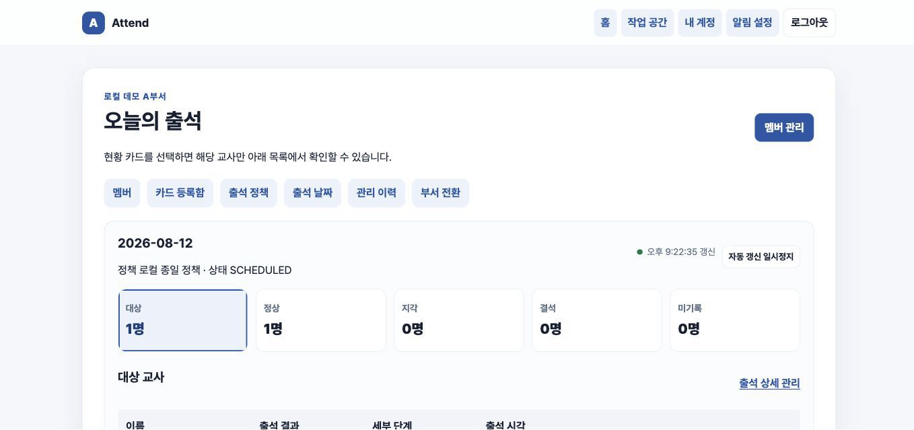
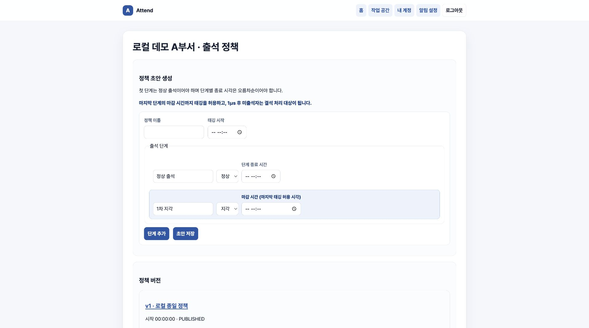

<div align="center">

# Attend

**NFC 태깅 한 번으로 출석을 기록하고, 부서별 기준으로 지각·결석까지 관리합니다.**

교회 교육부서 교사팀을 위한 출석 관리 서비스입니다.

[](https://github.com/jinhokingofworld/attend/actions/workflows/ci.yml)
[](https://github.com/jinhokingofworld/attend/actions/workflows/codeql.yml)
[](https://github.com/jinhokingofworld/attend/actions/workflows/dependency-review.yml)

[사용 흐름](#usage) · [로컬 데모](#demo) · [검증](#testing) · [문서](#documentation)

</div>

교사는 NFC 카드를 태그해 출석하고, 관리자는 웹에서 오늘의 현황을 확인합니다.
부서마다 다른 정상·지각 기준을 설정할 수 있으며, 마감 시각이 지나면 미출석자는
자동으로 결석 처리됩니다. 알림 기능을 켜면 Telegram을 연결한 활성 부서 관리자에게
결과가 전달됩니다.



<p align="center"><sub>실제 로컬 데모 화면 · 모든 이름과 데이터는 합성 fixture입니다.</sub></p>

## 👥 누가 사용하나요?

| 사용자 | 할 수 있는 일 |
|---|---|
| 교사 | 등록된 NFC 카드를 태그해 출석합니다. 펌웨어는 판정 결과를 LED로 표시하도록 구현했습니다. |
| 부서 관리자 | 교사·카드·출석 정책을 관리하고, 출석 현황 조회·수동 정정·Telegram 알림을 사용합니다. |
| 시스템 관리자 | 부서·관리자 계정·권한·NFC 장치 인증 정보를 관리합니다. |

<a id="usage"></a>

## 🔄 이렇게 사용합니다


## ✨ 주요 기능

- **부서별 출석 정책** — 정상 출석과 여러 지각 단계를 원하는 시각으로 설정합니다.
- **NFC 출석** — 카드 태깅 결과를 장치에 반환하고 웹 현황에 반영합니다.
- **오늘의 대시보드** — 정상·지각·결석·미기록 인원과 대상 교사를 한 화면에서 확인합니다.
- **교사와 카드 관리** — 카드 등록·교체·분실·폐기와 교사의 부서 소속을 관리합니다.
- **출석 관리** — 날짜 생성·취소, 대상자 관리, 수동 등록·정정과 변경 이력을 제공합니다.
- **자동 마감과 알림** — 마감 후 결석을 확정하고, 알림 기능을 켜면 연결된 활성 부서 관리자에게 Telegram 요약을 보냅니다.
- **다중 부서와 역할 분리** — 시스템 관리자와 부서 관리자의 권한·데이터 범위를 구분합니다.

## 🖥️ 주요 화면

### ⏱️ 출석 정책

관리자는 정상 출석과 지각 단계를 순서대로 추가한 뒤 정책을 발행합니다. 이미 출석에
사용된 정책은 그대로 보존되므로 나중에 기준을 바꿔도 과거 판정은 달라지지 않습니다.



## 🛡️ 신뢰할 수 있는 출석을 위한 설계

| 실제로 생길 수 있는 문제 | Attend의 처리 방식 |
|---|---|
| 네트워크 문제로 같은 태깅 요청이 다시 옴 | 최초 응답을 기억해 같은 결과를 돌려주고 출석은 한 번만 기록합니다. |
| 정책을 바꾼 뒤 과거 출석 결과가 달라짐 | 그날 사용한 정책과 판정 단계를 함께 보존합니다. |
| 한 교사가 하루에 여러 번 출석하거나 다른 부서 데이터가 연결됨 | 권한 검사와 DB 제약을 함께 적용해 잘못된 기록을 막습니다. |
| 마감 시각에 서버가 잠시 중단됨 | 재기동 후 미처리 작업을 찾아 다시 마감합니다. |
| Telegram 전송이 실패함 | 일시 오류는 제한 횟수만큼 다시 시도하며, 출석 결과는 바꾸지 않습니다. |

## 🧰 기술 구성

| 영역 | 기술 |
|---|---|
| Backend | Java 21, Spring Boot 3.5, Spring MVC, Spring Security |
| Web | Thymeleaf, Vanilla JavaScript, 반응형 CSS |
| Data | PostgreSQL 15, MyBatis, Flyway |
| Test | JUnit 5, MockMvc, Testcontainers |
| Device | Arduino, MFRC522, WiFiNINA, HTTPS JSON API |
| Operations | Docker Compose, Caddy, GitHub Actions, CodeQL |

관리자 웹, 장치 API와 자동 마감을 하나의 Spring Boot 애플리케이션으로 구성했습니다.
관리자 로그인과 NFC 장치 인증은 서로 다른 보안 경계를 사용합니다.

<a id="demo"></a>

## 🚀 로컬에서 체험하기

### ✅ 준비 사항

- JDK 21
- Docker Desktop 또는 Docker Engine + Compose
- Bash와 `curl`

### ▶️ 시작

```bash
git clone https://github.com/jinhokingofworld/attend.git
cd attend
./scripts/local-demo-start.sh
```

준비가 끝나면 <http://127.0.0.1:8080>에서 관리자 웹을 열 수 있습니다.

<details>
<summary><strong>로컬 데모 계정</strong></summary>

| 역할 | 사용자명 | 비밀번호 |
|---|---|---|
| 시스템 관리자 | `local-system-admin` | `local-system-admin-2026` |
| 부서 관리자 | `local-department-admin` | `local-department-admin-2026` |

이 계정은 loopback 로컬 데모 전용이며 운영 환경에 사용하면 안 됩니다.

</details>

실제 하드웨어 없이 두 부서의 NFC 요청, 재전송, 충돌과 부서 격리를 시험할 수 있습니다.

```bash
./scripts/local-http-demo.sh
```

자세한 시나리오는 [하드웨어 없는 로컬 장치 API 시험](docs/LOCAL_HTTP_DEMO.md)을
참고하세요.

### ⏹️ 종료

```bash
docker compose --env-file /dev/null -f compose.local.yaml stop
```

<a id="testing"></a>

## 🧪 검증

DB 통합 테스트와 migration 테스트는 H2 대신 PostgreSQL 15 Testcontainers에서 실행합니다.

```bash
./gradlew test
```

자동 테스트는 다음 위험을 중점적으로 확인합니다.

- 정책 경계 시각, 정상·지각 판정과 자동 결석
- 장치 요청 재전송·충돌과 하루 1회 출석
- 두 worker가 동시에 마감할 때의 중복 방지와 다른 부서 접근 차단
- DB migration·최소 권한과 운영 설정 오류

관리자 웹의 주요 HTTP 흐름은 별도 로컬 E2E로 확인할 수 있습니다.

```bash
./scripts/local-admin-e2e.sh
```

GitHub Actions는 테스트 외에도 세 실행 JAR, Docker·Compose, Caddy, shell script와 로컬
장치·관리자 HTTP 시나리오를 검증합니다.

## 📌 현재 상태와 범위

서버, 관리자 웹, 장치 HTTP API, Arduino 펌웨어와 Docker/Caddy 배포 구성을 구현했습니다.
하드웨어가 없어도 합성 데이터와 HTTP simulator로 관리자 웹과 장치 API의 핵심
시나리오를 재현할 수 있습니다.

아직 완료하지 않은 검증은 다음과 같습니다.

- Arduino와 NFC 리더 실기기 통합 시험
- 현장 네트워크에서의 반복 태깅 성능 시험
- 신규 운영 DB 배포와 실제 부서 파일럿

현재 운영 모델은 **단일 애플리케이션 인스턴스**와 **애플리케이션을 통한 업무 DB 쓰기**를
전제로 합니다. 여러 인스턴스를 사용할 때 필요한 분산 wake-up은 아직 지원하지 않습니다.
상세 배포 조건은 [운영·파일럿 실행서](docs/M5_M6_OPERATIONS_RUNBOOK.md)에 있습니다.

<a id="documentation"></a>

## 📚 문서

| 문서 | 내용 |
|---|---|
| [로컬 장치 API 시험](docs/LOCAL_HTTP_DEMO.md) | Docker 데모와 HTTP·Postman 시나리오 |
| [장치 OpenAPI](docs/device-api.yaml) | NFC 장치 요청·응답 계약 |
| [DB 설계](docs/DATABASE_DESIGN.md) | 데이터 모델과 무결성 규칙 |
| [보안·권한 매트릭스](docs/SECURITY_MATRIX.md) | 인증, 인가와 개인정보 경계 |
| [테스트 계획](docs/TEST_PLAN.md) | 위험 기반 테스트와 인수 조건 |
| [운영·파일럿 실행서](docs/M5_M6_OPERATIONS_RUNBOOK.md) | 배포, 복구와 현장 검증 절차 |
| [NFC 펌웨어](firmware/attend-nfc/README.md) | 지원 보드, 설치와 LED 신호 |
