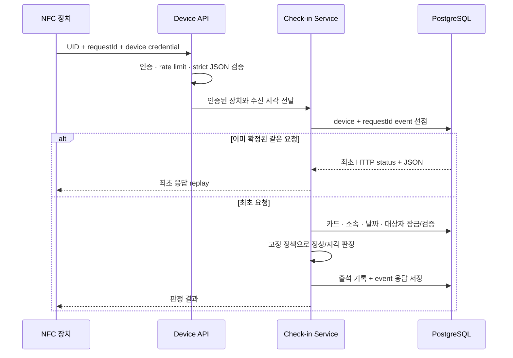

<div align="center">

# Attend

### 교회 교육부서 교사를 위한 NFC 출석 관리 시스템

NFC 태깅 한 번으로 출석을 기록하고, 부서별 기준에 따라 정상 출석·지각·결석을
일관되게 관리하는 Spring Boot 기반 반응형 웹 애플리케이션입니다.

[](https://github.com/jinhokingofworld/attend/actions/workflows/ci.yml)
[](https://github.com/jinhokingofworld/attend/actions/workflows/codeql.yml)
[](https://github.com/jinhokingofworld/attend/actions/workflows/dependency-review.yml)

</div>

> **현재 상태**<br>
> 서버, 관리자 웹, 장치 HTTP API와 운영 배포 산출물까지 구현했습니다. 하드웨어가
> 없어도 로컬 HTTP 시뮬레이터로 전체 흐름을 시험할 수 있습니다. 실제 Arduino/NFC
> 리더 연동, 신규 Neon 운영 DB 배포와 현장 파일럿은 아직 완료하지 않았습니다.

---

## 1. 왜 이 프로젝트를 만들었는가

교회 아동부 교사로 활동하면서 교사의 출석·지각·결석을 부서의 기준에 맞게 관리할
필요가 있었습니다. 그러나 출석 기준은 모든 부서에 똑같이 적용할 수 없습니다.
정상 출석 종료 시각과 지각 단계를 부서마다 다르게 정할 수 있고, 담당자나 정책이
바뀌어도 과거 출석 결과는 당시 기준 그대로 남아야 합니다.

단순히 NFC UID와 태깅 시각만 저장하는 것으로는 이 문제를 해결할 수 없습니다.

- 네트워크 장애로 장치가 같은 요청을 다시 보내도 출석이 중복되면 안 됩니다.
- 한 교사는 한 부서에서 하루에 한 번만 출석할 수 있어야 합니다.
- 서버가 정해진 마감 시각에 꺼져 있어도, 다시 실행된 뒤 누락된 결석을 처리해야 합니다.
- 관리자가 개발자의 도움 없이 정책·교사·NFC 카드·출석 기록을 관리할 수 있어야 합니다.
- 여러 부서의 데이터가 애플리케이션 실수로 서로 섞이지 않아야 합니다.

Attend는 이 문제를 **NFC 장치, 출석 도메인, 관리자 웹과 PostgreSQL 무결성 규칙을
하나의 시스템으로 연결해 해결하는 것**을 목표로 시작했습니다.

## 2. 프로젝트 목표

이 프로젝트에서 확인하고자 한 핵심 질문은 다음과 같습니다.

1. 부서마다 다른 출석 기준을 어떻게 독립적으로 관리할 것인가?
2. 정책이 바뀐 뒤에도 과거 출석의 판정 근거를 어떻게 보존할 것인가?
3. 장치가 HTTP 요청을 재전송해도 출석 중복과 최초 시각 변경을 어떻게 막을 것인가?
4. 여러 서버가 동시에 마감 작업을 실행해도 결석과 감사 이력을 한 번만 만들 수 있는가?
5. 실제 하드웨어가 없는 개발 환경에서도 NFC 출석 흐름을 어떻게 검증할 것인가?

이를 위해 다음을 MVP 범위로 정했습니다.

- 5~20명 규모의 교회 교육부서와 여러 부서 지원
- 부서별 정상 출석 시각과 여러 단계의 지각 기준 설정
- 부서·교사·날짜 기준 하루 1회 출석
- 날짜가 지난 미출석 대상자의 자동 결석 및 출석일 마감
- 부서 관리자의 교사·NFC 카드·정책·출석 기록 관리
- 시스템 관리자의 계정·부서 권한·NFC 장치 관리
- 기간별 개인 출석 통계와 부서 대시보드

## 3. 시스템의 큰 구조

데이터는 다음 순서로 이동합니다.


프로젝트는 책임에 따라 다음 영역으로 나뉩니다.

| 영역 | 책임 |
|---|---|
| 관리자 웹 | 로그인, 부서 선택, 교사·카드·정책·출석 관리와 통계 조회 |
| 장치 API | 장치 인증, NFC 요청 검증, 멱등 처리와 출석 결과 응답 |
| 출석 도메인 | 정책 판정, 날짜·대상자 snapshot, 기록·정정·통계와 자동 마감 |
| 계정·조직 도메인 | 계정 초대, 역할, 부서, 교사 소속과 NFC 카드 수명주기 |
| PostgreSQL | 부서 범위, 하루 1회, 참조 무결성과 동시성의 최종 방어선 |
| 운영 영역 | Caddy, Docker Compose, health, migration, 백업·복원과 보안 검사 |

관리자 웹과 NFC 장치는 서로 다른 보안 경계를 사용합니다.

```text
관리자 웹  ── Session + CSRF ──▶ MVC / Application Service
NFC 장치   ── Device headers ──▶ Stateless Device API
Scheduler  ── Internal actor  ──▶ Finalization Service
                                    │
                                    ▼
                              MyBatis / PostgreSQL
```

## 4. 핵심 요구사항을 어떻게 해결했는가

### 4-1. 부서마다 다른 출석 기준

출석 정책을 수정 가능한 한 행으로 두지 않고 `attendance_policy_version`과
`attendance_band`로 분리했습니다.

- 부서 관리자는 정상 출석 종료 시각과 1차·2차 지각 같은 여러 구간을 설정합니다.
- 작성 중인 정책은 `DRAFT`, 실제 판정에 사용할 정책은 `PUBLISHED` 상태로 구분합니다.
- 출석 날짜를 생성할 때 사용할 정책 버전을 고정합니다.
- 이미 사용된 정책 버전을 직접 수정하지 않고 새 버전을 발행합니다.
- 출석 기록에는 판정된 지각 단계의 순서와 이름도 snapshot으로 저장합니다.

따라서 관리자가 나중에 지각 기준이나 단계명을 바꿔도 과거 기록의 판정 근거와 표시가
달라지지 않습니다.

### 4-2. 하루에 한 번만 인정되는 출석

출석 데이터를 하나의 테이블에 몰아넣지 않고 역할에 따라 분리했습니다.

| 테이블 | 의미 |
|---|---|
| `attendance_day` | 특정 부서의 출석 날짜와 그날 사용할 정책 |
| `attendance_target` | 날짜 생성 시점에 출석 대상이었던 교사 snapshot |
| `attendance_record` | 대상자의 최종 정상·지각·결석 결과 |

`UNIQUE (department_id, attendance_date)`와
`UNIQUE (attendance_day_id, member_id)`로 날짜와 교사의 중복 기록을 차단합니다.
또한 부서 ID를 포함한 composite foreign key를 사용해 A 부서의 카드·교사·날짜가
B 부서의 출석 기록에 연결되지 못하도록 했습니다.

즉, 애플리케이션 코드가 검증을 빠뜨리더라도 DB가 **부서 범위와 1일 1회 출석이라는
불변식(invariant)** 을 마지막 단계에서 보장합니다.

### 4-3. 장치 HTTP 재전송과 멱등성

NFC 장치는 응답을 받지 못하면 같은 태깅을 다시 보낼 수 있습니다. 이 요청을 모두 새
출석으로 처리하면 중복 기록이나 최초 출석 시각 변경이 발생합니다.

Attend는 장치가 생성한 `requestId`를 장치별 idempotency key로 사용합니다.

1. `(device_id, request_id)`로 `tag_event_log` 처리권을 먼저 확보합니다.
2. 최초 요청만 카드·소속·날짜·대상자와 정책을 검사하고 출석을 저장합니다.
3. 확정된 HTTP status와 JSON 응답을 event에 함께 저장합니다.
4. 같은 `requestId`와 UID가 다시 오면 저장된 최초 응답을 그대로 재현합니다.
5. 같은 `requestId`에 다른 UID가 오면 `REQUEST_ID_CONFLICT`로 거부합니다.
6. 새 `requestId`로 다시 태깅해도 출석 기록의 unique constraint가 최초 기록을 지킵니다.

이 구조로 네트워크 재시도 이력과 최종 출석 상태를 구분하면서도, 재전송이 업무 결과를
바꾸지 않도록 했습니다.

### 4-4. 서버 중단을 고려한 자동 결석

정해진 시각에 한 번만 실행되는 작업은 그 시각에 서버가 꺼져 있으면 영원히 누락될 수
있습니다. 따라서 Scheduler는 "오늘 실행할 작업"이 아니라 **과거의 미마감 출석일**을
반복해서 찾는 catch-up 방식으로 동작합니다.

1. 오늘보다 이전이면서 `SCHEDULED`인 출석일을 조회합니다.
2. 각 출석일을 독립된 트랜잭션에서 `FOR UPDATE`로 잠급니다.
3. 대상자 중 기록이 없는 사람에게만 `ABSENT`를 생성합니다.
4. 출석일 상태를 `FINALIZED`로 변경합니다.
5. 고정된 idempotency key로 감사 이력을 한 번만 저장합니다.

두 worker가 같은 날짜를 동시에 선택해도 row lock, unique constraint와 idempotency key가
결석·마감·감사 이력의 중복을 막습니다. 작업 중 실패한 날짜는 다음 실행에서 다시
대상이 되므로 서버 재시작 뒤에도 누락을 따라잡을 수 있습니다.

### 4-5. 관리자가 직접 사용하는 웹 화면

부서 관리자는 로그인하고 작업할 부서를 선택하면 대시보드로 이동합니다.

- 정상·지각·결석·미기록 현황 카드와 상태별 교사 목록
- 5초 polling을 통한 대시보드 자동 갱신과 수동 일시정지
- 교사 목록, 행 선택 상세 조회, 정보 수정과 부서 제외
- 교사 상세 화면의 NFC 카드 연결·교체·분실·폐기
- 미등록 카드 태깅을 원본 UID 노출 없이 교사에게 연결하는 카드 등록함
- 출석 정책 작성·발행, 날짜 생성·취소와 대상자 관리
- 수동 출석 등록·정정, 메모와 감사 이력
- 기간을 다시 선택할 때마다 계산되는 개인별 원형 출석 통계

시스템 관리자는 별도의 화면에서 부서, 관리자 계정, 회원가입 초대, 부서 권한과 장치
credential 수명주기를 관리합니다. `SYSTEM_ADMIN`도 별도 부서 권한이 없으면 해당
부서의 교사·카드·출석 정보에 접근할 수 없습니다.

### 4-6. 하드웨어 없이 검증 가능한 장치 흐름

Arduino와 NFC 리더가 준비되지 않은 상태에서도 서버 구현을 멈추지 않도록 실제 HTTP
요청을 보내는 로컬 시뮬레이터와 Postman 시나리오를 제공했습니다.

시뮬레이터와 PostgreSQL 통합 테스트는 다음을 확인합니다.

- A 장치 코드와 B 장치 인증키를 조합한 요청의 `401` 거부
- A 부서 장치로 B 부서 카드 UID를 요청했을 때 제한 응답과 상세정보 비노출
- 최초 태깅과 출석 판정
- 같은 요청의 응답 replay
- 같은 `requestId`에 다른 UID를 보낸 충돌
- 같은 UID의 새 `requestId` 재태깅 후 `attendance_record` 1건과 최초 시각 유지

이 검증은 **서버의 장치 API 계약을 확인하는 것**이며, 안테나 인식 거리·Wi-Fi 품질·LED
신호 같은 물리 하드웨어 검증을 완료했다는 의미는 아닙니다.

## 5. 실제 NFC 출석 처리 흐름

장치에서 태깅이 발생하면 다음 순서로 처리됩니다.

1. Arduino가 NFC UID를 읽고 물리 태깅마다 새 `requestId`를 만듭니다.
2. 장치 코드와 credential을 header에, UID와 `requestId`를 JSON body에 담아 전송합니다.
3. 서버가 장치 상태와 credential을 확인하고 rate limit과 요청 형식을 검사합니다.
4. 장치·요청 ID 조합으로 event를 선점해 최초 요청과 재전송을 구분합니다.
5. 카드, 활성 소속, 당일 출석 날짜와 대상자 포함 여부를 확인합니다.
6. 출석 날짜에 고정된 정책 버전으로 수신 시각을 정상 또는 지각 단계로 판정합니다.
7. `attendance_record`와 최초 응답을 하나의 트랜잭션에서 확정합니다.
8. 장치는 결과에 따라 LED로 성공·지각·거부 상태를 표시합니다.



## 6. 기술 구성

| 구분 | 기술 |
|---|---|
| Language | Java 21 |
| Application | Spring Boot 3.5, Spring MVC, Spring Security |
| View | Thymeleaf, Vanilla JavaScript, 반응형 CSS |
| Persistence | PostgreSQL 15, MyBatis, Flyway |
| Test | JUnit 5, MockMvc, Testcontainers |
| Device | Arduino, MFRC522, WiFiNINA, HTTPS JSON API |
| Operations | Docker Compose, Caddy, Neon PostgreSQL |
| CI & Security | GitHub Actions, CodeQL, Dependency Review |

프론트엔드는 별도 SPA를 두지 않고 Spring MVC와 Thymeleaf로 구성했습니다. 5~20명 규모의
관리자 도구에서 필요한 서버 권한 검사를 화면 라우팅과 가깝게 유지하고, JavaScript는
대시보드 polling과 행 이동 같은 점진적 기능에만 사용합니다.

## 7. 로컬에서 실행하고 시연하기

### 준비 사항

- JDK 21
- Docker Desktop 또는 Docker Engine + Compose
- Bash와 `curl`

### 7-1. 로컬 데모 시작

```bash
./scripts/local-demo-start.sh
```

시작 스크립트는 PostgreSQL과 애플리케이션을 실행하고, health 및 seed 완료를 기다린 뒤
당일 출석 데이터를 준비합니다. 날짜가 바뀌어도 당일 출석일과 대상자를 다시 upsert합니다.

| 주소 | 용도 |
|---|---|
| <http://127.0.0.1:8080> | 관리자 웹 |
| <http://127.0.0.1:8081/actuator/health> | 로컬 health |

<details>
<summary><strong>로컬 데모 계정 보기</strong></summary>

| 역할 | 사용자명 | 비밀번호 |
|---|---|---|
| 시스템 관리자 | `local-system-admin` | `local-system-admin-2026` |
| 부서 관리자 | `local-department-admin` | `local-department-admin-2026` |

이 계정은 loopback 로컬 데모 전용입니다. 운영 환경에 복사하지 마세요.

</details>

### 7-2. 장치 API 시나리오

```bash
./scripts/local-http-demo.sh
```

두 부서의 최초 출석, 동일 요청 replay, `requestId` 충돌과 재태깅을 실제 HTTP 요청으로
검증합니다. A 장치 코드와 B 장치 인증키의 혼합 인증, A 부서 장치와 B 부서 카드의
교차 요청도 각각 `401`, 정보가 제한된 `409` 응답으로 끝나는지 확인합니다.

### 7-3. 관리자 웹 E2E

```bash
./scripts/local-admin-e2e.sh
```

로그인, 역할 분리와 주요 관리자 페이지를 실제 HTTP session으로 확인합니다.

Postman을 포함한 자세한 시나리오는
[로컬 HTTP 데모 가이드](docs/LOCAL_HTTP_DEMO.md)를 참고하세요.

### 7-4. 종료

```bash
docker compose --env-file /dev/null -f compose.local.yaml stop
```

로컬 데이터까지 초기화하려면 다음 명령을 사용합니다. 이 명령은 로컬 데모용 Docker
volume을 삭제합니다.

```bash
docker compose --env-file /dev/null -f compose.local.yaml down --volumes
```

## 8. 테스트에서 무엇을 검증했는가

자동 테스트는 H2가 아니라 PostgreSQL Testcontainers를 사용합니다.

```bash
./gradlew test
```

Javadoc 생성까지 함께 확인하려면 다음 명령을 사용합니다.

```bash
./gradlew test javadoc
```

주요 검증 범위는 다음과 같습니다.

- 정책 경계 시각과 여러 지각 단계 판정
- 날짜별 대상자 snapshot과 자동 결석 마감
- 카드·정책·출석의 트랜잭션 및 동시성
- 같은 날짜를 두 worker가 마감할 때 결석·감사 이력 중복 방지
- 같은 `requestId` replay, 다른 UID 충돌과 새 요청 재태깅 시 최초 출석 유지
- 장치 code/key 혼합 인증 거부와 다른 부서 카드 정보 비노출
- 다른 부서 IDOR 차단과 시스템·부서 역할 분리
- 회원가입 초대·비밀번호 재설정 token 수명주기
- 장치 인증, rate limit, strict JSON과 요청 크기 제한
- 빈 DB·레거시 DB migration 및 DB 최소 권한
- 민감정보 로그 마스킹과 운영 설정 fail-fast

GitHub Actions에서는 애플리케이션 테스트뿐 아니라 Compose 구성, runtime·migration 이미지,
Shell script, Caddy 설정과 실제 로컬 E2E 흐름도 검증합니다.

## 9. 프로젝트 구조

```text
src/main/java/com/example/attend
├── access          # 계정, 권한, 관리자 웹
├── organization    # 교사 소속과 NFC 카드
├── attendance      # 정책, 날짜, 기록, 통계, 자동 마감
├── device          # 장치 인증과 출석 API
├── audit           # 업무 변경 감사 기록
├── database        # Flyway, preflight, schema·권한 guard
└── operations      # health와 민감정보 로그 처리

src/main/resources/db/migration  # V001~V009 Flyway migration
firmware/attend-nfc              # WiFiNINA 기반 Arduino 펌웨어
ops                              # Caddy, DB role, backup·restore
scripts                          # 로컬 E2E와 HTTP simulator
docs                             # 프로젝트 기준 문서
```

## 10. 현재 구현 범위와 남은 검증

### 구현 완료

- [x] DB schema와 Flyway migration 안전화
- [x] 조직·교사·NFC 카드 도메인
- [x] 출석 정책·기록·통계·자동 마감
- [x] 계정·권한과 관리자 웹
- [x] 장치 인증 API와 하드웨어 없는 HTTP E2E
- [x] Docker·Caddy·백업·복원 운영 산출물

### 아직 완료하지 않은 항목

- [ ] 신규 Neon 운영 DB migration 및 실제 배포
- [ ] Arduino + NFC 리더 실기기 통합 검증
- [ ] 50회 태깅 성능 시험
- [ ] 최소 4회 현장 파일럿

따라서 현재 결과는 **서버와 웹의 기능 구현 및 소프트웨어 E2E 검증 완료** 단계입니다.
실제 장치와 현장 네트워크에서의 안정성까지 입증된 상태는 아닙니다.

## 11. 문서 안내

| 문서 | 내용 |
|---|---|
| [프로젝트 정의서](docs/PROJECT_DEFINITION.md) | 배경, 목표, 범위와 업무 규칙 |
| [아키텍처](docs/ARCHITECTURE.md) | 모듈 경계, 런타임과 데이터 흐름 |
| [DB 설계](docs/DATABASE_DESIGN.md) | ERD, 테이블과 무결성 규칙 |
| [Migration 계획](docs/MIGRATION_PLAN.md) | DB 분류, Flyway와 전환 안전장치 |
| [장치 OpenAPI](docs/device-api.yaml) | NFC 장치 HTTP 요청·응답 계약 |
| [관리자 UI 명세](docs/ADMIN_UI_SPEC.md) | 역할별 화면과 사용자 흐름 |
| [보안 매트릭스](docs/SECURITY_MATRIX.md) | 인증·인가, 개인정보와 운영 경계 |
| [테스트 계획](docs/TEST_PLAN.md) | 인수 조건과 안정적인 테스트 ID |
| [운영·파일럿 실행서](docs/M5_M6_OPERATIONS_RUNBOOK.md) | 배포, 백업, 컷오버와 현장 검증 |
| [펌웨어 안내](firmware/attend-nfc/README.md) | 지원 보드, 설치와 LED 신호 |

## 12. 운영 시 주의사항

- 저장소의 `.env`나 로컬 데모 credential을 운영에 재사용하지 않습니다.
- DB URL, 사용자명과 비밀번호를 분리하고 secret source에서 주입합니다.
- 최초 migration은 읽기 전용 `dbPreflight`가 `FRESH`로 판정한 빈 Neon DB에만 적용합니다.
- migration 계정과 애플리케이션 runtime 계정의 권한을 분리합니다.
- 실제 개인정보를 넣기 전에 백업 위치·보유 기간·삭제 담당자를 확정합니다.
- 장치 API와 자동 마감은 제한 시험 후 순서대로 활성화합니다.

## 13. 이 프로젝트에서 다룬 핵심 주제

이 프로젝트는 단순히 NFC 값을 DB에 저장하는 기능을 넘어 다음을 직접 설계하고 검증하기
위한 프로젝트입니다.

- 업무 규칙을 application validation과 DB constraint로 나누는 기준
- 정책 version과 snapshot을 이용해 과거 판정 근거를 보존하는 방법
- HTTP 멱등성과 DB unique constraint를 함께 사용해 중복 부작용을 막는 방법
- Scheduler catch-up, row lock과 idempotency key로 분산 실행에 대비하는 방법
- 웹 session과 stateless 장치 인증을 분리하는 보안 경계
- 하드웨어가 없어도 API 계약과 핵심 시나리오를 먼저 검증하는 개발 방식

완료 기준과 단계별 계획은 [plan.md](plan.md)를 기준으로 관리합니다.

---

<div align="center">

작은 팀의 실제 출석 업무를 안전하게 운영하면서<br>
Spring Boot, PostgreSQL과 하드웨어 연동을 함께 학습하기 위한 프로젝트입니다.

</div>
