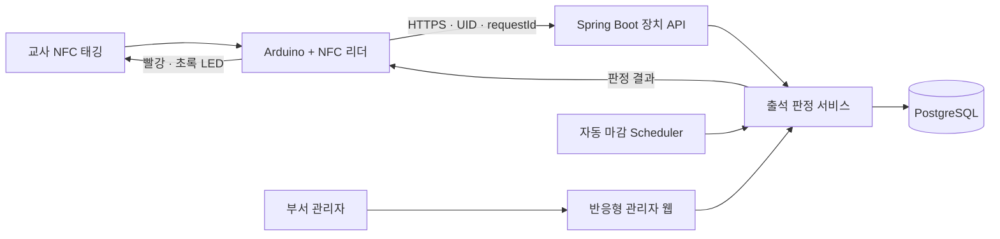

<div align="center">

# Attend

### 교회 교육부서 교사를 위한 NFC 출석 관리 시스템

NFC 태깅 한 번으로 출석을 기록하고, 부서별 정책에 따라 정상 출석·지각·결석을
일관되게 관리하는 Spring Boot 기반 반응형 웹 애플리케이션입니다.

[](https://github.com/jinhokingofworld/attend/actions/workflows/ci.yml)
[](https://github.com/jinhokingofworld/attend/actions/workflows/codeql.yml)
[](https://github.com/jinhokingofworld/attend/actions/workflows/dependency-review.yml)

</div>

> **현재 상태**<br>
> 서버·관리자 웹·장치 HTTP API·운영 배포 산출물까지 구현되어 있습니다. 실제
> Arduino/NFC 리더 시험, 운영 배포 및 4회의 현장 파일럿은 아직 완료되지 않았습니다.

---

## 프로젝트 소개

Attend는 5~20명 규모의 교회 교육부서 교사팀을 위한 출석 관리 프로젝트입니다.
첫 적용 대상은 아동부이며, 하나의 교회 안에서 여러 부서가 서로 다른 관리자와
출석 정책을 사용할 수 있도록 설계했습니다.

기존의 수기 출석 확인에서 발생하기 쉬운 누락, 중복, 주관적인 지각 판정과 통계
재계산 문제를 다음 흐름으로 해결합니다.



## 주요 기능

| 영역 | 제공 기능 |
|---|---|
| 부서 관리 | 여러 부서, 부서별 관리자와 독립된 교사 명단 관리 |
| 교사 관리 | 교사 추가·수정·부서 제외, NFC 카드 연결·교체·분실·폐기 |
| 출석 정책 | 정상 출석 시간과 여러 단계의 지각 구간을 부서별로 설정 |
| 출석 기록 | 하루 1회 NFC 출석, 중복 태깅 멱등 처리, 수동 등록·정정 |
| 자동 결석 | 날짜가 지나면 미출석 대상자를 자동으로 결석 처리하고 날짜 마감 |
| 대시보드 | 오늘의 정상·지각·결석·미기록 인원과 대상자 목록 자동 갱신 |
| 개인 통계 | 기간별 정상·지각·결석 비율과 지각 단계별 통계 제공 |
| 시스템 관리 | 계정 초대·재설정, 부서 권한, 장치 credential lifecycle 관리 |
| 감사·운영 | 주요 변경 감사 기록, health 확인, 백업·복원 절차 제공 |

### 출석 정책의 핵심 원칙

- 출석은 **부서·교사·날짜별 하루 한 번**만 인정합니다.
- 부서 관리자가 정상 출석과 여러 지각 단계의 종료 시각을 직접 설정합니다.
- 출석 날짜를 만들 때 당시 활성 교사를 대상자로 고정합니다.
- 날짜가 지나면 미기록 대상자는 자동으로 결석 처리됩니다.
- 공식 통계에는 마감된 출석 날짜만 포함합니다.
- 마감 후 수정은 사유와 관리자 감사 기록을 남깁니다.

## 화면과 역할

### 시스템 관리자

- 부서 생성 및 상태 확인
- 관리자 계정 생성과 회원가입 초대 링크 발급
- 부서 관리자 권한 부여·회수
- NFC 장치 생성, credential 시험·교체·폐기
- 시스템 health, schema version과 feature flag 확인

### 부서 관리자

- 담당 부서 대시보드 조회
- 교사 기본정보와 NFC 카드 관리
- 출석 정책과 출석 날짜 관리
- 수동 출석 등록·정정 및 감사 이력 확인
- 개인별 기간 출석 통계 조회

`SYSTEM_ADMIN`은 별도의 부서 권한을 받지 않는 한 교사·카드·출석 데이터에 접근할
수 없습니다.

## 기술 구성

| 구분 | 기술 |
|---|---|
| Language | Java 21 |
| Application | Spring Boot 3.5, Spring MVC, Spring Security |
| View | Thymeleaf, Vanilla JavaScript, 반응형 CSS |
| Persistence | PostgreSQL 15, MyBatis, Flyway |
| Test | JUnit 5, MockMvc, Testcontainers |
| Device | Arduino, MFRC522, WiFiNINA, HTTPS JSON API |
| Operations | Docker Compose, Caddy, Neon PostgreSQL |
| CI & Security | GitHub Actions, CodeQL, Dependency Review |

웹 사용자와 NFC 장치는 서로 다른 보안 경계를 사용합니다.

```text
관리자 웹  ── Session + CSRF ──▶ MVC / Application Service
NFC 장치   ── Device headers ──▶ Stateless Device API
Scheduler  ── Internal actor  ──▶ Finalization Service
                                    │
                                    ▼
                              MyBatis / PostgreSQL
```

## 로컬에서 실행하기

하드웨어가 없어도 운영 화면과 장치 HTTP 흐름을 함께 시험할 수 있습니다.

### 준비 사항

- JDK 21
- Docker Desktop 또는 Docker Engine + Compose
- Bash와 `curl`

### 1. 로컬 데모 시작

```bash
./scripts/local-demo-start.sh
```

시작 스크립트는 PostgreSQL과 애플리케이션을 실행하고, health 확인 후 당일 출석
데이터까지 준비합니다.

| 주소 | 용도 |
|---|---|
| <http://127.0.0.1:8080> | 관리자 웹 |
| <http://127.0.0.1:8081/actuator/health> | 로컬 health |

<details>
<summary><strong>로컬 데모 계정 보기</strong></summary>

| 역할 | 사용자명 | 비밀번호 |
|---|---|---|
| 시스템 관리자 | `local-system-admin` | `local-system-admin-2026` |
| 부서 관리자 | `local-department-admin` | `local-department-admin-2026` |

이 계정은 loopback 로컬 데모 전용입니다. 운영 환경에 복사하지 마세요.

</details>

### 2. 장치 API 시나리오 시험

```bash
./scripts/local-http-demo.sh
```

두 부서의 credential 확인, 최초 출석, 동일 요청 재전송과 `requestId` 충돌을 실제
HTTP 요청으로 검증합니다.

### 3. 관리자 웹 E2E 시험

```bash
./scripts/local-admin-e2e.sh
```

로그인, 역할 분리와 주요 관리자 페이지를 실제 HTTP 세션으로 확인합니다.

### 4. 종료

```bash
docker compose --env-file /dev/null -f compose.local.yaml stop
```

로컬 데이터까지 초기화하려면 아래 명령을 사용합니다. 이 명령은
`attend-local-demo`의 합성 volume을 삭제합니다.

```bash
docker compose --env-file /dev/null -f compose.local.yaml down --volumes
```

자세한 사용법과 Postman 시나리오는
[로컬 HTTP 데모 가이드](docs/LOCAL_HTTP_DEMO.md)를 참고하세요.

## 테스트

전체 자동 테스트는 실제 PostgreSQL Testcontainers를 사용합니다. H2로 DB 동작을
대체하지 않습니다.

```bash
./gradlew test
```

문서 주석 생성까지 확인하려면 다음 명령을 사용합니다.

```bash
./gradlew test javadoc
```

주요 검증 범위는 다음과 같습니다.

- 정책 경계 시각과 여러 지각 단계 판정
- 날짜별 대상자 snapshot과 자동 결석 마감
- 카드·정책·출석의 트랜잭션 및 동시성
- 다른 부서 IDOR 차단과 역할 분리
- 초대·비밀번호 재설정 token 수명주기
- 장치 인증, 멱등 replay, rate limit과 strict JSON
- 빈 DB·레거시 DB migration 및 DB 최소 권한
- 민감정보 로그 마스킹과 운영 설정 fail-fast

## 프로젝트 구조

```text
src/main/java/com/example/attend
├── access          # 계정, 권한, 관리자 웹
├── organization    # 교사 소속과 NFC 카드
├── attendance      # 정책, 날짜, 기록, 통계, 자동 마감
├── device          # 장치 인증과 출석 API
├── audit           # 업무 변경 감사 기록
├── database        # Flyway, preflight, schema·권한 guard
└── operations      # health와 민감정보 로그 처리

src/main/resources/db/migration  # V001~V008 Flyway migration
firmware/attend-nfc              # WiFiNINA 기반 Arduino 펌웨어
ops                              # Caddy, DB role, backup·restore
scripts                          # 로컬 E2E와 HTTP simulator
docs                             # 프로젝트 기준 문서
```

## 문서 안내

| 문서 | 내용 |
|---|---|
| [프로젝트 정의서](docs/PROJECT_DEFINITION.md) | 배경, 목표, 범위와 업무 규칙 |
| [아키텍처](docs/ARCHITECTURE.md) | 모듈 경계, 런타임과 데이터 흐름 |
| [DB 설계](docs/DATABASE_DESIGN.md) | ERD, 테이블과 무결성 규칙 |
| [Migration 계획](docs/MIGRATION_PLAN.md) | DB 분류, Flyway와 전환 안전장치 |
| [장치 OpenAPI](docs/device-api.yaml) | NFC 장치 HTTP 요청·응답 계약 |
| [관리자 UI 명세](docs/ADMIN_UI_SPEC.md) | 역할별 화면과 사용자 흐름 |
| [보안 매트릭스](docs/SECURITY_MATRIX.md) | 인증·인가, 개인정보와 운영 경계 |
| [테스트 계획](docs/TEST_PLAN.md) | 인수 조건과 안정적인 테스트 ID |
| [운영·파일럿 실행서](docs/M5_M6_OPERATIONS_RUNBOOK.md) | 배포, 백업, 컷오버와 현장 검증 |
| [펌웨어 안내](firmware/attend-nfc/README.md) | 지원 보드, 설치와 LED 신호 |

## 운영 시 주의사항

- 저장소의 `.env`나 로컬 데모 credential을 운영에 재사용하지 않습니다.
- DB URL, 사용자명과 비밀번호를 분리하고 secret source에서 주입합니다.
- 최초 migration은 읽기 전용 `dbPreflight`가 `FRESH`로 판정한 빈 Neon DB에만
  적용합니다.
- migration 계정과 애플리케이션 runtime 계정의 권한을 분리합니다.
- 실제 개인정보를 넣기 전에 백업 위치·보유기간·삭제 담당자를 확정합니다.
- 장치 API와 자동 마감은 제한 시험 후 순서대로 활성화합니다.

## 진행 현황

- [x] DB 및 Flyway 안전화
- [x] 조직·교사·NFC 카드 도메인
- [x] 출석 정책·기록·통계·자동 마감
- [x] 계정·권한과 관리자 웹
- [x] 장치 인증 API와 하드웨어 없는 E2E
- [x] Docker·Caddy·백업·복원 운영 산출물
- [ ] 신규 Neon 운영 DB migration 및 배포
- [ ] Arduino + NFC 리더 실기기 검증
- [ ] 50회 태깅 성능 시험
- [ ] 최소 4회 현장 파일럿

완료 기준과 단계별 세부 계획은 [plan.md](plan.md)를 기준으로 합니다.

---

<div align="center">

작은 팀의 실제 출석 업무를 안전하게 운영하면서<br>
Spring Boot, 데이터베이스와 하드웨어 연동을 함께 학습하기 위한 프로젝트입니다.

</div>
