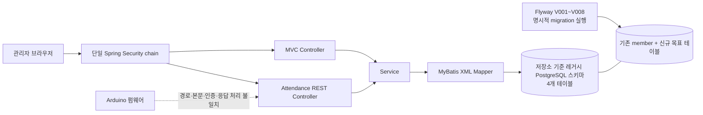
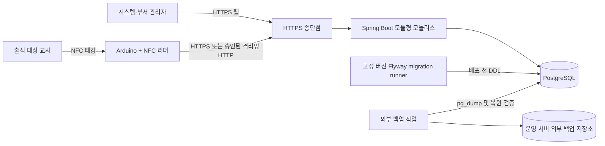
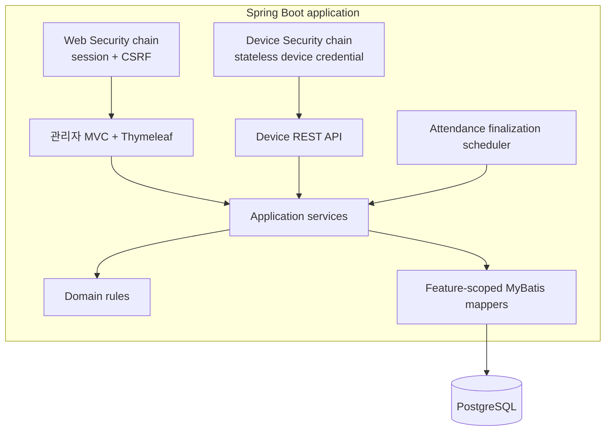
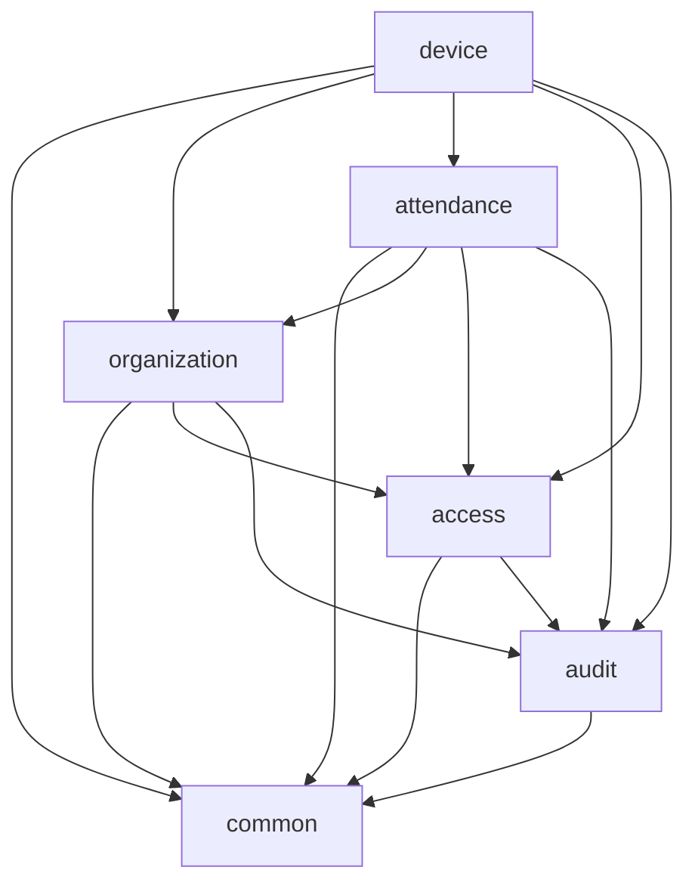
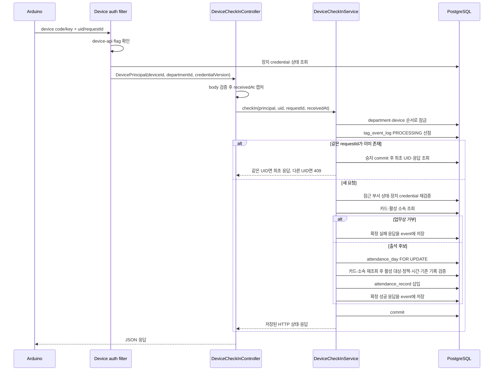

# Attend 시스템 아키텍처

> 기준 문서: [PROJECT_DEFINITION.md](./PROJECT_DEFINITION.md), [DATABASE_DESIGN.md](./DATABASE_DESIGN.md), [MIGRATION_PLAN.md](./MIGRATION_PLAN.md)
> 상세 계약: [device-api.yaml](./device-api.yaml), [SECURITY_MATRIX.md](./SECURITY_MATRIX.md), [ADMIN_UI_SPEC.md](./ADMIN_UI_SPEC.md), [TEST_PLAN.md](./TEST_PLAN.md)
> 대상 릴리스: 현장 사용 가능한 MVP
> 기술 기준: Java 21, Spring Boot 3.5.9, MyBatis, PostgreSQL, Arduino
> 작성 기준일: 2026-07-31
> 상태: M1~M2 구현 완료, M3 이후 미구현

## 0. 결론

Attend MVP는 **단일 Spring Boot 애플리케이션으로 배포하는 모듈형 모놀리스**로 구현한다.

핵심 결정은 다음과 같다.

1. 관리자 웹, 장치 API, 자동 마감은 한 애플리케이션 안에서 실행한다.
2. 코드는 기술 계층 전체를 한 폴더에 모으지 않고 업무 기능별 패키지로 나눈다.
3. 관리자 웹은 Spring MVC와 Thymeleaf를 사용하고, 장치만 JSON REST API를 사용한다.
4. 관리자 세션 인증과 장치 인증은 별도 Spring Security filter chain으로 분리한다.
5. PostgreSQL 한 개를 운영 기준 저장소로 사용하고 MyBatis로 명시적인 SQL을 작성한다.
6. 출석 저장, 수동 등록·정정, 날짜 취소와 자동 마감은 모두 `department → attendance_day` 순서로 필요한 행을 잠근다.
7. 장치 재시도는 `(device_id, request_id)`로 멱등 처리하고 최초 확정 응답을 재현한다.
8. 자동 결석은 PostgreSQL stored procedure에 별도로 구현하지 않는다. Spring 스케줄러는 실행 계기만 제공하고, 결석 생성과 날짜 마감은 하나의 애플리케이션 서비스 트랜잭션이 처리한다.
9. 운영 스키마 변경은 웹 애플리케이션이 아니라 별도 Flyway migration runner가 수행한다.
10. MVP는 단일 애플리케이션 인스턴스를 기본으로 하며 Redis, 메시지 브로커, Kubernetes와 마이크로서비스를 도입하지 않는다.

이 문서는 목표 구조를 정의한다. 현재 코드가 이미 이 구조로 구현됐다는 의미는 아니다.

---

## 1. 문서 목적과 기준

### 1.1 목적

- 현재 코드의 실제 구조와 목표 구조를 분리해 기록한다.
- 기능별 책임, 의존성 방향과 트랜잭션 경계를 확정한다.
- 관리자 웹과 NFC 장치 API의 보안 경계를 정의한다.
- 자동 마감, 시간 처리, 배포와 장애 대응의 구조를 정한다.
- 이후 API 명세, 보안 매트릭스, 테스트 계획과 관리자 화면 설계의 기준을 제공한다.

### 1.2 문서 간 책임

| 문서 | 책임 |
|---|---|
| [PROJECT_DEFINITION.md](./PROJECT_DEFINITION.md) | 사용자, 범위, 업무 규칙과 인수 기준 |
| `ARCHITECTURE.md` | 구성 요소, 모듈 경계, 의존성, 런타임·보안·트랜잭션 구조 |
| [DATABASE_DESIGN.md](./DATABASE_DESIGN.md) | 테이블, FK, 제약, 인덱스와 데이터 트랜잭션 기준 |
| [ATTENDANCE_DDL.sql](./ATTENDANCE_DDL.sql) | 신규 DB 기준 물리 스키마 |
| [MIGRATION_PLAN.md](./MIGRATION_PLAN.md) | 기존 DB 안전화, Flyway, 컷오버와 롤백 |
| [device-api.yaml](./device-api.yaml) | 장치 HTTP 요청·응답의 정확한 계약 |
| [SECURITY_MATRIX.md](./SECURITY_MATRIX.md) | URL·기능·역할별 허용과 거부 조건 |
| [ADMIN_UI_SPEC.md](./ADMIN_UI_SPEC.md) | 관리자 웹의 정보 구조, 화면·폼과 상호작용 계약 |
| [TEST_PLAN.md](./TEST_PLAN.md) | 계층별 테스트와 인수 시나리오 |

업무 규칙이 충돌하면 프로젝트 정의서를 우선하고, 물리 데이터 제약은 DB 설계서를 우선한다. 구현 과정에서 문서와 다른 판단이 필요하면 코드에만 반영하지 않고 먼저 관련 문서를 수정한다.

### 1.3 범위 밖

- 세부 HTML 레이아웃과 디자인 시스템
- 장치별 LED·부저의 최종 패턴
- 운영 서버 제품과 호스팅 사업자 선정
- 다중 교회 멀티테넌시
- 다중 리전, 무중단 이중화와 대규모 분산 처리
- 네이티브 모바일 애플리케이션

---

## 2. 아키텍처 동인과 제약

| 동인 | 아키텍처 영향 |
|---|---|
| 부서별 5~20명 | 단일 애플리케이션과 단일 PostgreSQL로 충분 |
| 실제 출석 업무에 사용 | 화면 수보다 데이터 정확성, 복구와 감사 이력을 우선 |
| 여러 부서의 독립 운영 | `department_id`를 인증 이후의 보안 경계로 강제 |
| 부서별 NFC 장치 최대 1~2대 | 동기 HTTP 처리로 충분하며 메시지 브로커 불필요 |
| Wi-Fi 장애와 장치 재시도 | 요청 ID 기반 멱등성과 확정 응답 재현 필요 |
| 부서별 동적 지각 단계 | 고정 enum이나 거대한 조건문 대신 정책 버전과 구간 행 사용 |
| 날짜 경과 후 자동 결석 | 대상자 스냅샷과 멱등한 날짜별 마감 트랜잭션 필요 |
| Java·Spring Boot 학습 목적 | Controller-Service-Mapper 흐름은 유지하되 책임을 명확히 분리 |
| 기존 운영 가능성이 있는 DB | 신규 구조로의 이중 쓰기 없이 안전 릴리스와 Flyway 전환 필요 |
| 기본 시간대 `Asia/Seoul` | 서버 수신 시각과 주입 가능한 `Clock`을 단일 시간 기준으로 사용 |

### 2.1 우선순위

설계 판단의 우선순위는 다음과 같다.

```text
데이터 보존
> 부서 격리와 인증
> 출석 판정 정확성·멱등성
> 복구 가능성
> 운영 단순성
> 개발 편의
```

빠른 시연을 이유로 위 순서를 뒤집지 않는다.

---

## 3. 현재 아키텍처

### 3.1 기술 구성

| 영역 | 현재 상태 |
|---|---|
| 언어·런타임 | Java 21 |
| 애플리케이션 | Spring Boot 3.5.9 단일 Gradle 프로젝트 |
| 웹 | Spring MVC, Thymeleaf |
| 보안 | Spring Security form login, 단일 filter chain |
| 데이터 접근 | MyBatis interface + XML Mapper |
| DB | PostgreSQL |
| 스키마 변경 | Spring SQL 초기화 차단, Flyway V001~V008 명시 실행 |
| 펌웨어 | `RFID.ino`, MFRC522, WiFiNINA |
| 테스트 | Spring context와 PostgreSQL 15 Testcontainers migration·제약 테스트 |

현재 패키지는 `controller`, `service`, `repository`, `entity`처럼 기술 계층별로 구성되어 있다. `Member`와 `Attendance` 객체가 DB 매핑, 서비스와 화면 전달에 함께 사용되므로 입력 DTO, 업무 모델과 저장 모델의 경계가 약하다.

### 3.2 현재 요청 흐름



현재 활성 장치 서버 경로는 다음과 같다.

```text
POST /api/attendance
→ member.card_uid 조회
→ LocalDateTime.now()와 전역 09:00 비교
→ IN_TIME 또는 TIME_OUT 저장
→ attendance_log를 REQUIRES_NEW 트랜잭션으로 별도 저장
```

이 흐름에는 부서, 출석 정책 버전, 출석 대상 날짜, 대상자 스냅샷, 요청 ID와 자동 마감이 없다.

### 3.3 현재 작업 트리의 M1~M4 서버 구현 상태

2026-07-31 M1 DB 기반 작업으로 다음 항목을 구현했다.

- 운영 classpath에서 파괴적 `schema.sql`, 샘플 `data.sql` 제거
- `spring.sql.init.mode=never` 고정과 운영 프로필의 필수 DB 접속정보
- 웹 runtime 기본 Flyway 비활성화와 테스트 프로필의 명시적 활성화
- fresh·정확한 레거시 DB만 허용하는 Flyway V001~V008
- `member` 물리 삭제 API·Mapper와 `card_uid` 직접 수정 경로 제거
- PostgreSQL 15에서 fresh, legacy, drift 거부, 부서 scope, 날짜–정책–구간–상태 복합 FK, 부분 unique, token·NULL 부정 제약 검증

M2에서는 다음 기능을 신규 기능 패키지와 목표 테이블에 구현했다.

- `Clock`과 `Asia/Seoul`을 사용하는 정책 구간 검증·포함 경계 판정
- 활성 부서 관리자 인가 계약과 모든 업무 서비스의 `department_id` 범위 강제
- 교사·소속·NFC 카드 등록, 연결·교체·종료와 부서 제외 원자 트랜잭션
- 정책 초안 편집, 전체 검증, 발행과 발행 후 application 경로 불변성
- 출석일 생성, 활성 소속 대상자 snapshot, 시작 전 대상·정책 변경과 날짜 취소
- 실제 출석 시각 기반 수동 등록·정정, 누락 대상자 원자 추가와 메모 원천 보존
- 과거 날짜 자동 결석·마감, 재기동 catch-up과 `FINALIZED` 기준 개인 통계
- 계정·시스템 주체의 감사 로그와 날짜별 멱등 자동 마감 감사

레거시 4개 테이블의 기준 구조는 운영 resource가 아니라 `src/test/resources/db/legacy/legacy-schema.sql`에 격리했다. M2 application service는 신규 목표 테이블만 사용하고 레거시 출석에 이중 쓰지 않는다. M3에서 웹 로그인과 `/admin/**` 화면은 신규 `account`, 역할, 조직·출석 application service로 교체했고 명시되지 않은 레거시 MVC URL은 Security 기본 거부 대상으로 닫았다.

M4 서버 범위에서는 다음 기능을 구현했다.

- 시스템 장치 등록, 원문 키 1회 표시, 시험 후 활성화, 비활성화, 즉시 키 교체와 종결 폐기
- 별도 `device-api.enabled` availability와 stateless header 인증, 인증 전·장치별 rate limit
- `POST /api/v1/device/credential-tests`와 `POST /api/v1/device/check-ins`
- 실제 1 KiB stream 제한, strict JSON, UID·request ID 검증과 개인정보 없는 공통 응답
- `(device_id, request_id)` 선점, PostgreSQL `jsonb` canonical 응답 저장과 동일 요청 재현
- 카드·소속·날짜·대상·고정 정책 판정, NFC 출석과 확정 event의 단일 transaction
- 원문 키를 process argument에 넣지 않는 `scripts/device-smoke.sh` HTTP 시험 도구

`RFID.ino`는 신규 계약을 구현한 펌웨어가 아니라 배포 금지 레거시로 표시했다. 따라서 M4의 서버·관리자 웹·HTTP simulator 범위가 구현된 것이며 실제 Arduino 연동 완료를 뜻하지 않는다.

그러나 다음 이유로 안전 릴리스가 완료된 것은 아니다.

- 실제 운영 DB의 성격과 기존 데이터는 아직 확인하지 않았다.
- 운영 복제본의 백업 복원, migration 반복과 앱 연속 재시작 검증이 남아 있다.
- `migration_owner`, `app_runtime`, `cutover_writer`, `legacy_writer` 역할·최소권한
  스크립트와 PostgreSQL 통합 검증을 추가했다. 운영 환경에는 아직 적용하지 않았다.
- 운영 runtime은 시작 시 실제 DB 권한을 검사해 schema DDL, 임시 테이블,
  Flyway history 변경, 교사 삭제와 레거시 DML 권한이 있으면 기동을 거부한다.
- 현재 guarded runner는 Gradle `dbMigrate` 작업으로 제공되며, 운영에서 이를 실행할 고정 컨테이너·배포 job은 아직 없다.
- 실제 Arduino 펌웨어와 현장 네트워크는 아직 신규 장치 계약으로 교체·검증하지 않았다.

### 3.4 현재 구조에서 유지할 수 없는 부분

| 문제 | 영향 | 목표 조치 |
|---|---|---|
| 모든 인증 사용자에게 대부분 URL 허용 | 일반 `USER`도 관리자 기능 직접 호출 가능 | 역할·부서 단위 서버 인가 |
| 웹과 장치가 같은 보안 chain | Arduino는 세션·CSRF 경계를 통과할 수 없음 | 두 개의 filter chain |
| `member` 물리 삭제와 FK cascade | 구성원과 과거 출석·로그 동시 손실 | 소속 종료와 `ON DELETE RESTRICT` |
| `member.card_uid` 직접 수정 | 카드 교체 이력과 부서 검증 없음 | 카드·연결 이력 분리 |
| 전역 `attendance.late-time` | 부서별·다단계 정책 표현 불가 | 불변 정책 버전과 구간 |
| 누락 행 기반 통계 | 결석과 비대상을 구분할 수 없음 | 출석 날짜와 대상자 스냅샷 |
| 로그의 `REQUIRES_NEW` | 출석 rollback 뒤 거짓 성공 로그 잔존 가능 | 출석과 확정 태깅 결과의 단일 트랜잭션 |
| `SELECT *` Mapper | 스키마 확장과 column-level 권한 충돌 | 명시적 컬럼 목록 |
| `LocalDateTime.now()` 직접 호출 | 시간대와 경계 테스트 불안정 | `Clock`과 `ZoneId` 주입 |
| Arduino가 TCP 연결만 성공으로 처리 | 서버 저장 실패도 초록 LED 표시 가능 | HTTP 상태와 JSON 코드 확인 |
| 장치 요청 ID 없음 | 네트워크 재시도 시 결과 재현 불가 | 장치별 request ID와 이벤트 선점 |
| 컨텍스트 로드 테스트 한 건 | 권한·동시성·자동 마감 결함 검출 불가 | 실제 PostgreSQL 기반 다계층 테스트 |

현재 `RFID.ino`는 실제 UID 대신 정수 `1`을 잘못된 형식으로 JSON에 넣고 `/attendance/1`로 전송한다. 서버의 활성 경로는 `/api/attendance`이며, 펌웨어는 HTTP 응답 본문을 읽지 않는다. 현재 상태의 NFC 전체 흐름은 동작하는 통합 기능이 아니라 미완성 실험 코드다.

구조 개편과 별개로 남은 레거시·장치 구현에는 다음 결함이 있다.

- M3에서 `LoginUserDetailServiceImpl`, `AuthenticationMapper`, 기존 `ADMIN`·`USER` 보안 entity를 제거하고 활성 `account` 기반 로그인으로 교체했다.
- `selectRecentFailedUids()` SQL은 여러 행을 반환할 수 있지만 Java Mapper 반환형은 단일 객체다.
- `ApiResponse.fails()`는 이름과 달리 `success=true`, `code=SUCCESS`를 만든다.
- REST 입력의 UID 형식 검증과 공통 4xx 오류 계약이 없다.

목표 패키지로 이동하는 것만으로 이 결함들이 해결되지는 않는다. 각각 회귀 테스트를 먼저 추가하거나 새 유스케이스 구현에서 제거해야 한다.

---

## 4. 목표 시스템 구조

### 4.1 시스템 컨텍스트



공유 Wi-Fi, 인터넷 또는 신뢰할 수 없는 네트워크를 지나면 HTTPS를 필수로 한다. MCU에서 직접 TLS를 안정적으로 처리할 수 없다면 평문 HTTP를 그대로 허용하는 것이 아니라 다음 중 하나를 선택해야 한다.

1. 외부 접근이 차단된 격리 VLAN에서만 HTTP 사용
2. 로컬 TLS gateway를 두고 Arduino와 gateway 사이도 물리적으로 격리

장치가 서버 인증서 또는 승인된 CA를 검증하지 않는 HTTPS는 중간자 공격을 막지 못하므로 HTTPS로 인정하지 않는다.

이 조건을 충족하지 못하면 장치 인증키가 평문으로 노출되므로 운영 배포를 중단한다.

### 4.2 애플리케이션 런타임



관리자 MVC, 장치 API와 스케줄러는 같은 업무 서비스를 호출한다. 동일 규칙을 Controller, scheduler와 SQL procedure에 각각 복사하지 않는다.

### 4.3 배포 단위

MVP의 운영 배포 단위는 다음 네 개다.

| 배포 단위 | 책임 |
|---|---|
| Spring Boot 애플리케이션 1개 | 관리자 웹, 장치 API, 자동 마감 |
| PostgreSQL DB 1개 | 운영 데이터와 무결성 |
| Flyway migration runner | 배포 전 스키마 변경, 운영 웹 계정과 분리 |
| 외부 백업 작업·저장소 | DB 백업, 보존과 복원 검증 |

Nginx·Caddy 같은 reverse proxy는 HTTPS 종단과 접근 제한이 필요할 때 사용한다. 제품 자체는 고정하지 않지만, 공유망 운영에서 TLS 종단점은 선택 사항이 아니다.

---

## 5. 애플리케이션 모듈

### 5.1 기능별 패키지

목표 패키지는 다음 구조를 기본으로 한다.

```text
com.example.attend
├── common
│   ├── config
│   ├── error
│   ├── time
│   └── web
├── access
├── organization
│   ├── department
│   ├── roster
│   └── card
├── attendance
│   ├── policy
│   ├── day
│   ├── record
│   └── scheduling
├── device
│   ├── security
│   └── checkin
└── audit
```

각 기능 패키지는 필요한 범위에서 다음 하위 구조를 사용한다.

```text
<feature>
├── api
├── web
│   ├── controller
│   ├── request
│   └── view
├── application
├── domain
└── infrastructure
    └── mybatis
```

모든 기능에 빈 계층과 interface를 기계적으로 만들지 않는다. 실제로 교체 가능한 경계, 외부 입력과 트랜잭션 유스케이스에만 분리를 적용한다.

### 5.2 모듈 책임과 데이터 소유

| 모듈 | 책임 | 소유 테이블 |
|---|---|---|
| `common` | 공통 설정, `Clock`, 오류 코드, 요청 상관 ID | 없음 |
| `access` | 계정, 로그인, 시스템 역할, 부서 관리자 권한과 인가 | `account`, `account_department_role` |
| `organization` | 부서, 운영 구성원, 부서 소속, NFC 카드와 연결 이력 | `department`, `member`, `department_membership`, `nfc_card`, `nfc_card_assignment` |
| `attendance` | 정책·구간, 출석 날짜·대상자·최종 기록, 정정, 마감과 통계 | `attendance_policy_version`, `attendance_band`, `attendance_day`, `attendance_target`, `attendance_record` |
| `device` | 장치 등록·인증·상태, 체크인 API, 요청 멱등 처리와 미등록 카드 등록함 | `device`, `tag_event_log` |
| `audit` | 관리자·시스템 업무 변경 감사 이력 | `audit_log` |

`member`는 기존 물리 테이블을 재사용하는 운영 기준 테이블이다. 화면과 업무 용어는 `교사`를 사용할 수 있지만 별도 `teacher` 테이블이나 중복 영속 모델을 만들지 않는다.

### 5.3 의존성 방향



의존성 규칙은 다음과 같다.

- `common`은 어떤 업무 모듈에도 의존하지 않는다.
- Controller는 Mapper를 직접 호출하지 않는다.
- 웹·장치 request DTO를 영속 객체로 직접 사용하지 않는다.
- 다른 모듈의 Mapper XML을 직접 호출하지 않고 application API 또는 명시적인 읽기 경계를 사용한다.
- 쓰기는 테이블 소유 모듈의 application service를 통한다.
- 한 유스케이스 안의 모듈 간 command와 감사 기록은 기본 `Propagation.REQUIRED`로 바깥 트랜잭션에 참여하며 `REQUIRES_NEW`로 부분 commit하지 않는다.
- 교차 모듈 유스케이스는 의존성 그래프의 상위 모듈이 바깥 트랜잭션을 열고 하위 모듈의 좁은 `api` command를 호출한다. 하위 모듈은 호출자를 역으로 참조하지 않는다.
- 미등록 태그를 이용한 카드 등록·교체는 `device`가 이벤트와 부서를 검증하고 `attendance.api`의 당일 자격 변경 guard와 `organization.api`의 카드 command를 호출한다.
- 부서 제외와 미래 대상자 일괄 제외는 `attendance`가 부서와 날짜를 순서대로 잠그고 `organization.api`의 소속 종료 command를 호출한 뒤 자기 소유 대상자를 변경한다.
- 초기 설정은 부서 생성, 계정 생성, 부서 관리자 권한 부여를 각각 독립된 명령과 트랜잭션으로 순서대로 수행한다. MVP에서는 이 세 작업을 한 요청으로 묶는 교차 모듈 생성 유스케이스를 만들지 않는다. 아직 관리자가 없는 부서와 아직 부서 권한이 없는 계정은 유효한 중간 상태다.
- 부서 관리자 권한 부여는 `access`가 소유한다. `access`는 권한 부여를 위해 `organization`을 역참조하지 않고, 이미 생성된 `department_id`를 받아 DB FK와 영향 행 수로 존재 여부를 검증한다. 부서 선택 목록은 상태를 변경하지 않는 전용 read query로 제공한다.
- 미등록 카드 등록·교체와 부서 제외 흐름을 위해 범용 이벤트 버스나 workflow framework를 도입하지 않는다. 트랜잭션 경계가 분명한 application service를 명시적으로 둔다.
- 대시보드처럼 여러 모듈을 읽는 조회는 전용 read query를 허용하되 업무 상태를 변경하지 않는다.
- 순환 의존이 생기면 공통 패키지로 무조건 옮기지 말고 유스케이스의 실제 소유자를 다시 정한다.

이 경계는 Java module system이나 별도 Gradle subproject가 아니라 패키지 규칙으로 시작한다. 현재 규모에서 물리 멀티모듈 분리는 얻는 이점보다 빌드·설정 복잡도가 크다.

### 5.4 계층별 책임

| 계층 | 허용 책임 | 금지 |
|---|---|---|
| `web` | HTTP 입력 검증, 인증 주체 전달, 응답·화면 모델 변환 | 업무 판정, 직접 SQL |
| `application` | 권한 확인, 유스케이스 조정, 트랜잭션 경계 | HTML 렌더링, 펌웨어 신호 처리 |
| `domain` | 정책 구간 검증, 시간 판정, 상태 전이 같은 순수 규칙 | Spring MVC, MyBatis 의존 |
| `infrastructure.mybatis` | 명시적 SQL, row mapping, 잠금과 영향 행 수 반환 | 역할 판단, HTTP 응답 생성 |

`@Transactional`은 기본적으로 application service의 public 유스케이스 메서드에 둔다. 단순 조회는 `readOnly = true`를 사용한다. Controller 전체나 Mapper에 포괄적으로 붙이지 않는다.

### 5.5 객체 경계

다음 객체를 구분한다.

- Web form·request DTO
- Device request·response DTO
- application command·result
- domain value object와 상태
- MyBatis row object
- Thymeleaf view model

작은 클래스가 늘어난다는 이유만으로 모든 역할을 하나의 `@Data` 객체에 합치지 않는다. 반대로 값 복사만 하는 동일 객체를 계층마다 무조건 만들지도 않는다. 외부 입력, 보안상 노출 범위 또는 불변 규칙이 달라질 때 분리한다.

---

## 6. 진입점과 보안 경계

### 6.1 관리자 웹 filter chain

적용 범위는 장치 API를 제외한 웹 요청이다.

- form login과 서버 세션 사용
- 모든 상태 변경 요청에 CSRF 적용
- `HttpOnly`, `SameSite` 쿠키 적용
- HTTPS 운영에서는 `Secure` 쿠키 적용
- 인증 실패는 로그인 화면으로 이동
- 권한 실패는 HTML 403 화면 반환
- 로그인 반복 실패 제한과 세션 만료 적용

MVP 웹 계정은 `SYSTEM_ADMIN`, `DEPARTMENT_ADMIN`만 사용한다. 기존 `ADMIN`, `USER` enum을 목표 권한 모델로 재사용하지 않는다.

계정 비활성화는 신규 로그인만 즉시 차단한다. 이미 발급된 Spring Security 세션을 계정 비활성화나 비밀번호 재설정과 동시에 찾아 강제 만료하는 기능은 MVP 이후로 둔다. 따라서 MVP에서는 짧은 유휴·최대 세션 만료 시간을 적용하고, 이 제한을 계정 탈취 대응 수단으로 과대평가하지 않는다.

### 6.2 장치 API filter chain

`@Order(1)`의 별도 chain이 `/api/v1/device/**`에만 적용된다.

- stateless
- form login, HTTP session과 browser redirect 사용 금지
- 외부 장치 코드와 장치별 비밀키 검증
- CSRF 예외는 이 경로에만 좁게 적용
- 인증 실패는 JSON `401 DEVICE_UNAUTHORIZED`
- 체크인 경로는 비활성·폐기 장치를 거부
- credential test 경로는 `INACTIVE`만 허용하고 `ACTIVE`, `REVOKED`는 거부
- 인증된 principal에 `deviceId`, `departmentId`, credential version 저장
- request body의 부서 ID를 신뢰하거나 받을 필요가 없음

CSRF를 애플리케이션 전체에서 끄는 방식은 금지한다.

### 6.3 부서 인가

부서 인가는 세 단계에서 강제한다.

1. Controller에서 로그인 주체와 요청 형식 확인
2. application service에서 해당 계정의 활성 부서 권한 확인
3. Mapper의 조회·갱신 조건에 `department_id` 포함

부서 범위 리소스는 다음 형태를 기본으로 조회한다.

```sql
SELECT ...
FROM attendance_day
WHERE id = :id
  AND department_id = :authorizedDepartmentId;
```

갱신·종료 SQL도 같은 조건을 사용하고 영향 행 수가 1인지 검사한다. 전역 `findById(id)` 결과를 읽은 뒤 Java에서 부서를 비교하는 패턴은 정보 노출과 누락 위험이 있으므로 사용하지 않는다.

`member`는 전역 기준 테이블이지만 부서 관리자는 `department_membership`을 통해 자기 부서 범위에서만 접근한다. 다른 부서에서 사용 중인 카드나 구성원의 상세 정보는 반환하지 않는다.

`SYSTEM_ADMIN`은 부서·계정·장치와 전체 운영 상태를 관리한다. 부서 출석·교사·카드·정책을 변경하려면 해당 부서의 `DEPARTMENT_ADMIN` 권한도 명시적으로 가져야 한다. 시스템 관리자라는 이유로 모든 부서 업무 변경을 자동 허용하지 않는다.

MVP의 부서 관리는 생성, 조회와 관리자 권한 지정·해제까지만 포함한다. `department.active`는 후속 비활성화 기능을 위한 예약 필드이며 MVP 서비스와 화면은 활성 부서를 비활성화하거나 다시 활성화하는 명령을 제공하지 않는다.

### 6.4 장치 인증

장치 요청의 기본 계약은 다음과 같다.

```http
POST /api/v1/device/check-ins
X-Device-Code: entrance-01
X-Device-Key: <device-secret>
Content-Type: application/json
```

외부 계약의 `X-Device-Code`는 사람이 발급하는 유일 문자열 `device.device_code`다. DB의 숫자 `device.id`는 내부 FK이므로 헤더에 노출하지 않는다. 서버는 장치 비밀키 원문을 저장하지 않고 검증 가능한 해시와 credential version만 저장한다.

장치 입력과 자원 사용 경계는 다음과 같이 고정한다.

- 체크인 JSON body는 실제 읽은 바이트 기준 최대 1 KiB다. `Content-Length`만 신뢰하지 않고 초과 body를 역직렬화 전에 거부한다.
- `requestId`는 `[A-Za-z0-9_-]` 문자만 사용한 1~64자이며 application validation과 DB CHECK를 함께 둔다.
- UID는 구분자 없는 대문자 16진수이며 MVP는 MFRC522가 읽은 4·7·10-byte UID만 허용한다.
- 인증 전 effective source는 capacity 20·초당 1 token, 인증된 check-in 장치는 capacity 10·초당 1 token, credential test 장치는 capacity 2·20초당 1 token의 초기 rate limit을 적용한다. 신뢰 proxy 밖의 forwarded address는 source 계산에 사용하지 않는다.
- timeout은 `DB lock/statement < application·reverse proxy request < 장치 read` 순서를 지켜 서버가 결과를 확정하거나 rollback할 시간을 장치보다 먼저 확보한다.

- 새 장치의 기본 상태는 `INACTIVE`
- 키 발급·교체 후 실제 장치 설정과 현재 credential version의 제한 시험을 통과해야 `ACTIVE`
- MVP 키 교체는 신·구 키 중첩 없는 즉시 교체다. 먼저 장치를 `INACTIVE`로 바꾸고 새 비밀키 hash 저장, credential version 증가, 발급 시각 갱신과 `credential_tested_version`·`credential_tested_at` 초기화를 한 트랜잭션으로 처리한다.
- 새 비밀키는 한 번만 표시해 장치에 주입한다. `POST /api/v1/device/credential-tests`는 `INACTIVE` 장치의 credential 검증만 허용하며 출석·태깅 event·교사 데이터를 읽거나 쓰지 않는다. 성공 시 장치 행을 잠그고 상태가 여전히 `INACTIVE`이며 인증 principal의 version이 현재 version과 같은지 다시 확인한 뒤 `credential_tested_version`·`credential_tested_at`을 원자적으로 기록한다. 상태 또는 version이 바뀌었으면 `409 CREDENTIAL_TEST_NOT_ALLOWED`로 끝내고 시험 증거를 갱신하지 않는다. 제한된 상태 정보만 반환하고 `last_seen_at` telemetry도 갱신할 수 있다.
- credential test를 통과한 뒤 관리자가 장치 행을 잠그고 `credential_tested_version = credential_version` 및 `credential_tested_at >= credential_issued_at`을 확인해야 `ACTIVE`로 전환한다. 범용 `last_seen_at`은 활성화 근거가 아니다. 관리자가 `ACTIVE → INACTIVE`로 바꿀 때도 시험 필드를 초기화해 재활성화 전에 새 시험을 요구한다. 교체 commit 직후 이전 키는 무효다.
- `REVOKED`는 장치 분실·침해·영구 폐기를 뜻하는 종결 상태다. 해당 행은 다시 활성화하거나 키를 발급하지 않으며, 물리 장치를 재사용하려면 새 device code의 새 장치 행을 등록한다.
- 키 발급·교체, 상태 변경과 폐기는 모두 감사 로그에 남긴다.
- 장치 키와 Wi-Fi 비밀번호는 펌웨어 저장소에 커밋하지 않음
- 인증 헤더는 access log와 오류 로그에서 마스킹
- 장치가 속한 부서는 인증 결과로만 결정
- MVP에서는 장치 생성 후 `department_id` 변경을 거부한다. 다른 부서로 옮기는 기능과 이력 모델은 후속 범위이며, 운영 중 잘못 배정한 장치는 폐기 후 올바른 부서에 새 장치 코드와 자격증명으로 다시 등록한다.
- `last_seen_at`은 출석 저장 성공 시각이 아니라 마지막 장치 인증 성공 시각으로 정의

`DeviceApiAvailabilityFilter`는 DB를 조회하거나 `last_seen_at`을 쓰기 전에 `device-api.enabled`를 검사한다. 비활성이면 `503`으로 종료하고 장치 관련 DB 쓰기를 만들지 않는다. 활성일 때만 장치 인증 서비스가 키 검증과 `last_seen_at` 갱신을 짧은 별도 트랜잭션으로 완료한 뒤 `DevicePrincipal(deviceId, departmentId, credentialVersion)`을 만든다.

이후 체크인 업무가 실패해도 `last_seen_at`은 유지된다. 이 값은 장치가 서버에 인증됐다는 뜻일 뿐 출석 저장 성공을 뜻하지 않는 재구성 가능한 telemetry이며 컷오버의 권위 데이터 경계에서도 제외한다. 반대로 인증과 업무 트랜잭션 사이에 장치가 비활성화되거나 키가 교체될 수 있으므로 체크인 트랜잭션은 장치 행을 다시 잠그고 `ACTIVE` 상태와 credential version이 principal과 같은지 검증한다.

NFC UID는 복제 가능한 식별자다. 장치 인증키나 관리자 인증을 대신할 수 없다.

### 6.5 오류 응답 경계

관리자 웹과 장치 API의 예외 응답을 분리한다.

- MVC handler: 오류 화면, form field 오류, flash message
- Device API handler: 안정적인 HTTP 상태와 기계 판독 가능한 결과 코드
- 내부 예외명이나 SQL 메시지를 외부에 노출하지 않음
- 장치 응답에는 교사 연락처나 다른 부서 소유자 정보가 없음

`GlobalMvcExceptionHandler`와 `GlobalRestExceptionHandler`가 같은 예외를 우연히 처리하게 두지 않고 적용 package 또는 marker annotation을 명시한다.

---

## 7. 시간과 상태 모델

### 7.1 시간 기준

- 업무 시간대는 `Asia/Seoul`로 고정한다.
- 애플리케이션에 `Clock`과 `ZoneId` bean을 주입한다.
- 출석 판정은 장치 시간이 아니라 서버 수신 시각을 사용한다.
- 업무 시점은 Java `Instant` 또는 offset이 있는 타입으로 다루고 PostgreSQL `TIMESTAMPTZ`에 저장한다.
- 출석 날짜는 `LocalDate`, 정책 시각은 `LocalTime`을 사용한다.
- 신규 업무 코드에서 `LocalDateTime.now()`와 `LocalDate.now()`를 직접 호출하지 않는다.
- 기존 `member.created_at`과 레거시 출석 시각은 변환하지 않고 참고 이력으로만 사용한다.

테스트에서는 고정 `Clock`으로 구간 상한, 자정, 날짜 경과와 재기동 상황을 재현한다.

### 7.2 출석 날짜 상태

DB 저장 상태는 다음 세 개다.

```text
SCHEDULED → FINALIZED
SCHEDULED → CANCELED
```

`OPEN`은 저장 상태가 아니다. `attendance_date`가 현재 업무 날짜와 같을 때 계산하는 운영 상태다.

- 과거 날짜 신규 등록 금지
- 기록이 생긴 날짜 취소 금지
- `FINALIZED`, `CANCELED`에서 다른 상태로 자동 복귀 금지
- 마감 후 태깅으로 `ABSENT`를 자동 변경하지 않음
- 오늘의 대상자에게 기록이 없는 상태는 화면상 `미출석`일 뿐 아직 `ABSENT`가 아니며 공식 통계에 포함하지 않음

### 7.3 정책 판정

정책 판정은 순수 domain component로 분리한다.

```text
입력:
  checkInStartTime
  ordered attendance bands
  serverReceivedTime

출력:
  CHECK_IN_NOT_OPEN
  matched PRESENT/LATE band
  CHECK_IN_CLOSED
```

구간 상한과 정확히 같은 시각은 해당 구간에 포함한다. 발행된 정책과 구간은 수정하지 않고 새 버전을 만든다.

MVP 정책 전이는 `DRAFT → PUBLISHED`만 제공한다. 스키마의 `RETIRED`는 후속 기능을 위한 예약 상태이며 MVP 화면·서비스에서는 정책 폐기 명령을 노출하지 않는다.

---

## 8. 핵심 트랜잭션

### 8.1 구성원·소속·카드 등록

카드를 함께 등록하는 구성원 추가는 `device.application.DeviceCardRegistrationService`가 소유하는 하나의 바깥 트랜잭션이다. `device`가 미등록 이벤트를 검증하고, `attendance.api`와 `organization.api`의 command는 그 트랜잭션에 참여한다.


- 카드 없이 구성원과 소속만 먼저 만들 수 있다.
- 구성원만 활성화되고 소속 생성이 실패하는 부분 성공을 허용하지 않는다.
- 활성 카드 중복은 부분 유일 인덱스와 서비스 검증을 함께 사용한다.
- 다른 부서의 카드 소유자 정보는 충돌 응답에 포함하지 않는다.
- `organization`은 `tag_event_log`나 `attendance_day` Mapper를 직접 호출하지 않는다.
- 카드 없는 구성원·소속 생성도 먼저 해당 `department` 행을 잠가 출석 대상 날짜의 명단 snapshot 생성과 직렬화한다.

카드 연결·교체처럼 당일 태깅 자격을 바꾸는 작업도 같은 `device` orchestration service를 사용한다. `department` 행을 잠근 다음 해당 부서의 오늘 출석일이 있으면 `attendance.api`가 그 행을 잠그고 자격을 다시 확인한다. 그 뒤 `organization.api`가 기존 assignment를 종료하고 새 카드·assignment를 생성해 감사 이력과 함께 commit한다. 교체·연결 해제 사유는 화면과 서버에서 필수 검증하고 처리 관리자 ID는 request body가 아니라 Spring Security 인증 주체에서 가져온다.

카드의 물리 행과 UID는 수정·삭제하지 않는다. 관리자 화면의 등록·교체·해제·분실·폐기 동작은 다음 상태 전이로 구현하며, 연결 이력과 카드 상태를 반드시 같은 트랜잭션에서 변경한다.

- 등록·재연결: `AVAILABLE → ACTIVE`와 새 `nfc_card_assignment` 생성을 함께 commit
- 정상 교체: 기존 assignment 종료·기존 카드 `ACTIVE → AVAILABLE`·새 카드 `AVAILABLE → ACTIVE`·새 assignment 생성을 함께 commit
- 정상 연결 해제: 활성 assignment 종료와 기존 카드 `ACTIVE → AVAILABLE`을 함께 commit
- 분실 처리: 활성 assignment 종료와 `ACTIVE → LOST`를 함께 commit
- 영구 폐기: 활성 assignment가 있으면 먼저 종료하고 카드 상태를 `RETIRED`로 바꾸며, 이후 재연결 금지
- 잘못 입력한 UID 정정: UID update나 물리 삭제가 아니라 기존 카드를 폐기하고 새 카드 행을 등록

한 단계라도 실패하면 전체를 rollback한다. DB `CHECK`만으로 카드 상태와 활성 assignment의 교차 행 일치를 모두 보장할 수 없으므로 application integration test로 원자성과 허용 전이를 검증한다.

부서 제외는 물리 삭제가 아니다. `attendance.application.DepartmentMembershipExclusionService`가 `department` 행을 먼저 잠근 뒤 오늘 출석일과 관리자가 대상에서 제외하려는 미래 출석일 ID를 구하고, 모든 대상 날짜를 ID 오름차순으로 잠근다. 그 다음 `organization.api` command가 소속과 활성 카드 연결을 잠가 종료하고, 회수한 카드는 `AVAILABLE`, 미회수·분실 카드는 `LOST`, 영구 폐기 카드는 `RETIRED`로 같은 트랜잭션에서 변경한다. 카드 disposition은 필수 입력이며 활성 assignment를 종료하면서 카드를 `ACTIVE`로 남길 수 없다. 다른 활성 소속이 없으면 `member.active = FALSE`로 바꾼다. 이어서 `attendance`가 잠근 날짜 중 태깅 시작 전인 대상자만 `is_target = FALSE`로 변경하고 전체 변경을 감사 이력과 함께 commit한다. 종료 처리 관리자 ID는 request body가 아니라 Spring Security의 인증 주체에서 얻고, 비어 있지 않은 사유는 화면과 서버에서 검증한 뒤 소속·카드 연결 종료 행과 감사 로그에 함께 저장한다. 잠금 뒤에도 권한·소속·날짜 상태와 시작 시각을 다시 검증한다.

### 8.2 정책 발행

1. `department` 행을 공유 잠금으로 읽고 활성 상태와 부서 관리자 권한을 확인한다.
2. draft 정책 행을 잠근다.
3. 정상 구간 한 개, 지각 구간 한 개 이상, 순서와 상한을 전체 검증한다.
4. 정책과 구간을 `PUBLISHED`로 고정한다.
5. 감사 로그를 저장하고 커밋한다.

발행 이후의 수정·삭제 Mapper를 제공하지 않는다. 관리자 수정 요청은 새 draft version 생성으로 처리한다.

### 8.3 출석 대상 날짜 등록

1. `department` 행을 잠그고 활성 상태와 부서 권한을 검증한다.
2. 발행 정책을 검증한다.
3. 오늘 또는 미래 날짜인지, 당일이면 태깅 시작 전인지 검사한다.
4. `attendance_day`를 생성한다.
5. 같은 department lock 아래에서 현재 활성 소속을 `attendance_target`으로 복사한다.
6. 감사 로그를 저장하고 커밋한다.

대상자 스냅샷은 이후 소속 변경으로 자동 수정하지 않는다. 날짜 생성과 구성원 추가·부서 제외가 동시에 실행되어 종료된 구성원이 새 날짜 snapshot에 들어가는 경합은 공통 `department` 행 잠금으로 막는다.

등록 이후 일반 대상자 추가·제외, 적용 정책 버전 재선택과 날짜 취소는 반드시 해당 `department` 행을 먼저 잠그고, 그다음 `attendance_day`를 잠근 뒤 시작 시각, 상태와 기존 기록을 재검증한다. 일반 대상자 변경은 태깅 시작 전까지만 허용하고, 누락자 사후 추가는 8.7의 수동 등록 절차로만 처리한다.

### 8.4 NFC 체크인

장치 요청은 기능 flag 확인, 장치 인증, 전체 JSON body 수신·역직렬화·형식 검증을 체크인 트랜잭션 밖에서 순서대로 수행한다. 이 단계가 모두 끝난 직후이자 `device.application.DeviceCheckInService` 호출 직전에 `Clock`으로 `receivedAt`을 한 번만 캡처한다. 느린 body 전송이 정책 경계를 앞당기지 않도록 filter chain 진입 시각은 사용하지 않는다.



세부 원칙은 다음과 같다.

- check-in 트랜잭션은 부서 행과 장치 행을 이 순서로 공유 잠금하고 현재 상태를 읽은 뒤 `(device_id, request_id)` 이벤트 행을 선점한다. FK가 장치 행을 암묵적으로 먼저 잠그는 event insert를 앞세우지 않는다.
- 기존 event가 있으면 같은 UID에는 최초 응답을 재현하고 다른 UID에는 충돌을 반환한다.
- 새 event를 선점한 경우에만 잠가 둔 부서의 활성 상태, 장치의 `ACTIVE` 상태와 인증 당시 credential version을 재검증한다. 검증에 실패하면 event 선점을 포함한 트랜잭션을 rollback하고 장치 오류를 반환한다.
- 요청 하나의 업무 날짜, 정책 구간, `checked_in_at`, event 수신 시각과 응답 `serverTime`은 처음 캡처한 같은 `receivedAt`에서 계산한다.
- 같은 요청 ID와 같은 UID는 최초 HTTP 상태와 응답 본문을 그대로 재현한다.
- 최초 요청과 재시도 모두 DB에 확정된 `response_body`의 동일한 canonical JSON 직렬화를 반환한다. 최초 요청만 메모리 DTO를 별도로 직렬화해 JSONB의 key 순서와 달라지게 하지 않는다.
- 같은 요청 ID에 다른 UID가 오면 기존 이벤트를 변경하지 않고 `REQUEST_ID_CONFLICT`를 반환한다.
- 미등록 카드, 비활성 카드, 부서 미소속, 날짜 없음, 활성 대상자 아님, 시간 전·후 같은 결정적 업무 실패는 event에 저장하고 commit한다.
- 결정적 업무 실패는 rollback 전용 예외로 던지지 않고 명시적인 application result로 표현해 event 저장과 commit이 가능하게 한다.
- 미등록 UID는 당일 출석 날짜가 없어도 부서별 카드 등록함에 남긴다.
- 등록 카드의 날짜가 존재해도 `attendance_target.is_target = TRUE`가 아니면 출석을 만들지 않고 `NOT_ATTENDANCE_TARGET` event를 확정한다. 이 조건을 `NOT_DEPARTMENT_MEMBER`나 `NO_ATTENDANCE_DAY`로 뭉개지 않는다.
- DB 연결 실패, transaction timeout과 예상하지 못한 서버 오류는 성공·실패 event를 확정하지 않고 전체 rollback한다.
- `500 SERVER_ERROR`를 멱등한 업무 결과처럼 고정 저장하면 복구 후 재시도도 계속 실패하므로 금지한다.
- 출석 기록과 성공 event는 같은 트랜잭션에서 commit한다.
- 동시 중복은 PostgreSQL transaction을 오류 상태로 만드는 unique 예외를 잡아 계속 처리하지 않는다. `INSERT ... ON CONFLICT DO NOTHING`의 영향 행 수를 확인한 뒤 기존 최초 기록을 읽어 `ALREADY_CHECKED_IN`으로 완성한다.
- `REQUIRES_NEW`로 성공 로그만 먼저 commit하는 현재 패턴은 폐기한다.
- HTTP 응답은 transaction commit이 성공한 뒤에만 장치에 반환한다.
- 장치는 TCP 연결 여부가 아니라 HTTP 상태와 JSON 결과 코드를 모두 확인한 뒤 신호를 표시한다.

장치 인증 실패와 JSON·UID 형식 자체가 잘못된 요청은 운영 보안 로그에 남긴다. 인증된 형식 유효 태깅만 `tag_event_log`의 업무 이력으로 저장한다. 이는 현재 `tag_event_log.uid`가 정규화된 유효 UID를 요구하기 때문이다.

### 8.5 동시 체크인과 자동 마감

출석을 변경하는 모든 유스케이스는 다음 공통 잠금 순서를 사용한다.

```text
1. department 행 잠금
2. check-in 또는 장치 관리이면 device 행 잠금
3. check-in만 자기 request ID의 tag_event_log 행 선점·장치 상태 재검증
4. 영향받는 attendance_day 행을 ID 오름차순으로 잠금
5. 자격 변경 또는 check-in이면 department_membership·nfc_card_assignment 잠금·재검증
6. 해당 날짜의 attendance_target·attendance_record
7. audit 또는 tag event 완성
```

check-in은 1번과 2번을 공유 잠금으로 읽고, 구성원·날짜·장치 관리 command는 변경 범위에 `FOR UPDATE`를 사용한다. 1번은 새 날짜의 대상자 snapshot과 구성원·소속 변경을 직렬화하고, 2번은 credential 교체·장치 비활성화와 check-in을 직렬화한다. 장치 상태 변경도 `department → device` 순서를 지킨다.

3번은 요청 하나에만 귀속된 멱등성 선점이다. `tag_event_log`는 `device`와 `department`를 FK로 참조하므로 반드시 두 부모 행을 명시적으로 잠근 뒤 삽입한다. 반대 순서로 삽입하면 암묵적인 device 잠금과 관리자 명령의 `department → device` 잠금이 교착될 수 있다.

체크인은 날짜 잠금 전 카드·소속을 예비 조회할 수 있지만 행을 잠그거나 변경하지 않으며, 날짜 잠금 뒤 반드시 다시 조회하고 필요한 행을 잠근다. 미등록 카드처럼 출석 날짜를 변경하지 않는 실패는 `attendance_day`를 잠그지 않고 event만 완성한다.

적용 대상은 다음과 같다.

- NFC 체크인
- 관리자 수동 출석 등록·정정
- 출석 대상자 추가·제외
- 출석 날짜의 정책 버전 재선택
- 출석 날짜 취소
- 카드 연결·교체와 부서 제외
- 자동 결석과 날짜 마감

같은 교사를 서로 다른 request ID로 동시에 태깅해도 날짜 행 잠금과 `(attendance_day_id, member_id)` 유일 제약으로 최초 기록 한 건만 남긴다.

### 8.6 자동 결석과 날짜 마감

스케줄러는 다음 application service를 호출하는 실행 계기일 뿐이다.

```text
AttendanceFinalizationScheduler
→ findOverdueScheduledDayIds(today)
→ 각 ID에 대해 AttendanceFinalizationService.finalize(dayId)
```

날짜 하나당 별도 트랜잭션으로 처리한다.

1. 대상 날짜의 `department` 행을 공유 잠금으로 읽고 활성 범위를 고정
2. `attendance_day FOR UPDATE`
3. 여전히 과거 `SCHEDULED`인지 재검증
4. `is_target = TRUE`이고 기록이 없는 대상자만 `ABSENT` 삽입
5. 대상자 수와 최종 기록 수 검증
6. `FINALIZED` 변경
7. idempotency key가 있는 시스템 감사 로그 기록
8. commit

여러 날짜를 한 거대한 트랜잭션으로 묶지 않는다. 한 날짜의 오류가 다른 날짜의 정상 마감을 rollback시키지 않아야 한다.

Spring 내부 self-invocation으로 `@Transactional`이 무시되지 않도록 scheduler와 날짜별 finalization service를 별도 bean으로 둔다.

스케줄러는 특정 자정 한 번의 실행 성공에 의존하지 않는다. 애플리케이션 기동 후와 설정된 주기마다 모든 과거 미마감 날짜를 다시 찾고, 한 날짜의 실패를 기록한 뒤 나머지 날짜 처리를 계속한다.

### 8.7 수동 등록·정정

- 해당 부서 관리자 권한과 필수 사유 확인
- `department` 행 공유 잠금
- `attendance_day` 잠금
- `CANCELED`가 아님을 확인하고 변경 전 대상자·기록과 허용 상태 전이 확인
- `PRESENT`·`LATE` 수동 등록이나 실제 출석 시각 정정은 실제 출석 시각을 필수로 받음
- 입력한 실제 출석 시각이 해당 날짜의 `Asia/Seoul` 달력 날짜와 같은지 확인
- 실제 출석 시각이 소속 기간 `[joined_at, ended_at)` 안인지 확인. `ended_at IS NULL`이면 현재도 소속 중인 것으로 본다.
- 입력한 실제 출석 시각과 해당 날짜에 고정된 정책으로 서버가 `PRESENT`·`LATE` 상태와 구간을 계산하고, request의 임의 상태·구간 값은 신뢰하지 않음
- `ABSENT` 수동 정정은 실제 출석 시각과 구간을 `NULL`로 저장
- 상태에 영향을 주는 수동 등록·정정이면 `source = 'MANUAL'`, `updated_by_account_id = 인증된 관리자 ID`로 갱신
- 메모만 수정하면 기존 `source`를 유지
- before/after와 사유를 `audit_log`에 저장
- 한 트랜잭션으로 commit

실제 출석했지만 명단에서 누락된 교사를 태깅 시작 후 또는 마감 후 등록하는 경우에는 같은 잠금 아래 소속 기간 검증을 통과한 `department_membership`을 근거로 `added_source = 'MANUAL'`, 처리 관리자와 사유가 있는 활성 `attendance_target`을 먼저 추가하고 `source = 'MANUAL'`, `created_by_account_id = 인증된 관리자 ID`인 출석 기록을 바로 생성한다. 상태와 구간은 관리자가 고르는 값이 아니라 입력한 실제 출석 시각과 고정 정책으로 계산한다. 두 쓰기는 하나의 트랜잭션으로 묶어 대상자만 추가한 상태를 허용하지 않으며 `FINALIZED` 날짜를 다시 `SCHEDULED`로 열지 않는다.

통계 요약 행을 별도로 갱신하지 않는다. 통계는 확정 출석 기록에서 다시 계산하므로 정정과 요약 데이터의 불일치가 생기지 않는다.

---

## 9. 데이터 접근과 무결성

### 9.1 MyBatis 사용 원칙

- SQL은 기능 모듈 안의 Mapper와 XML에 둔다.
- `SELECT *`를 사용하지 않는다.
- row object와 result map의 컬럼을 명시한다.
- 부서 범위 query는 `department_id`를 필수 파라미터로 받는다.
- 갱신 Mapper는 영향 행 수를 반환하고 예상값과 비교한다.
- 업무 중복은 예외 문자열이 아니라 이름이 고정된 유일 제약으로 판별한다.
- 통계 query는 신규 `FINALIZED` 출석 날짜만 사용한다.
- 작은 fixture의 실행계획보다 결과 정확성과 필요한 인덱스 존재를 먼저 검증한다.

### 9.2 트랜잭션과 DB 제약의 역할

| 규칙 | application service | PostgreSQL |
|---|---|---|
| 권한·부서 접근 | 필수 | 복합 FK와 scope key로 보조 |
| 하루 한 건 | 업무 오류 변환 | 유일 제약으로 최종 보장 |
| 정책 구간 전체 순서 | 발행 시 전체 검증 | 행별 CHECK·unique로 보조 |
| 활성 카드·소속 한 건 | 사전 검증 | 부분 유일 인덱스 |
| 출석 대상자만 기록 | 서비스 검증 | 복합 FK와 통합 테스트 |
| 누락자 사후 수동 등록 | 대상자와 기록을 한 트랜잭션으로 생성 | 대상자 FK와 유일 제약 |
| 태깅 이벤트 중복 | `(device_id, request_id)` 선점과 최초 응답 재현 | 유일 제약 |
| 자동 마감 멱등성 | 날짜 잠금·재검증 | unique와 `ON CONFLICT` |
| 이력 보존 | 물리 삭제 API 미제공 | `ON DELETE RESTRICT`, DELETE 권한 회수 |

PostgreSQL 기본 `READ COMMITTED`와 명시적 행 잠금·유일 제약을 사용한다. MVP에서 모든 요청을 `SERIALIZABLE`로 올리지 않는다.

### 9.3 레거시 경계

- 기존 `member`는 채택·확장 후 신규 운영에서도 사용한다.
- 기존 `authentications`, `attendance`, `attendance_log`는 읽기 전용 레거시다.
- 신규 출석을 레거시 `attendance`에 이중 저장하지 않는다.
- 레거시 출석을 신규 공식 통계 query와 join하지 않는다.
- 레거시 참고 화면이 필요하면 별도 read-only package와 표시 문구를 사용한다.
- 신규 runtime DB 역할은 세 레거시 테이블 DML과 `member` DELETE 권한을 가지지 않는다.

### 9.4 스키마 변경

- 운영 runtime은 `spring.flyway.enabled=false`
- 배포 전 별도 runner가 승인된 target version까지 migration
- 웹 애플리케이션 DB 계정은 DDL 권한 없음
- 애플리케이션 artifact에는 지원하는 최소·최대 schema version을 기록한다. MVP에서는 두 값을 같은 승인 target version으로 두고, runtime은 시작 시 `flyway_schema_history`에 대한 읽기 전용 검사로 일치 여부를 확인한다.
- V008 release의 runtime 검사는 history 부재, `success = FALSE` 행, V001~V008 중 누락·중복·초과 version을 모두 실패로 판정한다.
- version 문자열에 `MAX`를 사용하지 않고 Flyway `MigrationVersion`으로 해석한 적용 순서 전체를 artifact의 V001~V008 목록과 정확히 비교한다.
- repeatable migration은 현재 version 계산에서 제외하고 checksum·누락 여부는 배포 runner의 `flyway validate`로 검증한다.
- 위 조건이 맞지 않으면 readiness 경고만 내는 것이 아니라 쓰기 요청을 받을 수 없도록 기동을 실패한다.
- Spring SQL init과 Flyway를 함께 사용하지 않음
- baseline·백업·롤백은 [MIGRATION_PLAN.md](./MIGRATION_PLAN.md)를 따름

---

## 10. 설정과 실행 프로필

### 10.1 공통 원칙

- 저장소에 DB 비밀번호, 관리자 비밀번호, 장치 키와 Wi-Fi 비밀번호를 커밋하지 않는다.
- 운영 설정에는 안전한 기본값을 둔다.
- 필수 설정이 없으면 임의 fallback으로 운영을 시작하지 않고 fail fast한다.
- 실제 비밀값을 exception과 startup log에 출력하지 않는다.
- `.env.example`은 변수 목록을 설명하는 template일 뿐 Spring Boot가 `.env`를 자동으로 읽는 기능이 아니다. systemd, container 또는 승인된 배포 스크립트가 환경변수를 실제 process에 주입해야 한다.

현재 `.env.example`처럼 hosted PostgreSQL의 pooled URL과 direct URL을 분리하는 경우, 웹 runtime은 pooled `DB_URL`을 사용할 수 있지만 Flyway, `pg_dump`와 `pg_restore`는 session·DDL 동작이 보장되는 direct 연결을 사용한다. 특정 DB 사업자나 pooler는 아키텍처 필수 요소가 아니다.

### 10.2 프로필

| 프로필 | DB | Flyway | SQL init | scheduler | 장치 API |
|---|---|---:|---:|---:|---:|
| local runtime | 전용 로컬 PostgreSQL | 비활성, 먼저 `dbMigrate` 실행 | 비활성 | 기본 비활성 | 선택 |
| test | Testcontainers PostgreSQL | 활성 | 비활성 | 비활성, 테스트가 직접 호출 | 테스트별 활성 |
| prod runtime | 운영 PostgreSQL, `app_runtime` | 비활성 | 비활성 | feature flag | feature flag |
| migration job | direct PostgreSQL, `migration_owner` | guarded `dbMigrate` runner | 비활성 | 해당 없음 | 해당 없음 |

### 10.3 운영 feature flag

초기 컷오버와 장애 격리를 위해 다음 쓰기 경계를 독립적으로 제어한다.

- `admin-write.enabled`
- `device-api.enabled`
- `scheduler.enabled`

운영 기본값은 모두 `false`다. feature flag는 권한 검사를 대체하지 않는다. 비활성화 시 쓰기를 명확한 서비스 불가 응답으로 거부하며, 단순히 화면 버튼만 숨기지 않는다.

MVP feature flag는 환경변수 또는 외부 Spring 설정에서 시작 시 읽어 immutable configuration으로 고정한다. DB 테이블, 관리자 변경 API와 동적 refresh는 두지 않는다. 값 변경은 승인된 설정 변경과 controlled restart로만 수행하고, 재기동할 때마다 schema 호환성 검사와 해당 단계의 smoke test를 다시 통과해야 한다.

- `device-api.enabled`는 장치 인증 filter와 `last_seen_at` 갱신보다 앞선 availability filter에서 검사한다.
- `admin-write.enabled`는 MVC 진입 경계와 application command 양쪽에서 검사한다.
- `scheduler.enabled`는 scheduler bean 생성을 조건부로 막고, 실제 finalization command는 권한 있는 내부 호출만 허용한다.

---

## 11. 배포 구조와 운영

### 11.1 배포 순서

```text
백업·복원 확인
→ Flyway migration runner
→ flyway validate
→ 애플리케이션 시작(모든 쓰기 flag off)
→ 읽기 smoke test
→ 제한 관리자 쓰기
→ 단일 장치 실제 태깅
→ 나머지 장치
→ scheduler
```

구체적인 컷오버와 rollback 경계는 마이그레이션 계획을 따른다.

### 11.2 단일 인스턴스 기준

MVP는 Spring Boot 애플리케이션 한 인스턴스를 기본으로 한다.

- scheduler leader election을 추가하지 않는다.
- DB 행 잠금과 멱등성은 유지해 재기동과 우발적인 중복 실행에도 안전하게 한다.
- 향후 여러 인스턴스로 늘리더라도 먼저 DB 기반 동시성 테스트를 통과해야 한다.
- 현재 규모에서 Redis distributed lock은 필요하지 않다.

### 11.3 백업

백업은 웹 애플리케이션 트랜잭션 안에서 `pg_dump`를 실행하는 방식으로 구현하지 않는다.

- 외부 운영 작업이 하루 1회 백업
- 출석 날짜 마감 후 추가 백업 또는 승인된 운영 절차 실행
- 운영 서버와 다른 위치에 저장
- 백업 성공 여부와 최근 성공 시각을 운영자가 확인
- 파일럿 전과 운영 중 정기적으로 별도 DB에 복원

---

## 12. 장애 처리와 관측성

### 12.1 세 종류의 기록

| 기록 | 용도 | 예시 |
|---|---|---|
| application log | 서버·네트워크·DB 운영 장애 | DB timeout, 인증 실패, 예외 stack trace |
| `tag_event_log` | 인증된 유효 장치 태깅의 결정적 업무 결과 | 정상, 지각, 중복, 미등록 UID |
| `audit_log` | 관리자·시스템의 업무 변경 | 정책 발행, 카드 교체, 수동 등록·정정, 자동 마감 |

세 기록을 서로 대체하지 않는다. 정상·실패·중복 태깅은 `tag_event_log`에만 기록하며 같은 태깅 내용을 `audit_log`에 다시 적재하지 않는다. 체크인으로 생성된 `attendance_record`는 최종 출석 상태이고 `tag_event_log`는 장치 요청·응답 이력이므로 역할이 다르다. 같은 `requestId`의 네트워크 재시도는 event 한 행만 사용하고, 사용자가 실제로 다시 태깅해 새 `requestId`가 생긴 경우에는 별도 시도 event를 남기되 출석 기록은 한 건만 유지한다. 모든 application log에 개인정보와 장치 키 원문을 남기지 않는다.

### 12.2 상관 ID

- 장치 요청: `deviceCode + requestId`
- 관리자 요청: 서버가 생성한 request correlation ID
- 자동 마감: `attendanceDayId`와 audit idempotency key

로그에는 UID 전체 대신 마스킹 값 또는 내부 카드 ID를 우선 사용한다.

### 12.3 최소 운영 확인 항목

- 애플리케이션 health와 DB 연결
- 최근 장치별 `last_seen_at`
- 장치 인증 실패 수
- 결과 코드별 최근 태깅 수와 처리 시간
- 과거 미마감 `attendance_day` 수
- 마지막 자동 마감 성공·실패
- 마지막 백업 성공 시각과 복원 시험 기록

Spring Boot Actuator를 도입하면 health endpoint를 외부에 무제한 공개하지 않고 운영망 또는 인증된 관리자에게만 허용한다. 대규모 로그·메트릭 플랫폼은 MVP 필수 조건이 아니다.

### 12.4 재시도

- 장치는 연결·읽기 timeout을 둔다.
- 응답이 없거나 `429`, `500`, `503`을 받았을 때만 같은 `requestId`와 UID로 제한 재시도한다.
- 새 request ID로 바꾸어 재시도하지 않는다.
- `201`, `200` 업무 성공·중복은 재시도하지 않는다.
- `429`를 제외한 결정적 `4xx`는 자동 재시도하지 않는다.
- `429`와 `503`은 `Retry-After`를 따르고, `500`이나 응답 없음은 2초·5초·15초 간격으로 최초 전송 이후 최대 3회만 재전송한다. 재시도 중 성공 응답을 받기 전에는 성공 LED를 표시하지 않는다.
- 오프라인 큐와 장기 로컬 저장은 MVP에서 제외한다.

---

## 13. 테스트 아키텍처

### 13.1 원칙

- H2로 PostgreSQL 동작을 흉내 내지 않는다.
- Testcontainers PostgreSQL에 Flyway를 적용한다.
- 테스트는 운영 DB URL을 사용할 수 없게 한다.
- 시간 경계 테스트는 fixed `Clock`을 사용한다.
- 동시성은 mock이 아니라 실제 두 transaction으로 검증한다.

### 13.2 계층별 테스트

| 계층 | 핵심 대상 |
|---|---|
| domain unit | 정책 구간 순서, 상한 포함, 시작 전·종료 후, 상태 전이 |
| Mapper integration | FK, unique, 부분 인덱스, 부서 범위 query, 잠금 |
| application integration | 구성원·카드 상태 원자성, 날짜 snapshot, check-in, 수동 등록 소속 기간·정책 재계산, 정정, 마감 rollback |
| security test | 두 filter chain, CSRF, 역할, 다른 부서 IDOR, `INACTIVE` 전용 credential test와 장치 키 상태 |
| MVC test | form validation, 오류 화면, PRG 흐름 |
| device contract test | 요청·응답 schema, HTTP 코드, 최초 응답 재현 |
| concurrency test | 동일 교사 동시 태깅, 같은 request ID 재시도, 태깅과 마감 경합 |
| migration test | 빈 DB V001~V008, baseline 0 레거시 fixture, 두 번 재현 |
| firmware integration | 실제 UID, timeout, 전체 응답 읽기, LED·부저 결과 |
| performance check | 운영망에서 1초 간격 50회 태깅, p95 2초·전체 5초 기준 |
| end-to-end pilot | 실제 장치부터 통계·마감·정정까지 전체 흐름 |

### 13.3 반드시 자동화할 부정 시나리오

- 다른 부서 관리자의 구성원·카드·정책·출석 ID 접근
- 시스템 관리자만 가진 계정의 부서 업무 변경
- 비활성·폐기 장치 키
- `ACTIVE` 장치의 credential test와 기존 장치의 부서 변경
- 같은 request ID에 다른 UID
- 발행 정책 수정
- 과거 날짜 등록
- 태깅 시작 후 일반 대상자·정책 변경과, 사유·출석 기록 없이 누락 대상자만 추가하는 요청
- 수동 출석 시각이 출석 날짜·소속 기간 밖인 요청과 상태·구간을 임의 지정한 요청
- 기록이 있는 날짜 취소
- 자동 마감 도중 강제 오류
- 앱 재시작 뒤 과거 미마감 날짜 복구
- 새 앱의 레거시 출석·로그 DML 시도

현재 환경의 JDK 21과 PostgreSQL 15 Testcontainers에서 전체 20개 테스트가 통과했다. M2 통합 테스트는 교사·카드 등록, 정책 발행·불변성, 날짜·대상자 snapshot, 시작 전 대상 변경, 수동 판정, 자동 결석·멱등 마감, 통계, 메모 원천 보존과 부서 제외를 한 대표 흐름으로 검증한다. M3 통합 테스트는 활성 계정 로그인, 시스템·부서 역할 분리, CSRF, 장치 chain의 stateless availability 차단, 관리자 주요 화면 rendering과 초대·재설정 token의 hash 저장·재사용 거부·교체 무효화를 검증한다. M4 통합 테스트는 INACTIVE 차단, credential 시험, 활성화, 최초 NFC 출석, 동일 requestId의 canonical 응답 재현, UID 충돌, 중복 JSON member와 1 KiB 본문 제한을 검증한다. 별도 PostgreSQL 동시성 테스트는 같은 날짜 자동 마감 2건에서 결석·상태·멱등 감사 중복이 없음을 검증한다. 아직 자동화하지 않은 전체 부정·경합 시나리오와 실제 Arduino 현장 연동까지 검증됐다는 의미는 아니다.

---

## 14. 단계적 전환

### M1. 개발 기반 안전화

- 파괴적 SQL init과 물리 삭제 경로 제거
- Flyway와 실제 PostgreSQL 테스트 기반 추가
- DB 역할 분리
- 기존 `member` 채택
- 목표 스키마 생성과 migration 리허설

### M2. 출석 도메인

- 최소 `access.api` 인가 계약과 테스트 전용 actor fixture
- `organization`, `attendance`, `audit` 패키지 생성
- 정책 판정과 날짜 snapshot
- 자동 마감과 통계
- 실제 PostgreSQL 동시성 테스트

이 단계에서 레거시 `attendance`에 신규 데이터를 이중 쓰지 않는다.

### M3. 관리자 웹과 인가

- `access` 모듈의 실제 계정·권한 저장과 Security 연결
- 부서 범위 서비스·Mapper
- 구성원·카드·정책·날짜·정정 화면
- `device`의 미등록 카드 등록함과 카드 등록·교체 orchestration slice
- 기존 `ADMIN`, `USER` 권한과 레거시 로그인 제거

최초 시스템 관리자는 migration 완료 뒤 실제 terminal에서 다음 제한 CLI로 한 번만 생성한다.

```bash
./gradlew bootstrapSystemAdmin
```

DB 연결은 migration과 같은 `FLYWAY_DB_URL`, `FLYWAY_DB_USERNAME`, `FLYWAY_DB_PASSWORD` 환경변수를 사용하지만 관리자 사용자명과 비밀번호는 대화형 입력으로만 받는다. `account` 행이 하나라도 있으면 CLI는 재실행을 거부한다. 웹 변경은 `ADMIN_WRITE_ENABLED=true`일 때만 허용하며, 초대·재설정 발급에는 32 byte 이상의 `ACCOUNT_TOKEN_PEPPER`와 HTTPS `PUBLIC_BASE_URL`이 필요하다.

### M4. 장치 통합

- `device`의 인증·check-in API slice
- 장치 전용 filter chain
- [device-api.yaml](./device-api.yaml) 준수 구현
- 실제 UID 전송과 응답 기반 펌웨어 신호
- 중복·timeout·재시도 통합 시험

### M5. 운영 준비

- HTTPS 또는 승인된 격리망
- health, 운영 로그, 백업과 복원
- feature flag 컷오버
- 운영·장애 수기 절차

### M6. 파일럿

- 실제 2개 이상 부서 설정
- 실제 교사 5~20명 규모의 최소 4회 출석 운영
- 태깅, 마감, 통계, 정정과 복구 결과 확인

기존 패키지를 한 번에 이름만 바꾸는 대규모 이동은 하지 않는다. 완결된 유스케이스 단위로 새 기능 패키지에 구현하고 테스트한 뒤 해당 레거시 경로를 제거한다.

---

## 15. 채택·기각 결정

| ID | 결정 | 상태 | 이유 |
|---|---|---|---|
| ADR-001 | 단일 배포 모듈형 모놀리스 | 채택 | 규모와 운영 인력에 적합 |
| ADR-002 | 기능별 패키지 + 내부 계층 | 채택 | 현재 전역 계층 구조의 결합 완화 |
| ADR-003 | Spring MVC + Thymeleaf 관리자 웹 | 채택 | 별도 SPA가 제공할 이점이 작음 |
| ADR-004 | 장치 전용 JSON REST API | 채택 | 기계 계약과 웹 화면 오류 경계 분리 |
| ADR-005 | MyBatis + PostgreSQL 유지 | 채택 | 명시적 SQL과 잠금·제약 학습, 기존 기술 연속성 |
| ADR-006 | 관리자·장치 Security filter chain 분리 | 채택 | 세션·CSRF와 기계 인증 요구가 다름 |
| ADR-007 | Spring service 기반 자동 마감 | 채택 | 규칙 중복 없이 테스트·감사·transaction 통합 |
| ADR-008 | 운영 Flyway runner 분리 | 채택 | runtime DDL 권한 제거 |
| ADR-009 | 서버 시각 + `Clock` | 채택 | 장치 시각 조작 방지와 경계 테스트 |
| ADR-010 | 단일 runtime 인스턴스 | 채택 | 현재 부하에 충분, DB 멱등성은 유지 |
| ADR-011 | PostgreSQL stored procedure 자동 결석 | 기각 | Java 서비스와 규칙·감사 로직 중복 |
| ADR-012 | 마이크로서비스·메시지 브로커 | 기각 | 이 규모에서 네트워크·운영 실패 지점만 증가 |
| ADR-013 | Kubernetes | 기각 | 단일 소규모 서비스에 과도함 |
| ADR-014 | Redis lock·cache | 기각 | 현재 부하와 단일 인스턴스에 불필요 |
| ADR-015 | React/Vue SPA | 기각 | 관리자 화면 범위에 비해 빌드·인증 복잡도 증가 |
| ADR-016 | H2 통합 테스트 | 기각 | PostgreSQL 제약·부분 인덱스·잠금과 동작 차이 |
| ADR-017 | NFC UID를 사용자 인증으로 사용 | 기각 | 복제 가능한 식별자일 뿐 강한 인증이 아님 |
| ADR-018 | PostgreSQL RLS | MVP 기각 | 단일 runtime 역할에서는 부서 scope query·복합 FK·부정 테스트가 더 단순. 보안 요구가 커지면 재검토 |
| ADR-019 | credential test는 `INACTIVE` 장치만 허용 | 채택 | 실제 출석 가능한 `ACTIVE` 장치의 시험 경로 오용 방지 |
| ADR-020 | 장치의 배정 부서는 생성 후 불변 | MVP 채택 | 이벤트·감사 이력의 부서 의미 보존 |
| ADR-021 | 카드 상태와 assignment 이력을 한 트랜잭션에서 변경 | 채택 | 활성 자격과 카드 상태의 부분 반영 방지 |
| ADR-022 | 수동 출석의 상태·구간을 실제 시각과 고정 정책으로 계산 | 채택 | 계산 가능한 값을 관리자 입력에 맡기지 않음 |
| ADR-023 | 일반 태깅은 `tag_event_log`에만 저장 | 채택 | 감사 로그와 중복 적재하지 않고 책임 분리 |
| ADR-024 | 초기 부서·계정·권한 설정을 독립 명령으로 순차 수행 | MVP 채택 | 유효한 중간 상태를 허용하고 모듈 순환 의존 방지 |

---

## 16. 구현 전에 남은 결정

### M3~M4 전에 필요

1. 장치 수와 설치 위치
2. 공유망 HTTPS인지 외부 접근 불가능한 격리망 HTTP인지
3. LED·부저 상태 패턴
4. 장치 credential 발급·교체의 운영 담당자

UID 허용 길이, 오류별 HTTP·JSON code, `Retry-After`와 자동 재시도 규칙은 [device-api.yaml](./device-api.yaml)에서 확정됐다.

### 파일럿 부서 설정 전에 필요

1. 각 부서 최초 정책의 태깅 시작 시각, 정상 출석 상한과 지각 단계명·상한 시각

이 값들은 정책 모델 구현을 막는 아키텍처 결정이 아니라 부서 관리자가 입력하는 운영 데이터다. MVP의 결석 사유는 별도 상태로 확장하지 않고 `attendance_record.note`와 감사 이력으로 관리한다.

### 배포 전에 필요

1. 운영 호스트와 TLS 종단 방식
2. 최초 시스템 관리자 bootstrap과 비밀번호 전달 방식
3. 개인정보·태깅·감사 로그 보유기간
4. 백업 위치, 암호화, 복원 담당자
5. 고정 Flyway runner 종류와 버전

### MVP 이후로 미룬 기능

1. 계정 비활성화·비밀번호 재설정과 동시에 기존 로그인 세션을 찾아 강제 만료하는 기능
2. 부서 비활성화·재활성화와 기존 날짜·장치·권한의 처리 규칙
3. 발행 정책의 `RETIRED` 전이와 신규 날짜 선택 제외 규칙
4. 기존 장치를 다른 부서로 재배정하는 기능과 이력 모델

네트워크 보안 방식이 미확정인 상태에서도 도메인과 장치 contract test는 개발할 수 있다. 그러나 실제 장치 키를 사용하는 운영 파일럿은 진행할 수 없다.

---

## 17. 아키텍처 준수 조건

다음 조건을 충족해야 목표 아키텍처가 구현됐다고 본다.

- [ ] 운영 artifact에 파괴적 `schema.sql`, 샘플 `data.sql`이 없음
- [ ] 기능별 패키지의 Controller가 Mapper를 직접 호출하지 않음
- [ ] 관리자 웹과 장치 API가 서로 다른 Security filter chain을 사용함
- [ ] credential test가 `INACTIVE` 장치에만 허용됨
- [ ] 모든 부서 범위 조회·갱신이 권한 있는 `department_id`를 요구함
- [ ] `member` 물리 삭제와 `member.card_uid` runtime 수정 경로가 없음
- [ ] 신규 Mapper에 `SELECT *`가 없음
- [ ] 출석 변경 유스케이스가 `attendance_day` 잠금 순서를 공유함
- [ ] 체크인 record와 확정 event가 같은 트랜잭션에서 저장됨
- [ ] 카드 assignment와 카드 상태 전이가 같은 트랜잭션에서 저장됨
- [ ] 같은 태깅을 `tag_event_log`와 `audit_log`에 중복 적재하지 않음
- [ ] 결정적 업무 실패만 event로 확정되고 인프라 실패는 rollback됨
- [ ] 자동 마감이 날짜별 독립·멱등 트랜잭션으로 동작함
- [ ] 공식 통계가 신규 `FINALIZED` 날짜와 대상자만 사용함
- [ ] 운영 웹 계정에 DDL과 레거시 DML 권한이 없음
- [ ] fixed `Clock` 경계 테스트와 실제 PostgreSQL 동시성 테스트를 통과함
- [ ] 실제 Arduino가 UID·request ID를 보내고 전체 HTTP 응답을 확인함
- [ ] HTTPS 또는 승인된 격리망 조건을 충족함
- [ ] 백업을 별도 DB에 복원한 기록이 있음
