# 현재 코드 학습 순서와 데이터 흐름

이 문서는 레거시 설계가 아니라 **현재 작업 트리에서 실제로 실행 가능한 코드**를 기준으로 한다.

- 현재 관리자 경로: `/admin/**`
- 현재 장치 API: `/api/v1/device/**`
- 현재 펌웨어: `firmware/attend-nfc/attend-nfc.ino`
- 현재 DB 스키마: Flyway `V001`~`V008`
- 제외 대상: `/member`, `/attendance`, `/api/attendance`, 루트 `RFID.ino`

> 코드가 존재한다고 모든 기능이 실행되는 것은 아니다. 기본 설정에서 관리자 쓰기,
> 장치 API, 자동 마감 스케줄러는 모두 꺼져 있다.

| 기능 | 설정 | 기본값 |
|---|---|---:|
| 관리자 쓰기 | `attendance.admin.write-enabled` | `false` |
| 장치 API | `device-api.enabled` | `false` |
| 자동 마감 | `attendance.scheduler.enabled` | `false` |
| 관리자 태깅 이력 | `attendance.admin.show-tag-logs` | `false` |

---

## 1. 전체 학습 순서

DB부터 시작하되, DB만 읽고 끝내면 안 된다. 부서 권한 재검증, 잠금 순서, 출석 판정,
멱등성은 Application Service에 있기 때문이다.

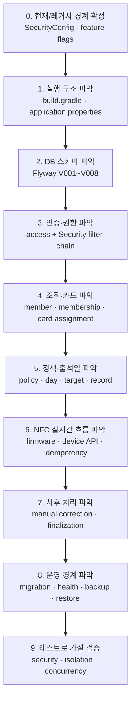

### 단계별 읽기 목록

#### 0단계 — 현재 코드의 경계

1. [SecurityConfig.java](../src/main/java/com/example/attend/config/SecurityConfig.java)
2. [application.properties](../src/main/resources/application.properties)
3. [MenuController.java](../src/main/java/com/example/attend/controller/MenuController.java)
4. [현재 펌웨어](../firmware/attend-nfc/attend-nfc.ino)
5. [배포 금지 레거시 펌웨어](../RFID.ino)

확인할 질문:

- 어떤 URL이 실제로 허용되는가?
- 어떤 기능이 feature flag에 의해 차단되는가?
- 파일이 남아 있는 것과 실행 가능한 것은 어떻게 다른가?

#### 1단계 — 실행 구조

1. [build.gradle](../build.gradle)
2. [AttendApplication.java](../src/main/java/com/example/attend/AttendApplication.java)
3. [TimeConfiguration.java](../src/main/java/com/example/attend/common/config/TimeConfiguration.java)
4. [CorrelationIdFilter.java](../src/main/java/com/example/attend/operations/logging/CorrelationIdFilter.java)

확인할 질문:

- Java 21, Spring Boot, MyBatis, PostgreSQL이 어디서 연결되는가?
- 요청이 비동기 queue가 아니라 DB commit을 기다리는 동기 흐름이라는 근거는 무엇인가?
- 출석 업무 시간대와 서버 `Clock`은 어떻게 주입되는가?

#### 2단계 — DB 스키마

아래 순서대로 migration을 읽는다.

1. [V001 — member 도입/레거시 채택](../src/main/resources/db/migration/V001__adopt_or_create_member.sql)
2. [V002 — department/account](../src/main/resources/db/migration/V002__create_organization_and_accounts.sql)
3. [V003 — membership/card/device](../src/main/resources/db/migration/V003__create_membership_card_and_device.sql)
4. [V004 — attendance policy](../src/main/resources/db/migration/V004__create_attendance_policy.sql)
5. [V005 — attendance day/target/record](../src/main/resources/db/migration/V005__create_attendance_domain.sql)
6. [V006 — tag event/audit](../src/main/resources/db/migration/V006__create_event_and_audit_log.sql)
7. [V007 — scope FK/index](../src/main/resources/db/migration/V007__add_indexes_and_scope_guards.sql)
8. [V008 — updated_at trigger](../src/main/resources/db/migration/V008__add_updated_at_triggers.sql)

확인할 질문:

- 삭제 대신 `ended_at`, `revoked_at`, `unassigned_at`을 쓰는 테이블은 무엇인가?
- 부서 간 잘못된 연결을 막는 composite FK는 무엇인가?
- 애플리케이션 검증 없이 DB만으로 막을 수 없는 규칙은 무엇인가?

#### 3단계 — 인증·권한

1. [AccountUserDetailsService.java](../src/main/java/com/example/attend/access/security/AccountUserDetailsService.java)
2. [AccountSecurityMapper.xml](../src/main/resources/com/example/attend/access/infrastructure/mybatis/AccountSecurityMapper.xml)
3. [DatabaseSystemAuthorization.java](../src/main/java/com/example/attend/access/application/DatabaseSystemAuthorization.java)
4. [DatabaseDepartmentAuthorization.java](../src/main/java/com/example/attend/access/application/DatabaseDepartmentAuthorization.java)
5. [DepartmentAuthorizationMapper.xml](../src/main/resources/com/example/attend/access/infrastructure/mybatis/DepartmentAuthorizationMapper.xml)
6. [CredentialTokenService.java](../src/main/java/com/example/attend/access/application/CredentialTokenService.java)

확인할 질문:

- URL 권한과 정확한 부서 권한이 왜 두 번 검사되는가?
- `SYSTEM_ADMIN`이 부서 관리자 권한을 자동으로 갖지 않는 이유는 무엇인가?
- 초대/재설정 raw token이 DB에 저장되지 않는 흐름은 어떻게 구성되는가?

#### 4단계 — 조직·교사·카드

1. [TeacherRosterService.java](../src/main/java/com/example/attend/organization/application/TeacherRosterService.java)
2. [CardManagementService.java](../src/main/java/com/example/attend/organization/application/CardManagementService.java)
3. [DepartmentMembershipExclusionService.java](../src/main/java/com/example/attend/attendance/application/DepartmentMembershipExclusionService.java)
4. [OrganizationMapper.xml](../src/main/resources/com/example/attend/organization/infrastructure/mybatis/OrganizationMapper.xml)

확인할 질문:

- `member`, `department_membership`, `nfc_card_assignment`을 분리한 이유는 무엇인가?
- 카드 상태와 assignment 이력이 각각 무엇을 표현하는가?
- 교사를 제외할 때 물리 삭제 대신 어떤 상태들이 종료되는가?

#### 5단계 — 정책·출석일·기록

1. [AttendancePolicyService.java](../src/main/java/com/example/attend/attendance/application/AttendancePolicyService.java)
2. [AttendancePolicy.java](../src/main/java/com/example/attend/attendance/domain/AttendancePolicy.java)
3. [AttendanceDayService.java](../src/main/java/com/example/attend/attendance/application/AttendanceDayService.java)
4. [AttendanceTargetService.java](../src/main/java/com/example/attend/attendance/application/AttendanceTargetService.java)
5. [AttendanceCorrectionService.java](../src/main/java/com/example/attend/attendance/application/AttendanceCorrectionService.java)
6. [AttendancePolicyMapper.xml](../src/main/resources/com/example/attend/attendance/infrastructure/mybatis/AttendancePolicyMapper.xml)
7. [AttendanceDayMapper.xml](../src/main/resources/com/example/attend/attendance/infrastructure/mybatis/AttendanceDayMapper.xml)
8. [AttendanceRecordMapper.xml](../src/main/resources/com/example/attend/attendance/infrastructure/mybatis/AttendanceRecordMapper.xml)

확인할 질문:

- 정책을 수정하지 않고 버전으로 발행하는 이유는 무엇인가?
- `attendance_target`이 단순 조회 결과가 아니라 snapshot인 이유는 무엇인가?
- `attendance_record`가 policy/band label을 snapshot으로 저장하는 이유는 무엇인가?

#### 6단계 — NFC 장치와 실시간 체크인

1. [현재 펌웨어](../firmware/attend-nfc/attend-nfc.ino)
2. [DeviceApiController.java](../src/main/java/com/example/attend/device/web/DeviceApiController.java)
3. [DeviceCheckInRequestParser.java](../src/main/java/com/example/attend/device/web/DeviceCheckInRequestParser.java)
4. [DeviceAuthenticationService.java](../src/main/java/com/example/attend/device/application/DeviceAuthenticationService.java)
5. [DeviceCheckInService.java](../src/main/java/com/example/attend/device/application/DeviceCheckInService.java)
6. [DeviceApiMapper.xml](../src/main/resources/com/example/attend/device/infrastructure/mybatis/DeviceApiMapper.xml)
7. [DeviceCheckInMapper.xml](../src/main/resources/com/example/attend/device/infrastructure/mybatis/DeviceCheckInMapper.xml)
8. [장치 OpenAPI](device-api.yaml)

확인할 질문:

- `requestId`를 펌웨어가 생성하고 서버가 저장하는 이유는 무엇인가?
- 인증 성공의 `last_seen_at`과 출석 transaction이 왜 분리되어 있는가?
- 최초 HTTP 응답 전체를 `tag_event_log`에 저장하는 이유는 무엇인가?

#### 7단계 — 자동 마감·통계

1. [AttendanceFinalizationScheduler.java](../src/main/java/com/example/attend/attendance/scheduler/AttendanceFinalizationScheduler.java)
2. [FinalizeAttendanceDayService.java](../src/main/java/com/example/attend/attendance/application/FinalizeAttendanceDayService.java)
3. [AttendanceStatisticsService.java](../src/main/java/com/example/attend/attendance/application/AttendanceStatisticsService.java)
4. [AttendanceStatisticsMapper.xml](../src/main/resources/com/example/attend/attendance/infrastructure/mybatis/AttendanceStatisticsMapper.xml)

확인할 질문:

- 자동 결석은 왜 당일 마감 시각 직후가 아니라 다음 날짜부터 생성되는가?
- 한 날짜의 마감 실패가 다른 날짜를 막지 않는 이유는 무엇인가?
- 공식 통계가 `FINALIZED` 날짜만 집계하는 이유는 무엇인가?

#### 8단계 — 운영 경계

1. [DatabasePreflightInspector.java](../src/main/java/com/example/attend/database/DatabasePreflightInspector.java)
2. [DatabaseMigrationRunner.java](../src/main/java/com/example/attend/database/DatabaseMigrationRunner.java)
3. [SchemaVersionGuard.java](../src/main/java/com/example/attend/database/SchemaVersionGuard.java)
4. [RuntimeDatabasePrivilegeGuard.java](../src/main/java/com/example/attend/database/RuntimeDatabasePrivilegeGuard.java)
5. [SystemAdminBootstrapCli.java](../src/main/java/com/example/attend/access/bootstrap/SystemAdminBootstrapCli.java)
6. [backup.sh](../ops/backup/backup.sh)
7. [restore-verify.sh](../ops/backup/restore-verify.sh)

---

## 2. 핵심 DB 관계

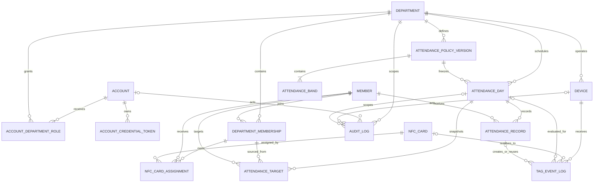

### 테이블을 읽는 기준

| 영역 | 사실의 원본 |
|---|---|
| 로그인·계정 상태 | `account` |
| 부서 관리자 권한 | `account_department_role` |
| 교사 원본 | `member` |
| 부서 소속 이력 | `department_membership` |
| 카드 상태 | `nfc_card` |
| 카드-교사 연결 이력 | `nfc_card_assignment` |
| 판정 규칙 | `attendance_policy_version`, `attendance_band` |
| 날짜별 대상 snapshot | `attendance_day`, `attendance_target` |
| 공식 출석 결과 | `attendance_record` |
| NFC 요청·멱등 응답 | `tag_event_log` |
| 관리자·시스템 변경 이력 | `audit_log` |

---

## 3. 실행 진입점 전체 지도

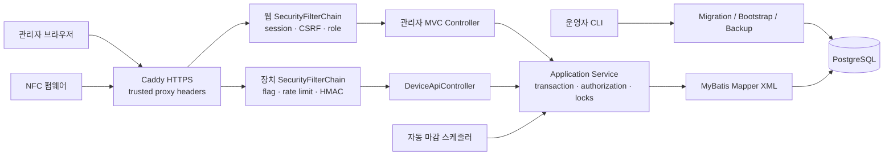

### 공통 관리자 쓰기 구조

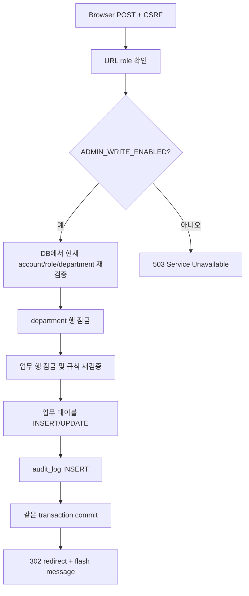

> 대부분의 관리자 변경은 위 흐름을 따르지만, 현재 `replaceDraft()`는 정책 초안을
> 변경하면서 `audit_log`를 작성하지 않는다.

---

## 4. 로그인·계정 데이터 흐름

### 로그인과 워크스페이스 선택

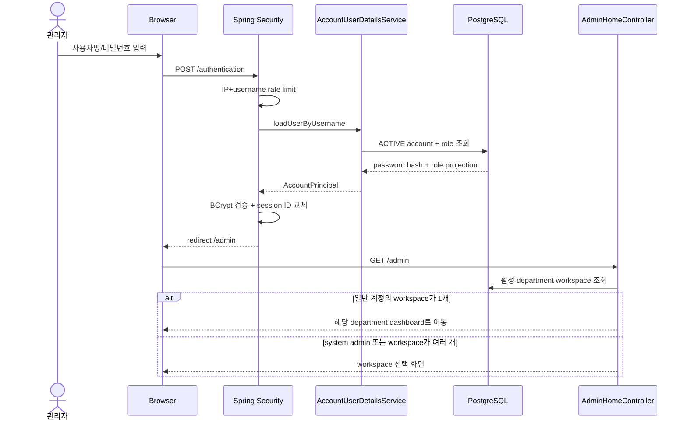

### 계정 초대·비밀번호 설정

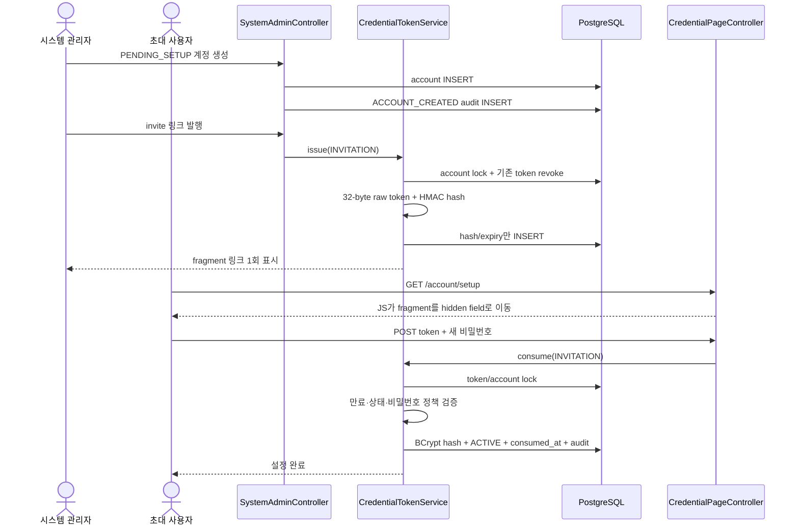

### 계정 상태·역할 변화

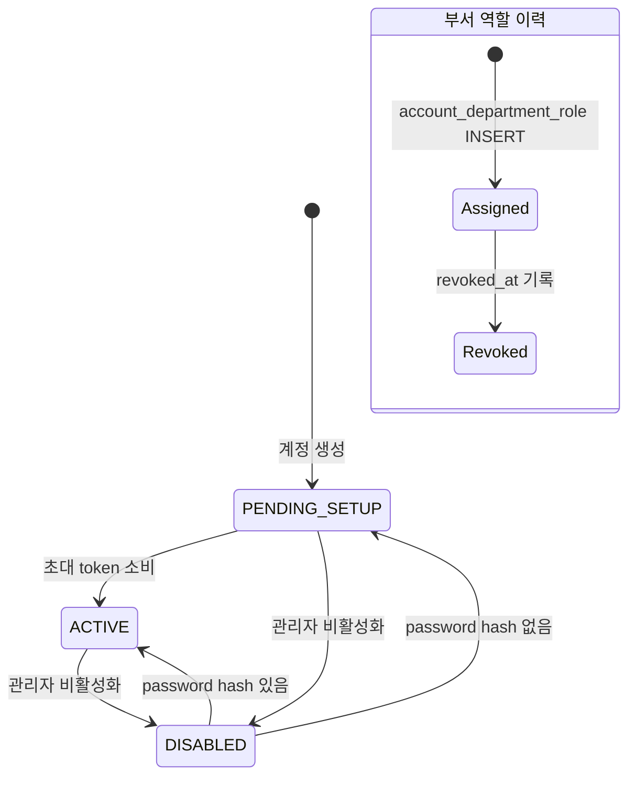

---

## 5. 장치 등록·활성화 흐름

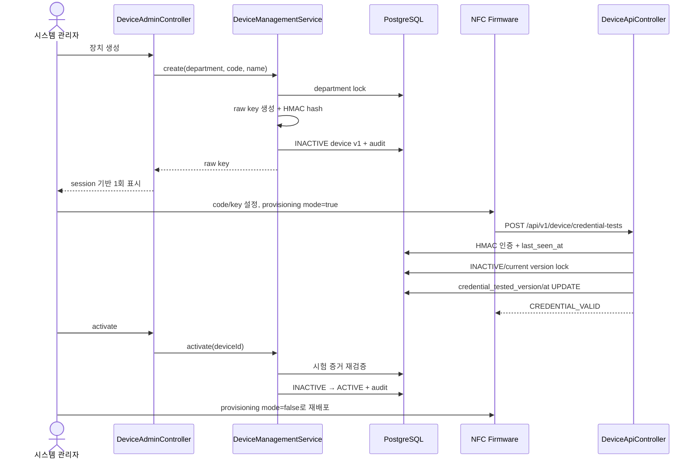

### 장치 상태 전이

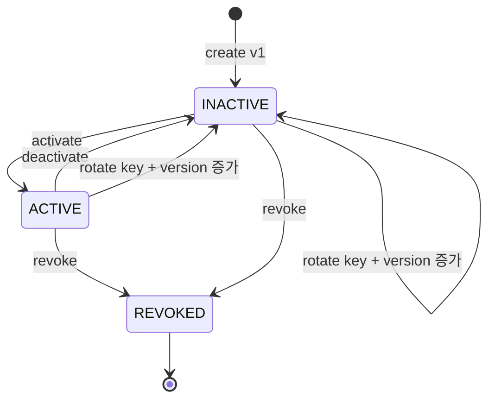

---

## 6. 교사·소속·카드 흐름

### 교사 추가

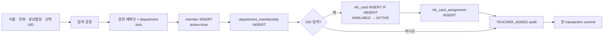

### 카드 연결·교체·종료

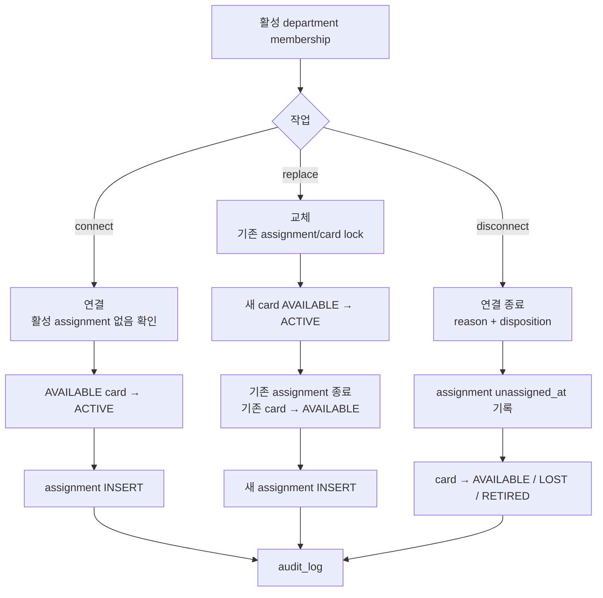

### 부서에서 교사 제외

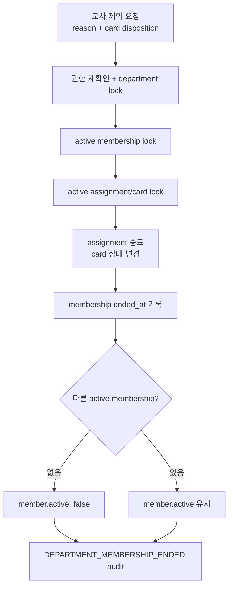

> 현재 Controller는 `futureAttendanceDayIds`에 항상 빈 목록을 전달한다. 따라서 이미
> snapshot된 미래 `attendance_target`은 이 흐름에서 제외되지 않는다.

### 미등록 카드 등록함

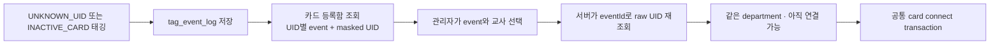

---

## 7. 정책·출석일·대상자 흐름

### 정책 생명주기

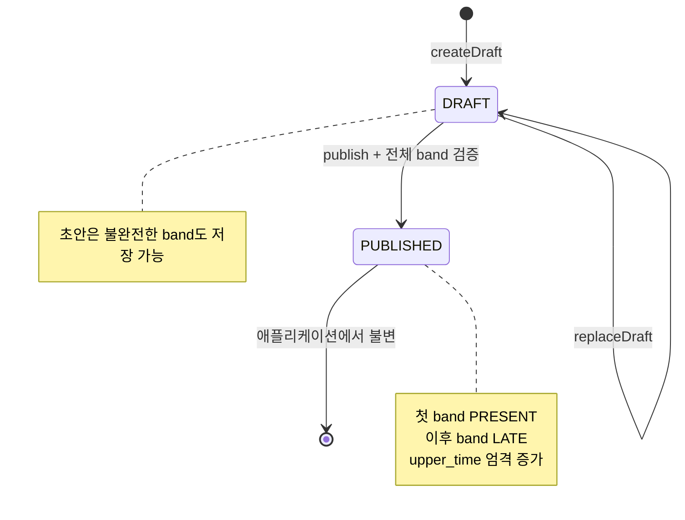

### 출석일 생성과 대상 snapshot

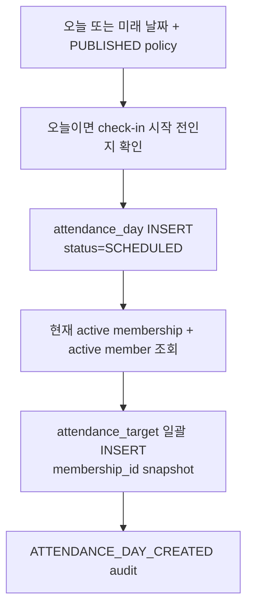

### 대상자 변경

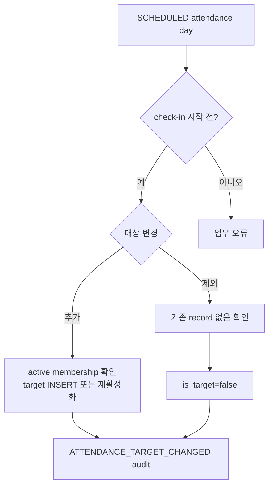

---

## 8. NFC 체크인 전체 데이터 흐름

### 정상·중복·멱등 처리

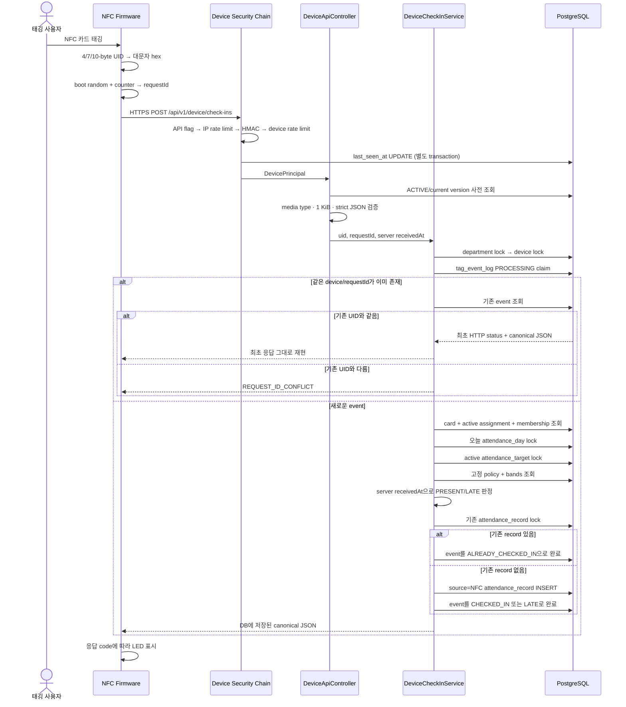

### 체크인 판정 순서

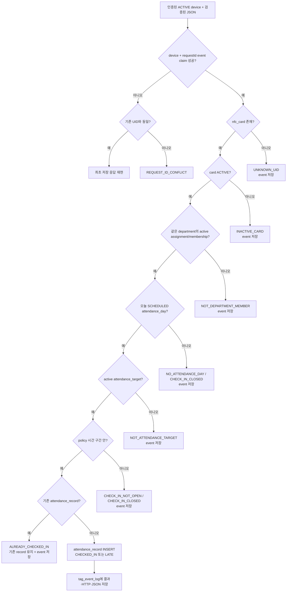

### DB 저장 여부

| 결과 | HTTP | `tag_event_log` | `attendance_record` |
|---|---:|---|---|
| `CHECKED_IN`, `LATE` | 201 | terminal event 저장 | 신규 저장 |
| `ALREADY_CHECKED_IN` | 200 | terminal event 저장 | 기존 기록 유지 |
| 카드·소속·날짜·대상·시간 업무 거부 | 404/409 | terminal event 저장 | 저장 안 함 |
| 같은 requestId에 다른 UID | 409 | 기존 event 불변 | 저장 안 함 |
| API off, rate limit, 인증, JSON 오류 | 4xx/5xx | 저장 안 함 | 저장 안 함 |
| transaction 중 device 상태 변경 | 409 | claim rollback | 저장 안 함 |

### 펌웨어 재시도와 LED

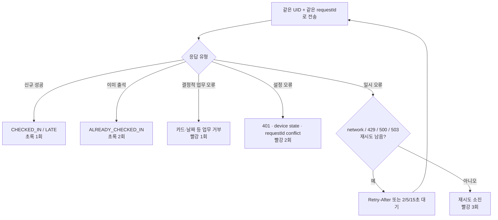

---

## 9. 수동 정정·자동 마감·통계

### 수동 출석 정정

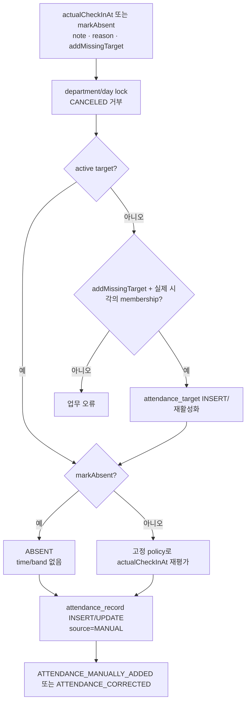

> 현재 구현은 `CANCELED`만 차단한다. 따라서 미래 `SCHEDULED` 날짜에도
> `markAbsent=true`로 결석 기록을 만들 수 있다.

### 자동 마감

```mermaid
sequenceDiagram
    participant Scheduler as AttendanceFinalizationScheduler
    participant Service as FinalizeAttendanceDayService
    participant DB as PostgreSQL

    loop 기본 5분 fixed delay
        Scheduler->>Service: findPendingDayIds
        Service->>DB: 오늘보다 이전인 SCHEDULED day 조회
        loop 각 day를 독립 transaction으로 처리
            Scheduler->>Service: finalizeDay(dayId)
            Service->>DB: department → day lock
            Service->>DB: target인데 record 없는 행에 AUTO_ABSENCE INSERT
            Service->>DB: day FINALIZED
            Service->>DB: idempotent system audit INSERT
        end
    end
```

### 공식 통계

```mermaid
flowchart LR
    Range["member + inclusive date range"]
    Auth["정확한 department 권한 확인"]
    Targets["is_target=true target"]
    Finalized["day.status=FINALIZED"]
    Records["attendance_record LEFT JOIN"]
    Summary["PRESENT · LATE · ABSENT 집계"]
    Bands["LATE band snapshot별 집계"]

    Range --> Auth --> Targets --> Finalized --> Records --> Summary --> Bands
```

---

## 10. DB migration·배포·백업 흐름

### Migration과 운영 애플리케이션 기동

```mermaid
flowchart TD
    Preflight["dbPreflight<br/>read-only transaction"]
    Class{"DB 분류"}
    Fresh["FRESH"]
    Legacy["LEGACY_CANDIDATE"]
    Managed["ALREADY_MANAGED"]
    Reject["REJECTED<br/>중단"]
    Approval["MIGRATION_SOURCE_CLASS와 대조"]
    Baseline["legacy만 baseline 0"]
    Migrate["Flyway V001~V008"]
    Validate["Flyway validate + exact version guard"]
    Grants["runtime 최소 권한 적용"]
    Start["prod app 시작<br/>Flyway auto-migrate=false"]
    RuntimeGuard["SchemaVersionGuard<br/>RuntimeDatabasePrivilegeGuard<br/>ProductionAdminSecurityGuard"]
    Health["loopback /actuator/health"]
    Proxy["Caddy가 app traffic 개방"]

    Preflight --> Class
    Class --> Fresh --> Approval
    Class --> Legacy --> Approval
    Class --> Managed --> Migrate
    Class --> Reject
    Approval --> Baseline --> Migrate
    Approval --> Migrate
    Migrate --> Validate --> Grants --> Start --> RuntimeGuard --> Health --> Proxy
```

### 백업·복원 검증

```mermaid
flowchart LR
    DirectDB[("PostgreSQL direct URL")]
    Dump["pg_dump custom format<br/>partial file"]
    Rename["atomic rename"]
    Checksum["SHA-256 checksum"]
    Artifact["backup artifact"]

    Verify["checksum 검증"]
    Empty["격리 대상 DB가 비었는지 확인"]
    Restore["pg_restore<br/>--clean 사용 안 함"]
    Schema["필수 테이블 + Flyway history 검증"]

    DirectDB --> Dump --> Rename --> Checksum --> Artifact
    Artifact --> Verify --> Empty --> Restore --> Schema
```

---

## 11. 현재 구현을 읽을 때 오해하면 안 되는 점

1. **현재 코드에는 DB RLS가 없다.** 부서 격리는 Service 권한 검사, SQL의
   `department_id`, composite FK에 의존한다.
2. **`SYSTEM_ADMIN`과 `DEPARTMENT_ADMIN`은 별개다.** 시스템 관리자도 부서 역할이
   없으면 부서 업무 데이터에 접근할 수 없다.
3. **관리자 쓰기 flag는 공개 setup/reset 소비에도 적용된다.** 링크 발행 후 flag를
   끄면 사용자는 503을 받는다.
4. **계정 disable은 기존 세션을 즉시 제거하지 않는다.** 중요 Service는 DB 권한
   재검증으로 막지만 세션은 idle 30분 또는 absolute 8시간까지 남을 수 있다.
5. **장치 HMAC 인증 성공 시 업무 검증보다 먼저 `last_seen_at`이 기록된다.** 이후
   JSON 오류나 상태 오류가 나도 최근 접속 시각은 갱신될 수 있다.
6. **카드 등록함에는 기간 제한과 `LIMIT`이 없다.** 카드가 다시 `AVAILABLE`이 되면
   오래된 이벤트가 재등장할 수 있다.
7. **정책 초안 `replaceDraft()`는 현재 audit을 남기지 않는다.**
8. **교사 제외 UI는 미래 target ID를 전달하지 않는다.** 미래 snapshot이 남아 자동
   결석으로 이어질 수 있다.
9. **Operations 화면의 backup 상태는 실제 감시 결과가 아니라 확인 불가 상태다.**

---

## 12. 새로운 흐름을 추적하는 방법

어떤 기능을 추가로 분석하더라도 아래 순서를 반복한다.

```mermaid
flowchart LR
    Route["1. Route / Scheduler / CLI"]
    Security["2. Security · flag · CSRF"]
    Controller["3. Controller input/output"]
    Service["4. Application Service transaction"]
    Locks["5. authorization · lock order · time guard"]
    Mapper["6. Mapper interface/XML"]
    Constraints["7. migration constraint/index"]
    SideEffect["8. audit/event/response/retry"]
    Tests["9. integration test로 실제 계약 확인"]

    Route --> Security --> Controller --> Service --> Locks --> Mapper --> Constraints --> SideEffect --> Tests
```

각 흐름마다 다음 질문에 답할 수 있으면 코드 이해가 끝난 것이다.

- 누가 이 흐름을 시작하는가?
- 어떤 인증·권한·feature flag를 통과하는가?
- transaction은 어디서 시작하고 끝나는가?
- 어떤 행을 어떤 순서로 잠그는가?
- 어떤 테이블을 읽고 변경하는가?
- 실패하면 무엇이 rollback되고 무엇이 남는가?
- 재시도하면 같은 결과가 재현되는가?
- `audit_log` 또는 `tag_event_log`에 어떤 흔적이 남는가?
- 사용자·장치가 최종적으로 어떤 응답을 받는가?
