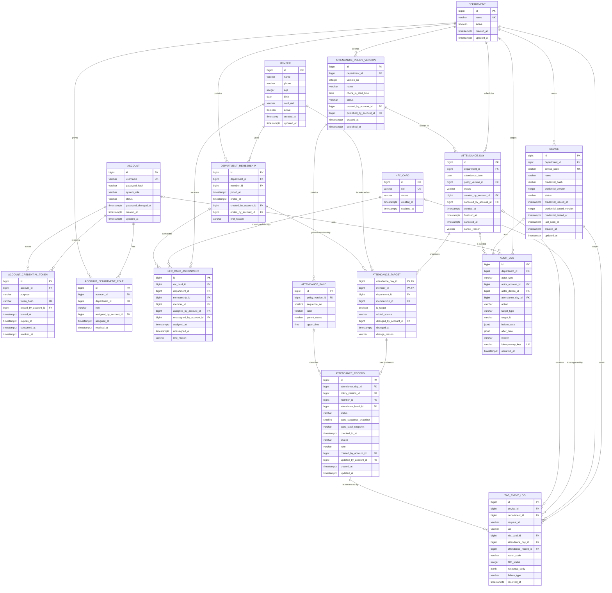
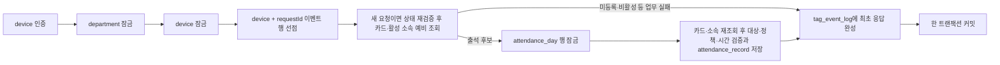

# Attend 데이터베이스 구조 설계

> 기준 문서: [PROJECT_DEFINITION.md](./PROJECT_DEFINITION.md)
>
> 대상: PostgreSQL 기반 MVP

## 0. 설계 결론

현재 확정된 정책만으로 MVP 데이터베이스를 설계할 수 있다. 구현을 막는 추가 정책 결정은 없다.

아직 확정되지 않았지만 1차 스키마를 막지 않는 항목은 다음 기본값으로 둔다.

- 결석 사유는 별도 출석 상태로 만들지 않고 `attendance_record.note`와 감사 로그에 기록한다.
- 구성원 한 명은 동시에 활성 NFC 카드 한 장만 사용한다. 향후 복수 카드를 허용하면 부분 유일 인덱스 하나만 제거한다.
- 기존 `member` 테이블을 출석 대상 구성원의 기준 테이블로 재사용한다. 여기서 구성원은 출석 대상자를 의미하며 관리자 로그인 계정인 `account`와는 별개다.
- `OPEN`은 DB 저장 상태가 아니라 `attendance_date = Asia/Seoul 기준 오늘`일 때 계산하는 운영 상태다.
- 모든 업무 시각은 `TIMESTAMPTZ`, 출석 대상 날짜는 `DATE`, 정책의 시각 구간은 `TIME WITHOUT TIME ZONE`으로 저장한다.
- 기존 `member.created_at`만 레거시 호환을 위해 `TIMESTAMP WITHOUT TIME ZONE`으로 보존하고 신규 판정·통계 로직에서는 사용하지 않는다.
- 운영 데이터는 물리 삭제하지 않고 비활성화·종료·취소 상태로 보존한다.

---

## 1. 핵심 설계 원칙

1. **부서가 보안 경계다.** 부서 데이터 조회에는 항상 `department_id` 조건이 포함되어야 한다.
2. **출석 단위는 부서·구성원·날짜다.** 한 부서에는 날짜별 출석일 하나, 한 대상자에는 최종 출석 기록 하나만 존재한다.
3. **출석 대상자를 먼저 확정한다.** 출석 기록은 반드시 `attendance_target`을 참조한다. 태깅 시작 후 발견한 누락자는 사유가 있는 수동 출석 등록과 같은 트랜잭션에서만 예외적으로 추가한다.
4. **정책은 버전으로 고정한다.** 발행된 정책과 구간은 변경하지 않고 새 버전을 만든다.
5. **지각 단계는 행 데이터다.** `1차 지각`, `2차 지각`을 DB enum이나 컬럼으로 고정하지 않는다.
6. **결석은 자동 마감에서 생성한다.** 기록이 없는 대상자만 `ABSENT`로 삽입한다.
7. **이력은 삭제하지 않는다.** 소속, 카드 연결, 관리자 권한은 종료 시각으로 이력을 남긴다.
8. **통계 요약 테이블은 두지 않는다.** MVP 규모에서는 확정된 날짜·대상자·출석 기록에서 즉시 집계한다.
9. **상태값은 `VARCHAR + CHECK`로 제한한다.** 변경이 어려운 PostgreSQL enum 타입은 사용하지 않는다.

새로 만드는 테이블의 단일 대체키는 `BIGINT GENERATED BY DEFAULT AS IDENTITY`를 기본으로 사용한다. 기존 `member.id`의 `BIGSERIAL` sequence는 PK 값을 보존하기 위해 그대로 유지한다.

---

## 2. 전체 ERD



---

## 3. 테이블별 역할과 핵심 제약

### 3.1 조직과 권한

| 테이블 | 역할 | 핵심 제약 |
|---|---|---|
| `department` | 교회 내 독립 운영 부서 | 이름 유일, 물리 삭제 금지 |
| `account` | 관리자 로그인 계정과 회원가입 초대 진행 상태 | 사용자명 대소문자 무시 유일, 상태와 nullable 비밀번호 hash·변경 시각의 일관성 |
| `account_credential_token` | 회원가입 초대와 비밀번호 재설정용 일회성 token | `INVITATION`·`RESET`, lowercase HMAC-SHA-256 hash, 계정·목적별 활성 token 최대 한 건 |
| `account_department_role` | 계정의 부서별 관리자 권한과 이력 | 동일 계정·부서·역할의 활성 권한은 한 건 |

`account.system_role`은 `SYSTEM_ADMIN` 또는 `NULL`만 허용한다. 부서 관리자 권한은 `account`에 직접 넣지 않고 `account_department_role`로 분리해 한 관리자가 여러 부서를 담당할 수 있게 한다.

`account.status`는 `PENDING_SETUP`, `ACTIVE`, `DISABLED`만 허용한다. `PENDING_SETUP`은 `password_hash`와 `password_changed_at`이 모두 `NULL`이어야 하고, `ACTIVE`는 두 값이 모두 있어야 한다. `DISABLED`는 초대 대기 중 비활성화된 계정과 비밀번호 설정 후 비활성화된 계정을 모두 보존하기 위해 두 값이 모두 `NULL`이거나 모두 존재하는 조합만 허용한다. 따라서 비밀번호가 없는 계정이 로그인 가능한 상태가 되거나 hash와 변경 시각 중 하나만 저장되는 중간 상태는 DB `CHECK`로 거부된다.

`account_credential_token.purpose`는 회원가입 초대 `INVITATION`과 비밀번호 재설정 `RESET`으로 제한한다. 서버는 원문 token을 저장하지 않고 별도 pepper를 사용한 HMAC-SHA-256 결과를 64자 lowercase 16진수 `token_hash`로 저장한다. 대상 계정, 발급 관리자, 발급·만료·사용·무효 시각을 보존하고 만료 시각은 발급 후 최대 30분까지만 허용한다. 사용과 무효는 동시에 기록할 수 없으며, 사용 시각은 유효기간 안이어야 하고 무효 시각은 발급 시각보다 빠를 수 없다. `(account_id, purpose)`별 미사용·미무효 token은 부분 유일 인덱스로 최대 한 건만 허용하므로 새 token 발급 서비스는 기존 활성 token 무효화와 새 행 생성을 한 트랜잭션으로 처리한다.

### 3.2 구성원, 소속, NFC 카드, 장치

| 테이블 | 역할 | 핵심 제약 |
|---|---|---|
| `member` | 출석 대상 구성원의 기준 정보. 기존 테이블 재사용 | 이름 필수, 연락처 선택, 부서 제외 시 물리 삭제 금지 |
| `department_membership` | 구성원의 부서 소속 이력 | MVP에서 구성원별 활성 소속 최대 한 건, 소속 제외 처리 관리자·사유 보존 |
| `nfc_card` | 물리 NFC 카드 | 정규화한 UID 전역 유일, 이벤트의 카드 ID–UID 복합 참조 기준 |
| `nfc_card_assignment` | 카드와 부서 소속 구성원의 연결 이력 | 카드별·구성원별 활성 연결 각각 최대 한 건, 자기 부서 활성 소속만 연결 |
| `device` | Arduino/NFC 단말기와 인증정보 | 장치 코드 유일, 한 부서에 고정 귀속, `ACTIVE`는 현재 key의 시험 증거 필수 |

`member`는 관리자 로그인용 `account`와 다른 개념이다. 기존 `member.id`, `name`, `phone`, `created_at`의 타입과 값을 보존하고 신규 운영에 필요한 `active`, `updated_at`을 추가한다. 단, 빈 문자열 전화번호는 immutable 원본 백업과 명시적 승인·정정 기록 후 `NULL`로 정규화할 수 있다. `active`의 기본값은 신규·레거시 경로 모두 `FALSE`이며, 승인된 구성원만 소속 생성과 같은 트랜잭션에서 활성화한다. 기존 행에 처음 설정되는 `updated_at`은 원본 변경 시각이 아니라 스키마 채택 시각이다. 기존 `created_at`은 레거시 표시용일 뿐 업무 시각으로 사용하지 않는다. 기존 `age`, `birth`는 신규 화면과 업무 로직에서 사용하지 않되 보유기간 정책이 확정되기 전까지 물리 삭제하지 않는다.

기존 `member.card_uid`는 이관 입력으로만 사용한다. 검증된 UID를 `nfc_card`와 `nfc_card_assignment`로 옮긴 뒤 신규 애플리케이션은 `member.card_uid`를 읽거나 수정하지 않는다. 카드의 현재 상태와 연결 이력에 대한 유일한 기준은 새 카드 테이블들이다.

NFC UID는 대문자 16진수 문자열로 정규화한다. 카드 연결을 별도 테이블로 둬 카드 교체·분실·재연결 이력을 보존한다. 부서 관리자는 `department_membership.department_id`가 자기 권한 범위와 일치하는 구성원만 추가·제외하고 카드를 연결할 수 있다.

소속 제외와 카드 연결 해제 시각을 기록할 때는 인증된 부서 관리자 계정 ID와 비어 있지 않은 사유를 함께 저장한다. 처리 관리자 ID는 클라이언트 입력을 신뢰하지 않고 인증 세션에서 서버가 결정한다. 화면의 필수 입력만으로는 API 직접 호출을 막을 수 없으므로 Spring 입력·권한 검증과 DB `CHECK`를 함께 적용한다.

MVP에서는 `department.active`를 생성 시 `TRUE`로 두고 변경하는 application command를 제공하지 않는다. 이 컬럼은 후속 부서 비활성화·재활성화 기능을 위한 예약 필드다.

카드의 UID와 물리 행은 수정·삭제하지 않는다. 등록·재연결은 `AVAILABLE → ACTIVE`와 assignment 생성을, 정상 해제·교체는 assignment 종료와 `ACTIVE → AVAILABLE`을, 분실은 assignment 종료와 `ACTIVE → LOST`를, 영구 폐기는 필요 시 assignment 종료와 `RETIRED` 전이를 각각 같은 트랜잭션에서 처리한다. `RETIRED` 카드는 다시 연결하지 않는다. 이 교차 행 규칙은 단일 `CHECK`로 표현할 수 없으므로 서비스 잠금·검증과 PostgreSQL 통합 테스트로 보장한다.

새 장치는 자격증명 발급만으로 출석 요청을 허용하지 않도록 `INACTIVE`가 기본값이다. 실제 장치 설정과 제한된 통합 시험을 통과한 뒤에만 명시적으로 `ACTIVE`로 전환한다. 범용 인증 telemetry인 `last_seen_at`을 시험 증거로 사용하지 않는다. credential-test 성공 transaction만 현재 `credential_version`과 같은 `credential_tested_version` 및 `credential_tested_at`을 기록하며, 키 발급·교체 또는 관리자의 비활성화는 두 시험 필드를 `NULL`로 초기화한다. 활성화 service는 잠근 장치에서 시험 version이 현재 version과 같고 시험 시각이 `credential_issued_at` 이상인지 확인한다. DB도 `ACTIVE` 행에는 같은 현재 version의 유효한 시험 증거가 반드시 존재하도록 `CHECK`로 방어해 직접 update로 이 규칙을 우회하지 못하게 한다.

MVP에서 `device.department_id`는 생성 후 불변이다. 다른 부서로 옮기는 update는 거부하고, 잘못 배정한 장치는 `REVOKED`로 끝낸 뒤 올바른 부서에 새 `device_code`와 자격증명으로 등록한다.

### 3.3 출석 정책

| 테이블 | 역할 | 핵심 제약 |
|---|---|---|
| `attendance_policy_version` | 부서별 출석 정책 버전 | `(department_id, version_no)` 유일 |
| `attendance_band` | 정상 출석과 동적 지각 구간 | 정책별 순서·상한 시각 유일 |

정책 상태 컬럼은 `DRAFT`, `PUBLISHED`, `RETIRED`를 허용하지만 MVP application은 `DRAFT → PUBLISHED` 전이만 제공한다. `RETIRED`는 후속 기능을 위한 예약값이다. `PUBLISHED` 이후 정책과 구간의 수정·삭제는 거부한다.

다음 다중 행 규칙은 단순 `CHECK`로 보장할 수 없으므로 정책 발행 트랜잭션에서 부모 `attendance_policy_version` 행을 먼저 잠근 뒤 전체 구간을 검증한다. 구간 추가·수정·삭제도 같은 부모 행을 먼저 잠가야 하며, 검증과 `PUBLISHED` 전환을 한 트랜잭션에서 처리한다.

- 첫 구간만 `PRESENT`
- 두 번째 구간부터 모두 `LATE`
- 지각 구간 최소 한 개
- `check_in_start_time <= 첫 구간 upper_time`
- 모든 `upper_time`이 엄격한 오름차순
- 자정을 넘기는 구간 없음

### 3.4 출석일, 대상자, 최종 기록

| 테이블 | 역할 | 핵심 제약 |
|---|---|---|
| `attendance_day` | 부서별 출석 대상 날짜와 적용 정책 | `(department_id, attendance_date)` 유일 |
| `attendance_target` | 날짜 등록 시점의 대상자 스냅샷과 사후 누락자 추가 이력 | `(attendance_day_id, member_id)` 기본키 |
| `attendance_record` | 대상자의 최종 정상·지각·결석 상태 | `(attendance_day_id, member_id)` 유일, 대상자 FK와 날짜–정책–구간–상태 복합 FK |

`attendance_day.status`에는 `SCHEDULED`, `FINALIZED`, `CANCELED`만 저장한다. `OPEN`은 저장하지 않는다.

`attendance_record`는 다음 조건을 만족해야 한다.

- 상태는 `PRESENT`, `LATE`, `ABSENT` 중 하나다.
- `PRESENT` 또는 `LATE`이면 `checked_in_at`, `attendance_band_id`, 구간 스냅샷이 필수다.
- `ABSENT`이면 `checked_in_at`, `attendance_band_id`, 구간 스냅샷은 `NULL`이다.
- 참조한 구간은 해당 출석 날짜의 정책 버전에 속하고, 구간의 `parent_status`는 기록의 상태와 같아야 한다.
- 현재 판정 원천은 `NFC`, `AUTO_ABSENCE`, `MANUAL` 중 하나다.
- `NFC`는 `PRESENT`·`LATE`, `AUTO_ABSENCE`는 `ABSENT`에만 사용하고, 관리자가 상태에 영향을 주는 등록·정정을 하면 `MANUAL`을 사용한다.
- 상태에 영향을 주는 수동 등록·정정은 `source = 'MANUAL'`로 바꾸고 처리 관리자 ID를 남긴다. 메모만 수정할 때는 기존 `source`를 유지한다.
- `PRESENT`·`LATE` 수동 등록·정정에는 실제 출석 시각이 필수다. 서버는 이 시각이 해당 출석 날짜와 소속 기간 `[department_membership.joined_at, ended_at)` 안인지 검증한다. `ended_at IS NULL`이면 현재도 소속 중이다.
- `PRESENT`·`LATE` 상태와 구간은 관리자가 임의 선택하지 않고, 입력한 실제 출석 시각과 해당 날짜에 고정된 정책으로 서버가 계산한다. `ABSENT` 수동 정정은 출석 시각과 구간을 `NULL`로 저장한다.
- 소속 기간 검증을 통과한 누락자는 `CANCELED`가 아닌 날짜에서 활성 `attendance_target`과 `MANUAL` 기록을 같은 트랜잭션으로 추가한다. 대상자만 추가하는 부분 성공은 허용하지 않는다.
- 정정 시 기존 행을 삭제하지 않고 갱신하며, 변경 전후 값과 사유를 `audit_log`에 남긴다.

구간과 날짜 정책 및 구간 `parent_status`의 일치는 복합 FK로 보장한다. `is_target = TRUE`, 출석 기록이 생긴 날짜의 취소 금지, 태깅 시작 후 일반 정책·대상자 변경 금지와 누락자 사후 수동 등록 예외는 여러 테이블과 현재 시각을 함께 확인해야 하므로 서비스 트랜잭션 또는 DB 트리거에서 검증한다.

### 3.5 태깅 및 감사 로그

| 테이블 | 역할 | 핵심 제약 |
|---|---|---|
| `tag_event_log` | 인증되고 UID 형식이 유효한 장치 요청과 최초 확정 응답 보존 | `(device_id, request_id)` 유일, request ID는 `[A-Za-z0-9_-]` 1~64자 |
| `audit_log` | 관리자·시스템의 업무 변경 이력. `DEVICE` actor는 후속 비태깅 장치 작업을 위한 예약 형태 | `idempotency_key`가 있으면 유일 |

`tag_event_log.response_body`는 동일 요청 재시도 시 최초 HTTP 상태와 응답 본문을 재현하기 위해 저장한다. 미등록 카드는 `result_code = 'UNKNOWN_UID'`인 최근 이벤트에서 조회한다. 저장 가능한 `result_code`는 내부 선점 상태 `PROCESSING`과 `CHECKED_IN`, `LATE`, `ALREADY_CHECKED_IN`, `UNKNOWN_UID`, `INACTIVE_CARD`, `NOT_DEPARTMENT_MEMBER`, `NO_ATTENDANCE_DAY`, `NOT_ATTENDANCE_TARGET`, `CHECK_IN_NOT_OPEN`, `CHECK_IN_CLOSED`로 제한한다. `NOT_ATTENDANCE_TARGET`은 날짜는 존재하지만 해당 교사의 활성 `attendance_target`이 없음을 뜻하며 부서 소속 실패와 구분한다. 인증 전 `DEVICE_UNAUTHORIZED`, 형식 검증 단계의 `INVALID_REQUEST`, 기존 이벤트를 보존해야 하는 `REQUEST_ID_CONFLICT`, 트랜잭션을 롤백하는 `SERVER_ERROR`는 이 행의 결과 코드로 저장하지 않는다.

정상·실패·중복 태깅은 `tag_event_log`에만 저장하고 같은 내용을 `audit_log`에 중복 저장하지 않는다. 같은 `(device_id, request_id)` 재시도는 유일 제약으로 event 한 행만 사용한다. 새 request ID로 실제 재태깅한 시도는 별도 event이므로 보존하되 `(attendance_day_id, member_id)` 유일 제약으로 최종 출석 기록은 한 건만 유지한다.

자동 마감 감사 로그의 `idempotency_key`는 `attendance-day:{dayId}:finalize` 형식으로 생성해 한 날짜에 한 건만 남긴다.

---

## 4. DB가 직접 보장할 제약

### 4.1 일일 출석 유일성

```text
attendance_day:
    UNIQUE (department_id, attendance_date)

attendance_target:
    PRIMARY KEY (attendance_day_id, member_id)

attendance_record:
    UNIQUE (attendance_day_id, member_id)
    FOREIGN KEY (attendance_day_id, member_id)
        REFERENCES attendance_target (attendance_day_id, member_id)
```

이 세 제약으로 `(부서, 날짜, 구성원)`의 최종 출석 기록이 한 건임을 보장한다.

### 4.2 활성 이력의 부분 유일 인덱스

```sql
CREATE UNIQUE INDEX uq_membership_one_active_per_member
    ON department_membership (member_id)
    WHERE ended_at IS NULL;

CREATE UNIQUE INDEX uq_card_one_active_assignment
    ON nfc_card_assignment (nfc_card_id)
    WHERE unassigned_at IS NULL;

CREATE UNIQUE INDEX uq_member_one_active_card
    ON nfc_card_assignment (member_id)
    WHERE unassigned_at IS NULL;

CREATE UNIQUE INDEX uq_department_role_active
    ON account_department_role (account_id, department_id, role)
    WHERE revoked_at IS NULL;
```

각 이력 테이블에는 종료 시각이 시작 시각보다 빠르지 않도록 `CHECK`를 둔다. 소속과 카드 연결은 활성 상태이면 종료 처리자·사유가 모두 없어야 하고, 종료 상태이면 처리 관리자·종료 시각·비어 있지 않은 사유가 모두 있어야 한다.

```text
department_membership:
    CHECK (ended_at IS NULL OR ended_at >= joined_at)
    CHECK (
        (ended_at IS NULL
            AND ended_by_account_id IS NULL
            AND end_reason IS NULL)
        OR
        (ended_at IS NOT NULL
            AND ended_by_account_id IS NOT NULL
            AND end_reason IS NOT NULL
            AND btrim(end_reason) <> '')
    )

nfc_card_assignment:
    CHECK (unassigned_at IS NULL OR unassigned_at >= assigned_at)
    CHECK (
        (unassigned_at IS NULL
            AND unassigned_by_account_id IS NULL
            AND end_reason IS NULL)
        OR
        (unassigned_at IS NOT NULL
            AND unassigned_by_account_id IS NOT NULL
            AND end_reason IS NOT NULL
            AND btrim(end_reason) <> '')
    )

account_department_role:
    CHECK (revoked_at IS NULL OR revoked_at >= assigned_at)
```

### 4.3 부서가 다른 데이터의 잘못된 연결 방지

다음 보조 유일 키와 복합 FK를 둔다.

```text
attendance_policy_version:
    UNIQUE (id, department_id)

attendance_day:
    UNIQUE (id, department_id)
    UNIQUE (id, policy_version_id)
    FOREIGN KEY (policy_version_id, department_id)
        REFERENCES attendance_policy_version (id, department_id)

attendance_band:
    UNIQUE (id, policy_version_id, parent_status)

department_membership:
    UNIQUE (id, department_id, member_id)

nfc_card_assignment:
    FOREIGN KEY (membership_id, department_id, member_id)
        REFERENCES department_membership (id, department_id, member_id)

attendance_target:
    FOREIGN KEY (attendance_day_id, department_id)
        REFERENCES attendance_day (id, department_id)
    FOREIGN KEY (membership_id, department_id, member_id)
        REFERENCES department_membership (id, department_id, member_id)

device:
    UNIQUE (id, department_id)

tag_event_log:
    FOREIGN KEY (nfc_card_id, uid)
        REFERENCES nfc_card (id, uid)
    FOREIGN KEY (device_id, department_id)
        REFERENCES device (id, department_id)
    FOREIGN KEY (attendance_day_id, department_id)
        REFERENCES attendance_day (id, department_id)
    FOREIGN KEY (attendance_record_id, attendance_day_id)
        REFERENCES attendance_record (id, attendance_day_id)

audit_log:
    FOREIGN KEY (actor_device_id, department_id)
        REFERENCES device (id, department_id)
    FOREIGN KEY (attendance_day_id, department_id)
        REFERENCES attendance_day (id, department_id)

attendance_record:
    UNIQUE (id, attendance_day_id)
    FOREIGN KEY (attendance_day_id, policy_version_id)
        REFERENCES attendance_day (id, policy_version_id)
    FOREIGN KEY (attendance_band_id, policy_version_id, status)
        REFERENCES attendance_band (id, policy_version_id, parent_status)
```

`tag_event_log`와 `audit_log`는 `attendance_day_id`가 있으면 `department_id`도 반드시 있도록 `CHECK`를 둔다. 후속 기능에서 장치가 작업 주체인 감사 로그를 사용한다면 `department_id`가 필수이며 `(actor_device_id, department_id)` 복합 FK로 장치 부서와 감사 범위를 일치시킨다. MVP의 일반 태깅은 이 감사 행을 만들지 않는다. `tag_event_log.attendance_record_id`가 있으면 `attendance_day_id`도 필수다. 위 복합 FK로 A부서 이벤트나 감사 이력이 B부서 출석 날짜·기록을 참조하지 못하게 한다.

모든 역사 데이터 FK는 기본적으로 `ON DELETE RESTRICT`를 사용한다. 기존 스키마의 `ON DELETE CASCADE`는 사용하지 않는다.

---

## 5. 권장 인덱스

| 인덱스 | 사용 목적 |
|---|---|
| `account_department_role(department_id, account_id)` | 부서 관리자 권한 확인 |
| `department_membership(department_id, member_id) WHERE ended_at IS NULL` | 날짜 대상자 스냅샷 생성 |
| `nfc_card_assignment(department_id, member_id) WHERE unassigned_at IS NULL` | 부서별 활성 카드 연결 조회 |
| `nfc_card_assignment(nfc_card_id)`, `nfc_card_assignment(member_id)` | 종료 이력을 포함한 카드·교사 FK 검사 |
| `device(department_id, status)` | 부서별 장치 관리 |
| `attendance_policy_version(department_id, status, version_no DESC)` | 최신 발행 정책 조회 |
| `attendance_band(policy_version_id, sequence_no)` | 정책 구간 순서 조회 |
| `attendance_day(attendance_date, id) WHERE status = 'SCHEDULED'` | 과거 미마감 날짜 탐색 |
| `attendance_day(policy_version_id, attendance_date DESC)` | 정책 적용 날짜 조회 |
| `attendance_target(member_id, attendance_day_id) WHERE is_target` | 개인 통계 분모 계산 |
| `attendance_target(member_id)` | 비활성 이력을 포함한 교사 FK 검사 |
| `attendance_record(member_id, attendance_day_id, status)` | 개인 상태·기간 통계 |
| `tag_event_log(department_id, received_at DESC)` | 부서 최근 태깅 조회 |
| `tag_event_log(department_id, received_at DESC) WHERE result_code = 'UNKNOWN_UID'` | 미등록 카드 등록함 |
| `audit_log(department_id, occurred_at DESC)` | 부서 감사 이력 |
| `audit_log(target_type, target_id, occurred_at DESC)` | 특정 데이터의 변경 이력 |

PostgreSQL은 외래 키 컬럼의 인덱스를 자동 생성하지 않으므로 실제 조인·필터에 쓰이는 FK 인덱스를 명시적으로 생성한다.

---

## 6. 핵심 트랜잭션

### 6.1 구성원 추가와 NFC 카드 연결


카드 없이 구성원과 소속만 먼저 생성할 수 있다. 카드를 함께 등록하면 구성원, 소속, 카드, 연결과 카드 상태 변경 중 하나라도 실패할 때 전체를 롤백한다. 이미 활성 연결된 UID나 다른 부서 소속 구성원에 대한 연결은 거부하며, 다른 부서의 소유자 정보는 응답하지 않는다. 카드 교체·연결 해제는 인증 세션의 부서 관리자 ID와 비어 있지 않은 사유를 기존 연결 종료 행에 함께 저장하고, 기존·신규 카드 상태와 assignment 이력을 한 트랜잭션에서 변경한다.

구성원·소속 생성과 카드 연결·교체처럼 명단이나 당일 태깅 자격을 바꾸는 작업은 `department` 행을 먼저 잠근다. 해당 부서의 오늘 `attendance_day`가 있으면 그 다음 날짜 행을 잠근 뒤 카드·소속을 다시 검증한다. 이 순서는 새 출석 날짜의 대상자 snapshot 생성과도 공유한다.

구성원을 부서에서 제외할 때는 다음 작업을 한 트랜잭션에서 수행한다.

1. 해당 `department` 행을 잠그고 활성 상태와 부서 관리자 권한을 검증한다.
2. 오늘 출석일과 관리자가 대상에서 제외하려는 미래 출석일 ID를 찾는다.
3. 영향받는 `attendance_day`를 ID 오름차순으로 잠근다.
4. 부서 소속과 활성 카드 연결을 잠근다.
5. 비어 있지 않은 제외 사유, 인증 세션에서 얻은 처리 관리자, 소속과 날짜 상태를 다시 검증한다.
6. `department_membership.ended_at`, `ended_by_account_id`와 활성 카드 연결의 `unassigned_at`, `unassigned_by_account_id`를 기록하고, 회수·분실·폐기 선택에 따라 카드 상태를 `AVAILABLE`, `LOST`, `RETIRED` 중 하나로 변경한다. 종료된 assignment의 카드를 `ACTIVE`로 남기지 않는다.
7. 다른 활성 소속이 없으면 `member.active = FALSE`로 변경한다.
8. 잠근 날짜 중 태깅 시작 전인 `attendance_target.is_target`만 `FALSE`로 변경한다.
9. 변경 전후 값과 작업자를 `audit_log`에 기록하고 커밋한다.

부서 제외 작업 자체로는 과거 출석일과 이미 태깅이 시작된 날짜의 대상자·출석 기록을 변경하지 않는다. 실제 출석자의 명단 누락은 아래의 별도 수동 등록 절차만 예외다.

### 6.2 출석 대상 날짜 등록


같은 부서·날짜의 유일 제약 충돌은 `이미 등록된 출석 날짜` 업무 오류로 변환한다.

등록 이후 일반 대상자 추가·제외, 적용 정책 버전 재선택과 날짜 취소는 `department`와 해당 `attendance_day`를 순서대로 잠근 뒤 상태, 태깅 시작 시각과 기존 기록을 재검증한다. 일반 대상자 변경은 태깅 시작 전까지만 허용한다.

태깅 시작 후 또는 마감 후 실제 출석자의 명단 누락을 발견한 경우에는 별도 수동 등록 유스케이스만 허용한다. `department → attendance_day` 순서로 잠그고 `CANCELED`가 아님을 확인한 뒤, 관리자가 입력한 실제 출석 시각이 해당 날짜와 소속 기간 `[joined_at, ended_at)` 안인지 검증한다. 서버가 실제 출석 시각과 고정 정책으로 상태·구간을 계산한 다음 `added_source = 'MANUAL'`, 처리 관리자와 사유가 있는 활성 대상자와 `source = 'MANUAL'` 출석 기록을 한 트랜잭션으로 생성한다. `FINALIZED` 상태를 다시 열지 않으며 대상자만 추가하거나 기록만 생성하는 부분 성공은 허용하지 않는다. 변경 전후 값은 `audit_log`에 남기고 통계는 저장된 대상자와 최종 기록에서 다시 계산한다.

### 6.3 NFC 태깅



트랜잭션 시작 시 `department`와 `device` 행을 순서대로 공유 잠금한 다음 `(device_id, request_id, uid)`와 `result_code = 'PROCESSING'`인 `tag_event_log` 행을 `INSERT ... ON CONFLICT DO NOTHING`으로 삽입해 요청 처리권을 선점한다. 삽입 행 수가 0이면 승자 트랜잭션의 커밋을 기다린 뒤 저장된 UID와 최초 응답을 읽는다. UID가 다르면 `REQUEST_ID_CONFLICT`, 같으면 최초 응답을 반환한다. 새 event를 선점한 요청만 잠가 둔 부서 활성 상태와 장치의 상태·credential version을 재검증하며 실패하면 전체 rollback한다.

업무 실패인 미등록 카드, 중복, 허용 시간 밖 요청은 결과 이벤트를 저장한다. DB 장애처럼 결과를 신뢰할 수 없는 인프라 실패는 전체 트랜잭션을 롤백한다. 날짜 잠금 전 카드·소속을 예비 조회할 수 있지만 잠금 뒤 해당 행을 다시 조회하고 잠근다. 공통 순서는 `department → device(필요 시) → tag event(check-in만) → attendance_day ID 오름차순 → membership·card → target·record → log`다. NFC 출석 저장, 자동 마감, 날짜 취소, 정책 재선택, 대상자 변경, 카드·소속 자격 변경과 수동 등록·정정은 이 순서에서 필요한 행만 잠근 뒤 상태를 확인하고 기록을 변경한다.

태깅 요청의 확정 결과는 `tag_event_log`를 완료하는 것으로 끝내며 일반 태깅용 `audit_log` 행은 생성하지 않는다. 성공 체크인은 최종 상태인 `attendance_record`와 요청 이력인 `tag_event_log`가 같은 트랜잭션에서 commit되지만 두 테이블의 책임은 서로 다르다.

### 6.4 자동 결석과 날짜 마감


결석 삽입은 다음 형태로 수행한다.

```sql
INSERT INTO attendance_record (
    attendance_day_id,
    policy_version_id,
    member_id,
    status,
    source,
    created_at,
    updated_at
)
SELECT
    atg.attendance_day_id,
    :policyVersionId,
    atg.member_id,
    'ABSENT',
    'AUTO_ABSENCE',
    CURRENT_TIMESTAMP,
    CURRENT_TIMESTAMP
FROM attendance_target AS atg
WHERE atg.attendance_day_id = :attendanceDayId
  AND atg.is_target = TRUE
  AND NOT EXISTS (
      SELECT 1
      FROM attendance_record AS ar
      WHERE ar.attendance_day_id = atg.attendance_day_id
        AND ar.member_id = atg.member_id
  )
ON CONFLICT (attendance_day_id, member_id) DO NOTHING;
```

Spring 스케줄러는 실행 계기만 제공한다. 결석 생성과 날짜 마감 규칙은 하나의 서비스 트랜잭션에만 둬 Java 로직과 DB 프로시저에 중복 구현하지 않는다.

---

## 7. 현재 스키마에서의 전환 원칙

기존 `member`는 폐기하거나 복제하지 않고 신규 출석 도메인의 기준 구성원 테이블로 재사용한다. 나머지 `authentications`, `attendance`, `attendance_log`는 신규 업무 테이블로 확장하지 않고 레거시 이력으로 격리한다. 세부 실행 순서는 [MIGRATION_PLAN.md](./MIGRATION_PLAN.md)를 따른다.

반드시 먼저 제거해야 할 운영 위험은 다음과 같다.

- 애플리케이션 시작 시 `DROP TABLE`을 실행하는 초기화 방식
- 환경변수로 다시 활성화할 수 있고 파괴적 SQL resource가 남아 있는 Spring SQL 초기화
- `member.card_uid` 단일 컬럼
- `attendance(member_id, attend_date)`만으로 구성된 출석 구조
- 구성원 삭제 시 출석과 로그가 함께 삭제되는 `ON DELETE CASCADE`
- 시간대가 없는 `timestamp without time zone`
- 고정 PostgreSQL enum인 `IN_TIME`, `TIME_OUT`, `MISS`
- `data.sql`에 포함된 공개 샘플 계정과 비밀번호

제거된 기존 `data.sql`의 샘플 UID에는 16진수가 아닌 문자가 포함되어 있었다. 이를 임의 변환해 실제 카드 UID로 이관하지 말고, 개발 샘플로 폐기하거나 비활성 레거시 값으로 격리한 뒤 실제 카드를 다시 태깅해 등록한다.

기존 `member`의 전환 규칙은 다음과 같다.

1. 기존 `id`, `name`, `phone`과 원본 생성 시각을 보존한다.
2. 신규 운영용 `active`, `updated_at` 컬럼과 필요한 제약을 추가한다.
3. `age`, `birth`는 신규 화면과 업무 로직에서 사용하지 않지만 보유기간 결정 전에는 삭제하지 않는다.
4. `card_uid`는 검증된 카드 이관 입력으로만 사용하고, 이관 후 신규 코드에서는 읽거나 수정하지 않는다.
5. 신규 FK는 모두 `member(id)`를 참조하고 컬럼명은 `member_id`로 통일한다.
6. 애플리케이션에서 구성원을 물리 삭제하지 않으며 기존 출석·로그 FK의 `ON DELETE CASCADE`도 `RESTRICT`로 교체한다.
7. 초기 전환에서는 기존 `created_at`의 타입이나 값을 변환하지 않는다. 시간대가 없는 원본 시각은 참고 정보로만 취급한다.

저장소에서 제거한 기존 `data.sql`의 내용은 샘플이므로 운영 데이터로 간주하지 않는다. 별도로 배포된 DB에 실제 운영 `member` 데이터가 있으면 승인된 행만 활성 구성원과 부서 소속으로 전환하고 기존 PK를 그대로 사용한다.

기존 데이터에는 과거 날짜의 부서, 출석 정책과 출석 대상자별 최종 상태가 완전하게 존재하지 않는다. 누락 행을 결석으로 해석할 근거가 없고 기존 정상·지각 상태를 신규 정책 구간에 연결할 수도 없다. 따라서 MVP에서는 과거 `attendance`와 `attendance_log`를 신규 출석 테이블로 이관하지 않고 별도의 읽기 전용 레거시 이력으로만 보존한다.

신규 `attendance_day`는 컷오버 이후 오늘 또는 미래 날짜만 등록할 수 있다. 따라서 신규 공식 통계는 신규 시스템에서 생성해 `FINALIZED`한 출석 날짜만 사용하며, 레거시 이력은 분자와 분모 모두에서 제외한다. 과거 출석을 공식 데이터로 통합하는 기능은 대상자별 최종 상태와 과거 부서·정책을 증명할 별도 모델을 설계한 뒤 후속 범위로 검토한다.

`member`는 전환 후에도 신규 애플리케이션이 사용하는 운영 테이블이므로 읽기 전용화하지 않는다. 반면 `authentications`, `attendance`, `attendance_log`는 DB 권한으로 읽기 전용화하고 별도 immutable dump를 보존한다. 신규 공식 통계는 신규 `attendance_day`, `attendance_target`, `attendance_record`만 사용한다.

---

## 8. 권장 구현 순서

1. [DB 전환 계획](./MIGRATION_PLAN.md)에 따라 파괴적 초기화를 제거하고 Flyway 도입
2. 기존 `member` 구조와 데이터 검증, 백업 및 신규 컬럼 추가
3. 조직·계정·부서 권한 테이블 생성
4. 구성원 소속·카드·장치 테이블 생성
5. 정책 버전·구간 테이블 생성
6. 출석일·대상자·기록 테이블 생성
7. 태깅·감사 로그 테이블 생성
8. 유일 제약·복합 FK·부분 인덱스 적용
9. 검증된 `member.card_uid`를 카드·연결 이력으로 이관
10. 정책 발행, NFC 태깅, 자동 마감 트랜잭션 구현
11. 신규 애플리케이션 전환 후 세 레거시 테이블의 보존·폐기 시점 검토
