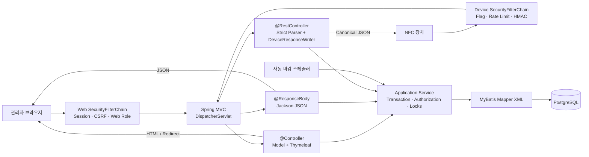

# Attend 프로젝트 정의서

> 교회 교육부서 교사팀을 위한 NFC 기반 출석 관리 시스템

## 0. 문서 정보

| 항목 | 내용 |
|---|---|
| 문서 상태 | 초안 v1.0 |
| 작성일 | 2026-07-30 |
| 대상 릴리스 | 현장 사용 가능한 1차 운영 버전(MVP) |
| 프로젝트명 | Attend |
| 서비스 대상 | 교회 내 각 교육부서별 5~20명 규모의 교사팀. 첫 적용 부서는 아동부 |
| 시스템 형태 | Spring Boot 웹 애플리케이션 + NFC 출석 단말기 |

### 0.1 문서 목적

이 문서는 프로젝트의 배경, 목표, 범위, 사용자, 핵심 규칙, 요구사항 및 완료 기준을 합의하기 위한 기준 문서다. 상세 화면 설계, API 명세, DB 설계 및 테스트 계획은 이 문서를 기반으로 별도 작성한다.

시스템 구성 요소, 모듈 경계와 런타임 구조는 [ARCHITECTURE.md](./ARCHITECTURE.md)를 기준으로 한다. 물리 데이터 구조는 [DATABASE_DESIGN.md](./DATABASE_DESIGN.md), 장치 HTTP 계약은 [device-api.yaml](./device-api.yaml), 관리자 화면은 [ADMIN_UI_SPEC.md](./ADMIN_UI_SPEC.md), 권한은 [SECURITY_MATRIX.md](./SECURITY_MATRIX.md), 검증 범위는 [TEST_PLAN.md](./TEST_PLAN.md)를 따른다.

### 0.2 핵심 전제

- 출석 대상은 부서 소속 아동·청소년이 아니라 **해당 교육부서의 교사**다.
- 이 문서에서 5~20명은 한 팀에 소속된 활성 교사의 수를 의미한다.
- 프로젝트의 1차 목적은 Java와 Spring Boot 기반 웹/API 개발을 학습하면서 실제 교회 업무에 사용할 수 있는 작은 시스템을 완성하는 것이다.
- MVP는 단일 교회 안의 여러 부서를 지원하며, 각 부서는 독립된 관리자와 출석 정책을 가진다.
- 출석은 부서별·교사별·날짜별 하루 1회로 제한한다.
- 부서 관리자가 출석 대상 날짜를 직접 등록하고, 날짜가 지나면 시스템이 미출석 대상자를 자동 결석 처리한다.
- 네이티브 모바일 앱은 MVP에 포함하지 않는다. 모바일 브라우저에서 사용할 수 있는 반응형 웹을 기본으로 한다.
- 이 문서의 MVP는 단순 시연 화면이 아니라 실제 출석 업무를 안전하게 운영할 수 있는 최소 운영 버전을 뜻한다. 일정이 부족하면 기능을 불완전하게 동시에 개발하지 않고 M1~M6 단계별로 완결한다.

---

## 1. 프로젝트 개요

### 1.1 배경

교육부서 교사의 출석, 지각 및 결석을 수기로 확인하면 다음과 같은 문제가 발생한다.

- 출석 확인 시각이 객관적으로 남지 않는다.
- 담당자가 매번 명단을 확인하고 통계를 다시 계산해야 한다.
- 중복 기록, 누락 및 사후 기억에 의존한 수정이 발생할 수 있다.
- 장기간의 출석·지각·결석 추이를 일관된 기준으로 확인하기 어렵다.

### 1.2 해결 방안

각 교사에게 NFC 카드를 연결하고, 교사가 카드를 태깅하면 부서에 배정된 Arduino 단말기가 UID를 Spring Boot API 서버로 전송한다. 서버는 장치의 소속 부서, 출석 대상 날짜와 해당 날짜에 적용된 출석 정책을 식별해 정상 출석 또는 지각 단계를 판정한 뒤 PostgreSQL에 저장한다. 날짜가 지나면 자동 마감 프로세스가 미출석 대상자를 결석 처리하며, 부서 관리자는 웹 화면에서 정책·대상 날짜·당일 현황·개인별 통계를 관리한다.

### 1.3 데이터 흐름



---

## 2. 프로젝트 목표

### 2.1 서비스 목표

1. 교사가 별도의 로그인이나 입력 없이 NFC 태깅만으로 출석할 수 있게 한다.
2. 부서별 관리자가 설정한 정상 출석과 다단계 지각 규칙으로 출석을 정확하게 기록한다.
3. 중복 태깅, 미등록 카드 및 통신 오류를 정상 출석과 명확히 구분한다.
4. 부서 관리자가 5~20명의 당일 출석 현황을 빠르게 확인하고 정정할 수 있게 한다.
5. 부서별 출석 대상 날짜를 기준으로 개인별 출석 통계를 신뢰할 수 있게 계산한다.
6. 출석 대상 날짜가 지나면 누락된 교사를 중복 없이 자동 결석 처리한다.
7. 서버 재시작, 배포 또는 테스트 때문에 운영 데이터가 삭제되지 않게 한다.

### 2.2 학습 목표

1. Spring Boot의 Controller-Service-Mapper 흐름을 실제 도메인에 적용한다.
2. Spring Security로 사람의 웹 인증과 장치 API 인증을 분리한다.
3. MyBatis와 PostgreSQL로 트랜잭션 및 데이터 무결성을 구현한다.
4. Arduino와 서버 간 HTTP/JSON 프로토콜을 설계하고 통합한다.
5. 단위·통합·보안 테스트와 운영 환경 분리를 경험한다.
6. 작은 서비스를 배포하고 백업·복구·장애 대응까지 수행한다.

### 2.3 성공 지표

- 운영 네트워크에서 태깅 인식부터 LED 결과 표시까지 측정했을 때 요청의 95%가 2초 이내, 전체가 5초 이내에 완료된다.
- 동일 부서·동일 교사·동일 날짜의 중복 출석 데이터가 발생하지 않는다.
- 장치가 서버의 저장 성공을 확인하기 전에는 성공 신호를 표시하지 않는다.
- 자동 마감 후 화면의 정상 출석·각 지각 단계·결석 인원 합계가 해당 날짜의 출석 대상 인원과 일치한다.
- 관리자가 한 출석 대상 날짜의 결과를 5분 이내에 검토할 수 있다.
- 최소 4회의 실제 운영 파일럿 동안 DB 백업 또는 수기 원본으로 복구할 수 없는 데이터 유실이 발생하지 않는다.

---

## 3. 대상 사용자와 운영 환경

### 3.1 운영 규모

| 항목 | MVP 기준 |
|---|---:|
| 활성 교사 | 5~20명 |
| 웹 관리자·담당자 | 시스템 관리자 및 부서별 관리자 1명 |
| 일반 웹 조회 사용자 | 최대 20명 |
| NFC 단말기 | 부서별 기본 1대, 최대 2대 |
| 주요 사용 빈도 | 주 1회 이상 및 특별 예배·행사 |
| 기본 시간대 | Asia/Seoul |
| 운영 조직 | 단일 교회·여러 교육부서 |

### 3.2 사용자 역할

| 역할 | 설명 | 주요 권한 |
|---|---|---|
| 플랫폼 운영자 `SYSTEM_ADMIN` | SaaS를 개발·운영하는 내부 담당자 | 고객 부서 생성, 부서 관리자 지정, 계정·장치 관리 및 개인정보 없는 전체 운영 상태 조회 |
| 부서 관리자 `DEPARTMENT_ADMIN` | 소속 부서의 출석을 관리하는 담당자 | 자기 부서의 교사 추가·부서 제외, NFC 카드 등록·연결, 출석 정책, 출석 대상 날짜, 출석 수동 등록·정정 및 통계 관리 |
| 조회 사용자 `USER` | 출석 현황을 확인하는 사용자 | 후속 범위. 허용된 명단·출석·통계의 읽기 전용 조회 |
| 출석 대상 교사 | NFC 태깅으로 본인의 출석을 기록하는 사람 | 웹 계정 없이 카드만 사용할 수 있음 |
| NFC 단말기 | UID를 서버에 제출하는 기계 주체 | 배정된 한 부서의 출석 API만 호출 가능 |

MVP에서는 플랫폼 운영자와 부서 관리자만 웹 계정을 사용한다. 고객 측 관리자는 `DEPARTMENT_ADMIN`만 사용하며 DB, backup, scheduler, 배포 상태와 `/admin/system/**`를 알거나 조작할 필요가 없다. 한 관리자가 여러 부서를 담당할 수 있지만, 부서 관리자는 권한이 부여된 부서의 데이터만 조회·변경할 수 있다. `USER` 역할과 교사 개인 계정은 후속 범위로 둔다. 현재 MVP는 고객별 단일 배포를 전제로 한 hosted service이며, tenant 경계가 없는 상태를 다중 고객 SaaS라고 부르지 않는다.

---

## 4. 프로젝트 범위

### 4.1 MVP 포함 범위

- 관리자 로그인·로그아웃
- 시스템 관리자·부서 관리자 권한 분리와 부서별 데이터 격리
- 관리자 웹 인증·인가와 장치 API 인증 경계 분리
- 부서 및 부서 관리자 관리
- 부서 관리자의 자기 부서 교사 추가, 조회, 수정 및 부서 제외
- 부서 관리자의 NFC 카드 UID 등록, 연결, 교체, 해제·분실·폐기 상태 처리
- 부서별 출석 정책과 정책 버전 관리
- 정상 출석 및 1차·2차 이상 동적 지각 단계 관리
- 부서별 출석 대상 날짜 등록·취소와 대상 교사 명단 확정
- NFC 장치용 출석 API와 장치 인증
- 정책 구간에 따른 정상 출석·지각 단계 판정 및 저장
- 동일 부서·교사·날짜의 중복 태깅 방지
- 미등록·비활성 카드와 통신 실패 처리
- 오늘의 출석 대시보드
- 날짜 경과 후 자동 마감과 결석 확정
- 관리자 수동 출석 등록·정정과 사유 기록
- 교사별·기간별 출석, 지각, 결석 통계
- 장치 태깅 이벤트 이력과 관리자·시스템 변경 감사 로그의 분리
- 개발·테스트·운영 환경 분리
- PostgreSQL 백업·복구 절차와 기본 운영 문서

### 4.2 후속 검토 범위

- CSV 또는 Excel 내보내기
- 교사 개인용 출석 이력 화면
- 읽기 전용 `USER` 역할과 일반 조회 화면
- 한 교사의 여러 부서 동시 소속과 한 장치의 다부서 전환
- 계정 비활성화·비밀번호 재설정 시 기존 로그인 세션의 즉시 강제 만료
- 부서 비활성화·재활성화와 기존 출석 날짜·장치·권한 처리
- 발행된 출석 정책의 폐기 상태 전환
- 등록된 장치를 다른 부서로 재배정하는 기능
- 3대 이상의 NFC 단말기 일괄 설정·모니터링
- 네트워크 단절 중 단말기 로컬 저장과 자동 재전송
- 이메일·문자·메신저 알림
- 흔한·유출 비밀번호 목록 기반의 비밀번호 차단
- 월간 보고서 자동 생성

### 4.3 MVP 제외 범위

- 교회 전체 교적·헌금·회계 시스템
- 아동 개인정보 및 아동 출석 관리
- 네이티브 iOS·Android 애플리케이션
- 얼굴·지문 등 생체 인증
- NFC를 이용한 출입문 개폐나 보안 신원 인증
- 급여, 인사평가 또는 징계 자동화
- 다중 교회용 멀티테넌트 서비스
- Kubernetes, 마이크로서비스, 메시지 브로커 등 이 규모에 불필요한 분산 인프라
- 24시간 무중단 이중화

---

## 5. 핵심 도메인 정의

### 5.1 주요 용어

| 용어 | 정의 |
|---|---|
| 부서 | 독립된 교사 명단, 관리자, 장치와 출석 정책을 가지는 운영 단위 |
| 부서 관리자 | 권한이 부여된 부서의 출석 정책과 데이터를 관리하는 사용자 |
| 교사 | 출석 대상이 되는 교육부서 교사 |
| NFC 카드 | 교사에게 연결된 UID 기반 태그 |
| 출석 정책 버전 | 특정 부서의 정상 출석 마감과 지각 단계가 확정된 불변 규칙 |
| 출석 구간 | 정상 출석 또는 특정 지각 단계를 판정하는 순서와 상한 시각 |
| 출석 대상 날짜 | 부서 관리자가 출석을 받도록 등록한 달력 날짜 |
| 출석 대상자 | 특정 부서·날짜에 출석 의무가 있는 교사 |
| 출석 기록 | 한 부서·교사·날짜에 대한 하나의 최종 출석 상태 |
| 태깅 이벤트 | 장치가 서버로 보낸 개별 카드 인식 시도 |
| 자동 마감 | 날짜가 지난 출석 대상일에서 미태깅 대상자를 결석으로 확정하는 작업 |
| 수동 등록·정정 | 권한 있는 부서 관리자가 사유를 입력해 누락된 출석을 등록하거나 기존 출석 상태·시각·구간을 변경하는 작업 |

### 5.2 출석 상태

| 업무 상태 | 의미 | 현재 코드의 대응 상태 |
|---|---|---|
| `PRESENT` | 해당 정책의 정상 출석 상한 시각까지 유효하게 태깅 | `IN_TIME` |
| `LATE` | 정책에 정의된 1차·2차 이상 지각 구간에서 유효하게 태깅 | `TIME_OUT` |
| `ABSENT` | 출석 대상 날짜가 지난 뒤에도 유효한 태깅 기록이 없음 | `MISS` |

화면과 문서에서는 `정상 출석`, 관리자가 정한 각 지각 단계명, `결석`을 사용한다. 출석 기록의 안정적인 상위 상태는 `PRESENT`, `LATE`, `ABSENT`로 유지하고, `1차 지각`, `2차 지각` 등은 고정 enum이 아니라 적용된 출석 구간으로 표현한다. `TIME_OUT`은 지각이라는 업무 의미가 불명확하므로 향후 코드에서도 `LATE`로 정리하는 것을 권장한다.

### 5.3 출석 대상 날짜 상태

| 상태 | 의미 |
|---|---|
| `SCHEDULED` | 관리자가 등록한 미래 출석 대상 날짜 |
| `OPEN` | 현재 날짜가 대상 날짜와 같을 때 계산되는 운영 상태. 별도 수동 개방이나 DB 상태 변경은 필요하지 않으며, 실제 태깅 허용 여부는 정책의 시작·상한 시각으로 판정 |
| `FINALIZED` | 날짜가 지나 자동 결석 처리가 끝난 상태 |
| `CANCELED` | 출석을 받지 않기로 취소한 상태. 통계와 자동 결석에서 제외 |

### 5.4 핵심 업무 규칙

| ID | 규칙 |
|---|---|
| BR-01 | MVP 출석 단위는 `(부서, 교사, 출석 대상 날짜)`이며 한 조합에는 하나의 최종 출석 기록만 존재한다. |
| BR-02 | 부서 관리자가 오늘 또는 미래의 출석 대상 날짜를 직접 등록한다. 과거 날짜는 새로 등록할 수 없고 같은 부서에는 같은 날짜를 두 번 등록할 수 없다. 당일 날짜는 정책의 태깅 시작 시각 전에만 등록할 수 있으며, 현재 날짜와 일치하면 별도 수동 개방 없이 `OPEN`으로 취급한다. |
| BR-03 | 출석 대상 날짜를 등록할 때 해당 부서의 활성 교사를 기본 대상자로 복사한다. 일반 대상자 조정은 정책의 태깅 시작 시각 전까지만 허용한다. 등록된 명단은 기본적으로 snapshot이지만, BR-29의 부서 제외가 시작 전·기록 없는 미래 날짜를 현재 소속과 동기화하는 예외다. 실제 출석한 교사가 명단에서 누락된 사실을 태깅 시작 후 발견한 경우에는 BR-21의 사후 수동 등록 절차만 허용한다. |
| BR-04 | `CANCELED` 날짜는 태깅, 자동 결석과 통계 분모에서 제외한다. 출석 기록이 생긴 날짜는 취소하거나 물리 삭제할 수 없다. |
| BR-05 | 각 NFC 단말기는 생성할 때 한 부서에 배정되며, 장치 인증정보에서 부서를 결정한다. 장치 요청이 임의의 부서 ID를 선택하게 하지 않고 MVP에서는 생성 후 배정 부서를 변경할 수 없다. |
| BR-06 | 부서 관리자는 자기 부서의 교사·카드·정책·출석 날짜·출석 기록만 조회·변경할 수 있다. |
| BR-07 | 출석 정책은 버전으로 관리한다. MVP는 `DRAFT → PUBLISHED` 전이만 제공하며 발행된 정책 버전은 수정·삭제·폐기하지 않고 새 버전을 만든다. 새 버전은 새로 등록하는 날짜에 선택하거나, 태깅 시작 전인 기존 날짜에 관리자가 명시적으로 다시 선택할 수 있다. |
| BR-08 | 출석 대상 날짜는 적용할 정책 버전을 저장한다. 새 정책 발행만으로 기존 날짜의 적용 버전이 자동 변경되지 않으며, 태깅 시작 후에는 해당 날짜의 정책 버전을 변경할 수 없다. 과거 출석 판정도 다시 계산하지 않는다. |
| BR-09 | 한 정책은 태깅 시작 시각을 가지며, 첫 구간은 유일한 정상 출석(`PRESENT`) 구간이어야 한다. 그 뒤에는 한 개 이상의 지각(`LATE`) 구간이 이어지고 관리자는 2차 이상 단계를 필요한 만큼 추가할 수 있다. |
| BR-10 | 각 구간은 순서, 표시명, 상위 상태(`PRESENT` 또는 `LATE`)와 상한 시각을 가진다. 정상 출석 상한은 태깅 시작 시각보다 빠를 수 없고, 첫 구간 이후에 `PRESENT`가 다시 나타날 수 없다. 전체 상한 시각은 오름차순이어야 하며 중복·역전될 수 없다. |
| BR-11 | 태깅 시각이 구간 상한과 정확히 같으면 해당 구간에 포함한다. 서버는 순서대로 첫 번째 `태깅 시각 <= 상한 시각`인 구간을 적용한다. |
| BR-12 | 태깅 시작 시각 전 요청은 `CHECK_IN_NOT_OPEN`으로 처리한다. 관리자가 정책에서 정한 마지막 지각 구간의 상한은 그 날짜의 마감 시간인 동시에 최종 태깅 허용 시각이다. 서버는 PostgreSQL 정밀도에 맞춰 해당 시각의 1µs 뒤를 `finalization_due_at`으로 고정하며 그 이후 요청은 `CHECK_IN_CLOSED`로 처리한다. |
| BR-13 | 출석 시각은 조작 가능한 단말 시각이 아니라 서버 수신 시각을 사용하며 기본 시간대는 `Asia/Seoul`이다. 자정을 넘기는 출석 구간은 MVP에서 허용하지 않는다. |
| BR-14 | 최초 유효 태깅이 최종 자동 출석 시각과 구간을 결정한다. 재태깅은 새 기록을 만들거나 최초 시각을 변경하지 않는다. |
| BR-15 | `requestId`는 영문 대·소문자, 숫자, `_`, `-`만 사용한 1~64자이며 장치별로 유일하다. 같은 `(deviceId, requestId)`와 같은 UID의 재요청은 최초 결과를 재현하고, 같은 요청 ID에 다른 UID가 오면 충돌로 거부한다. |
| BR-16 | 미등록·비활성 카드, 부서 미소속 교사, 해당 날짜의 출석 대상자가 아닌 교사, 등록되지 않은 날짜, 허용 시간 밖 태깅은 출석을 생성하지 않고 서로 구분된 실패 이력을 남긴다. |
| BR-17 | 하나의 활성 NFC UID는 동시에 한 교사에게만 연결할 수 있다. 카드 등록·재연결은 카드 `ACTIVE` 전이와 연결 생성을, 정상 해제·교체는 연결 종료와 `AVAILABLE` 전이를, 분실은 연결 종료와 `LOST` 전이를 각각 한 트랜잭션으로 처리한다. 카드는 물리 삭제하거나 UID를 수정하지 않으며 영구 폐기한 `RETIRED` 카드는 다시 연결하지 않는다. 처리 관리자 ID는 요청 값이 아니라 인증 세션에서 서버가 결정하고 종료·분실·폐기 사유를 기록한다. |
| BR-18 | `SCHEDULED` 상태이고 `finalization_due_at <= now`인 모든 출석 대상 날짜를 자동 마감 대상으로 찾는다. |
| BR-19 | 자동 마감은 대상자 중 출석 기록이 없는 교사에게 `ABSENT`를 생성한 뒤 날짜를 `FINALIZED`로 변경한다. 결석 생성과 상태 변경은 하나의 트랜잭션으로 처리한다. |
| BR-20 | 자동 마감은 여러 번 실행해도 결과가 같아야 한다. 서버가 마감 시각에 중지되어 있어도 재시작 시 DB에서 마감 시각이 지난 날짜를 복구한다. 실패하면 1·2·4·8·16분 간격으로 다섯 번 재시도하고 모두 실패한 날짜는 `SCHEDULED` 마감 지연 상태로 남긴다. |
| BR-21 | 마감 후 NFC 태깅은 기존 결석을 자동으로 바꾸지 않는다. 부서 관리자는 사유와 필요한 실제 출석 시각을 입력해 개별 기록을 수동 등록·정정할 수 있다. `PRESENT`·`LATE` 등록·정정은 실제 출석 시각이 해당 날짜와 소속 기간 `[joined_at, ended_at)` 안에 있을 때만 허용하고, `ended_at IS NULL`이면 현재도 소속 중인 것으로 본다. 서버는 입력 시각과 해당 날짜의 고정 정책으로 상태와 구간을 계산하며 관리자가 임의 상태·구간을 저장하게 하지 않는다. `ABSENT` 수동 정정은 출석 시각과 구간을 `NULL`로 저장한다. 대상자 명단에서 누락된 실제 출석자는 `CANCELED`가 아닌 날짜에서 활성 대상자 추가와 `MANUAL` 출석 생성을 하나의 트랜잭션으로 수행하며 부분 성공은 허용하지 않는다. 상태에 영향을 주는 수동 등록·정정은 판정 원천을 `MANUAL`로 바꾸고 처리 관리자, 변경 전후 값과 사유를 감사 로그에 남긴다. 메모만 수정할 때는 기존 판정 원천을 유지한다. |
| BR-22 | 통계 분모는 해당 교사가 대상자였던 `FINALIZED` 출석 날짜 수다. 정상 출석률, 단계별 지각률, 전체 지각률과 결석률은 같은 분모를 사용한다. |
| BR-23 | 교사 추가·부서 제외와 부서 이동은 이후 새로 등록하는 출석 대상 날짜의 기본 명단에 반영한다. 부서 제외는 BR-29에 따라 미확정 미래 날짜만 자동 동기화한다. 교사를 다시 소속에 추가해도 기존 미래 날짜의 비활성 대상자를 자동 복원하지 않는다. 과거·이미 시작한 날짜와 출석 기록이 하나라도 있는 날짜는 자동 변경하지 않되 BR-21의 사후 수동 등록·정정은 허용한다. |
| BR-24 | 장치는 TCP 연결 여부가 아니라 서버의 HTTP 상태와 응답 코드를 확인한 후 성공 여부를 표시한다. |
| BR-25 | 교사 추가·부서 제외, 정책 발행, 출석 대상 날짜·대상자 변경, 자동 마감, 카드 연결·교체·종료와 출석 수동 등록·정정에는 작업자 또는 시스템 주체, 시각, 변경 내용과 사유를 감사 이력으로 남긴다. |
| BR-26 | 부서 관리자는 자기 부서에 교사를 추가해 활성 소속을 만들고, 자기 부서 장치에서 태깅된 미등록 NFC 카드를 해당 교사에게 연결할 수 있다. 카드를 함께 등록하면 교사·소속·카드·카드 연결 생성과 카드 상태 변경을 하나의 트랜잭션으로 처리한다. |
| BR-27 | NFC 카드는 활성 상태인 자기 부서 소속 교사에게만 연결할 수 있다. 이미 다른 교사에게 활성 연결된 UID는 재사용할 수 없으며, MVP에서 한 교사는 활성 카드 한 장만 가진다. |
| BR-28 | 부서 관리자의 교사 삭제는 교사·출석 행을 지우는 동작이 아니라 자기 부서 소속과 활성 카드 연결을 종료하는 `부서 제외`다. 회수 카드는 `AVAILABLE`, 미회수·분실 카드는 `LOST`, 영구 폐기 카드는 `RETIRED`로 연결 종료와 같은 트랜잭션에서 변경하며 `ACTIVE`로 남기지 않는다. 처리 관리자, 카드 처리 방식과 사유는 필수이고 과거 대상자·출석·카드 연결·감사 이력은 보존한다. 처리 관리자 ID는 요청 값이 아니라 인증된 관리자 세션에서 서버가 결정하고, 필수 규칙은 화면·서버·DB에서 검증 가능한 범위까지 강제한다. |
| BR-29 | 교사를 부서에서 제외하면 이후 새로 등록하는 출석 날짜의 기본 대상에서 빠진다. 서버는 이미 등록된 날짜 중 `SCHEDULED`, 태깅 시작 전, 출석 기록 0건인 날짜의 해당 교사 대상자를 모두 자동 제외한다. 확인 화면은 `미래 출석일 N건에서도 제외됩니다`와 대상 날짜를 보여주고 명시적 확인을 받는다. 제출 시 서버가 같은 조건을 잠금 아래 재계산해 건수가 달라졌으면 전체를 rollback하고 재확인을 요구한다. 과거·이미 시작한 날짜와 어느 교사든 출석 기록이 하나라도 있는 날짜는 변경하지 않으며, 재가입해도 기존 미래 대상자를 자동 복원하지 않는다. |
| BR-30 | 부서 관리자는 다른 부서의 교사·소속·카드 연결을 조회·수정·종료할 수 없다. 다른 부서에서 사용 중인 카드의 상세 소유자 정보도 노출하지 않고 연결 불가 결과만 제공한다. |
| BR-31 | 초기 설정은 부서 생성, 계정 생성, 부서 관리자 권한 부여를 각각 독립된 작업으로 순서대로 수행한다. 아직 관리자가 없는 부서와 아직 부서 권한이 없는 계정은 유효한 중간 상태이며, 모듈 간 순환 의존을 만드는 일괄 생성 기능은 MVP에서 제공하지 않는다. |
| BR-32 | 정상·실패·중복 태깅의 장치 요청 이력은 `tag_event_log`에만 저장하고 같은 내용을 `audit_log`에 중복 저장하지 않는다. 같은 `(deviceId, requestId)` 재시도는 이벤트 한 행만 사용한다. 새 request ID로 실제 재태깅한 시도는 별도 이벤트로 남기되 최종 출석 기록은 한 건만 유지한다. |
| BR-33 | 신규 교사 등록, 활성 교사 기본정보 수정과 교사 활성화에는 미래가 아닌 정확한 생년월일이 필수다. 레거시 `birth IS NULL`은 확인된 날짜로 정정하기 전까지 생년월일과 파생 나이를 미상으로 유지하고 기존 정수 `age`로 추정하지 않는다. 기본정보 수정 감사에는 원문 before/after 대신 변경 작업과 실제 변경 필드명만 남긴다. |

---

## 6. 핵심 사용자 흐름

### 6.1 초기 설정

1. 설치 과정에서 공개 기본 비밀번호 없이 최초 시스템 관리자 계정을 생성한다.
2. 시스템 관리자가 부서를 만든다.
3. 시스템 관리자가 관리자 계정을 만들거나 기존 계정을 선택한다.
4. 시스템 관리자가 생성된 부서에 해당 계정의 부서 관리자 권한을 부여한다.
5. 부서 관리자가 소속 교사 명단과 NFC 카드를 등록한다.
6. 시스템 관리자가 장치별 코드와 인증키를 발급하고 장치를 한 부서에 배정한다. 서버에는 인증키 원문 대신 검증 가능한 해시를 저장하며, 장치는 `INACTIVE` 상태에서 credential test를 통과한 뒤 활성화한다. 등록 후 배정 부서는 변경할 수 없다.
7. 부서 관리자가 정상 출석 상한과 1차·2차 이상 지각 구간을 구성해 정책 버전을 발행한다.

### 6.2 교사 추가·카드 등록·교체·부서 제외

1. 부서 관리자가 자기 부서의 교사 추가 화면에서 이름과 필요한 최소 정보를 입력한다.
2. 카드를 함께 등록하려면 자기 부서 단말기에 미등록 카드를 태깅한다.
3. 서버는 당일 출석 대상 날짜가 없어도 UID, 장치, 부서와 태깅 시각을 해당 부서의 미등록 카드 목록에 저장한다.
4. 관리자가 미등록 카드 목록에서 UID를 선택해 새 교사 또는 기존 소속 교사에게 연결한다.
5. 시스템은 교사, 활성 부서 소속과 카드 연결을 검증해 한 트랜잭션으로 저장한다. 카드 없이 교사만 먼저 추가할 수도 있지만, 카드 연결 전에는 NFC 출석을 할 수 없다.
6. 카드 교체 시 관리자가 사유를 입력하고, 서버가 인증 세션의 관리자 ID와 함께 기존 연결 종료, 기존 카드 상태 변경, 새 카드 활성화와 새 연결 생성을 한 트랜잭션으로 처리한다. 기존 카드와 과거 출석 이력은 삭제하지 않는다.
7. 관리자가 교사를 삭제하면 시스템은 물리 삭제 대신 부서 제외 사유를 받고 소속과 활성 카드 연결을 종료한다.
8. 시스템은 시작 전이고 출석 기록이 없는 기존 미래 출석 날짜를 보여주며 `미래 출석일 N건에서도 제외됩니다` 확인을 받은 뒤 해당 교사를 모든 후보 날짜에서 자동 제외한다. 과거·시작 후·기록 있는 날짜는 건드리지 않고 재가입 시 기존 날짜에 자동 복원하지 않는다.

### 6.3 출석 정책과 대상 날짜 준비

1. 부서 관리자가 정책 초안에서 정상 출석과 지각 단계의 상한 시각을 순서대로 입력한다.
2. 시스템이 정상 구간 개수, 단계 순서와 상한 시각의 중복·역전을 검증한다.
3. 관리자가 정책을 발행하면 해당 버전은 변경할 수 없다.
4. 관리자가 출석 대상 날짜를 등록하고 적용 정책 버전을 선택한다.
5. 시스템이 부서의 활성 교사를 출석 대상자로 복사하고 관리자가 필요한 대상을 조정한다.

### 6.4 출석 처리

1. 교사가 NFC 카드를 태깅한다.
2. Arduino가 UID와 요청 식별자를 장치 API로 전송한다.
3. 서버가 장치의 부서, 당일 출석 대상 날짜, 카드, 교사 소속과 기존 출석을 검증한다.
4. 서버가 해당 날짜에 고정된 정책 버전으로 정상 출석 또는 지각 단계를 판정해 저장한다.
5. Arduino가 HTTP 상태와 응답 결과에 맞는 LED·부저 신호를 표시한다.
6. 부서 관리자는 당일 대시보드에서 정상 출석, 각 지각 단계와 미출석 대상자를 확인한다.

### 6.5 자동 마감과 결석 확정

1. Spring의 자동 마감 작업이 DB의 가장 이른 due·retry·lease 만료 시각을 동적으로 예약하고, 실행 시 `SCHEDULED` 상태의 처리 가능한 날짜를 선점한다.
2. 작업은 날짜 하나를 잠그고 출석 대상자 중 기록이 없는 교사에게 결석을 생성한다.
3. 대상자 수와 정상 출석·지각·결석 합계를 확인한 뒤 해당 날짜를 `FINALIZED`로 변경한다.
4. 서버가 예정 시각에 중지되어 있었다면 재시작 시 누락된 날짜를 복구하고, 처리 실패는 DB에 저장된 1·2·4·8·16분 backoff로 재시도한다.
5. 관리자가 최종 인원과 통계를 검토한다.
6. 마감 후 오류를 발견하면 개별 기록을 사유와 함께 정정한다. 실제 출석했지만 대상자에서 누락된 교사는 대상자 추가와 수동 출석 등록을 한 트랜잭션으로 처리한다. 시스템은 판정 원천을 `MANUAL`로 저장하고 감사 이력과 통계를 함께 갱신한다.

---

## 7. 기능 요구사항

| ID | 요구사항 | 우선순위 |
|---|---|---|
| FR-01 | 시스템은 설치 시 공개 기본 비밀번호 없이 최초 시스템 관리자를 생성하고 로그인·로그아웃·비밀번호 변경·계정 비활성화를 지원해야 한다. | 필수 |
| FR-02 | 시스템 관리자는 부서를 생성하고, 별도로 생성되었거나 기존에 존재하는 계정을 부서 관리자로 지정·해제할 수 있어야 한다. 부서 비활성화·재활성화는 후속 범위다. | 필수 |
| FR-03 | 부서 관리자는 URL이나 요청 ID를 조작해도 권한이 없는 다른 부서의 데이터에 접근할 수 없어야 한다. | 필수 |
| FR-04 | 부서 관리자는 자기 부서의 교사를 추가, 조회, 수정하고 사유와 함께 부서에서 제외할 수 있어야 한다. 제외는 물리 삭제가 아니며 소속 이력과 과거 출석을 보존해야 한다. | 필수 |
| FR-05 | 부서 관리자는 자기 부서 장치의 미등록 카드 목록에서 NFC 카드를 등록해 활성 소속 교사에게 연결하고, 필수 사유를 입력해 교체·해제·분실·폐기 처리할 수 있어야 한다. 연결 이력과 카드 상태 변경은 한 트랜잭션이어야 하고 처리 관리자 ID는 인증 세션에서 서버가 결정해야 한다. | 필수 |
| FR-06 | 부서 관리자는 출석 정책 초안을 만들고 정상 출석과 필요한 수의 지각 단계를 구성한 뒤 새 버전으로 발행할 수 있어야 한다. | 필수 |
| FR-07 | 서버는 첫 구간이 유일한 정상 출석인지, 이후 구간이 모두 지각인지, 지각 구간이 한 개 이상인지와 태깅 시작·상한 시각의 중복·역전·자정 초과를 검증하고 잘못된 정책 발행을 거부해야 한다. | 필수 |
| FR-08 | 발행된 정책은 수정·삭제할 수 없어야 하며 과거 출석 대상 날짜와 기록은 이후 정책 변경의 영향을 받지 않아야 한다. | 필수 |
| FR-09 | 부서 관리자는 오늘 또는 미래의 출석 대상 날짜를 등록·취소하고 적용 정책 버전과 대상 교사를 확정할 수 있어야 하며, 과거 날짜의 신규 등록은 거부해야 한다. | 필수 |
| FR-10 | 시스템은 같은 부서에 같은 출석 대상 날짜가 두 번 등록되는 것을 거부해야 한다. | 필수 |
| FR-11 | 시스템 관리자는 장치별 코드와 자격증명을 발급·교체·폐기하고 새 장치를 한 부서에 배정할 수 있어야 한다. 새 키는 `INACTIVE` 상태에서 출석 데이터를 만들지 않는 credential test를 통과한 뒤 활성화하며, MVP에서는 등록된 장치의 배정 부서를 변경할 수 없다. | 필수 |
| FR-12 | 장치 API는 장치에 배정된 부서의 당일 출석 대상 날짜에 대해 유효한 UID의 출석을 저장해야 한다. | 필수 |
| FR-13 | 서버는 해당 날짜에 고정된 정책 버전과 서버 시각으로 정상 출석 또는 구체적인 지각 단계를 판정해야 한다. | 필수 |
| FR-14 | 동일 부서·교사·날짜의 재태깅과 같은 `(deviceId, requestId)`의 재요청은 중복 기록이나 최초 시각 변경을 만들지 않아야 한다. | 필수 |
| FR-15 | 미등록·비활성 카드, 부서 미소속 교사, 당일 출석 대상자 아님, 출석 대상 날짜 없음, 허용 시간 전·후, 잘못된 요청과 장치 인증 실패를 구분해 응답해야 한다. | 필수 |
| FR-16 | 부서 관리자는 날짜별 정상 출석, 각 지각 단계, 미출석 또는 결석 인원과 최근 태깅을 확인할 수 있어야 한다. | 필수 |
| FR-17 | 시스템은 `SCHEDULED` 상태이고 `finalization_due_at <= now`인 모든 출석 대상 날짜를 찾아 누락된 대상자를 자동 결석 처리하고 날짜를 `FINALIZED`로 변경해야 한다. | 필수 |
| FR-18 | 자동 마감은 중복 실행과 서버 재시작에도 결석 누락·중복 없이 마감 시각이 지난 미마감 날짜를 복구해야 한다. | 필수 |
| FR-19 | 부서 관리자는 사유와 실제 출석 시각을 입력해 개별 출석을 수동 등록·정정할 수 있어야 한다. 태깅 시작 후 또는 마감 후 발견한 대상자 누락은 실제 출석 시각의 부서 소속 기간을 검증하고, 서버가 고정 정책으로 상태·구간을 계산한 뒤 대상자 추가와 `MANUAL` 출석 생성을 하나의 트랜잭션으로 처리해야 한다. | 필수 |
| FR-20 | 시스템은 정책·대상자·자동 마감·관리자 변경 이력을 감사 로그로, 장치 태깅 요청과 결과를 태깅 이벤트 로그로 구분해 민감정보를 최소화하여 기록하고 권한 있는 관리자만 조회하게 해야 한다. 같은 태깅을 두 로그에 중복 저장하지 않는다. | 필수 |
| FR-21 | 부서 관리자는 교사별·기간별 정상 출석, 단계별·전체 지각과 결석 횟수·비율을 조회할 수 있어야 한다. | 필수 |
| FR-22 | 미등록 카드 태깅은 당일 출석 대상 날짜가 없어도 부서별 카드 등록함에 남아야 한다. | 필수 |
| FR-23 | 관리자는 장치 자격증명 상태, 배정 부서, 활성 여부와 마지막 통신 시각을 확인할 수 있어야 한다. | 필수 |
| FR-24 | 조회 결과를 CSV 또는 Excel 형식으로 내보내는 기능을 제공한다. | 후속 |

---

## 8. 화면 범위

| 화면 | 주요 내용 | MVP |
|---|---|---|
| 로그인·비밀번호 변경 | 사용자명·비밀번호 로그인, 실패 안내, 본인 비밀번호 변경 | 필수 |
| 부서·관리자 계정 | 부서 생성, 계정 생성·비활성화, 부서 관리자 지정·해제를 순서가 분리된 작업으로 제공 | 필수 |
| 부서 출석 대시보드 | 날짜 선택, 정상 출석·동적 지각 단계·미출석/결석 인원, 최근 태깅 결과 | 필수 |
| 교사 목록 | 이름, 부서 소속 상태, 카드 연결 여부, 당일 상태, 교사 추가·부서 제외 | 필수 |
| 교사 등록·수정 | 신규 등록·활성 교사 수정에 필수인 정확한 생년월일, 선택 연락처, 미등록 NFC 카드 선택·연결과 소속 상태 관리 | 필수 |
| 교사 상세 | 카드 상태, 날짜별 출석 이력, 기간 통계 | 필수 |
| 카드 등록함 | 자기 부서 장치의 최근 미등록 UID와 재사용 가능한 `AVAILABLE` 카드 태깅, 태깅 시각, 장치, 교사 연결·교체 | 필수 |
| 교사 부서 제외 확인 | 제외 사유, 회수·분실·폐기 카드 처리, 활성 연결 종료, 자동 제외되는 미래 출석 날짜와 건수 확인 | 필수 |
| 출석 정책 목록·이력 | 부서 정책 버전, 발행 상태, 적용 날짜 확인 | 필수 |
| 출석 정책 편집 | 태깅 시작, 정상 출석과 지각 단계 추가·삭제·순서·상한 시각 설정 및 판정 미리보기 | 필수 |
| 출석 대상 날짜 관리 | 날짜 등록·취소, 적용 정책 버전과 대상 교사 확인 | 필수 |
| 출석 수동 등록·정정 | 누락자 사후 대상 추가, 실제 출석 시각·사유 입력, 서버 계산 상태·구간 미리보기 및 이력 확인 | 필수 |
| 장치 관리 | 장치 코드, 고정 배정 부서, 키 발급·교체·폐기, credential test, 활성 여부, 마지막 통신 시각 | 필수 |
| 오류 화면 | 권한 없음, 찾을 수 없음, 입력 오류와 서버 오류의 사용자 안내 | 필수 |

동적 지각 단계는 고정된 두 칸으로 만들지 않고 정책의 단계 목록을 반복 렌더링한다. 색상만으로 결과를 구분하지 않고 상태 텍스트와 아이콘을 함께 표시한다. 관리자 화면은 데스크톱과 모바일 브라우저 모두에서 기본 기능을 사용할 수 있어야 한다.

---

## 9. 장치 API 개요

아래 내용은 업무 관점의 API 개요다. 정확한 요청·응답 schema, 오류 코드, 재시도와 rate limit 계약은 [device-api.yaml](./device-api.yaml)을 따른다.

장치 credential 확인은 `POST /api/v1/device/credential-tests`로 분리한다. 이 경로는 `INACTIVE` 장치의 키 검증을 허용하지만 출석·태깅 event·교사 데이터를 만들거나 반환하지 않는다. 아래 요청·결과 표는 출석용 check-in endpoint의 업무 개요이며 정확한 외부 계약은 [device-api.yaml](./device-api.yaml)을 따른다.

### 9.1 요청 예시

```http
POST /api/v1/device/check-ins
Content-Type: application/json
X-Device-Code: entrance-01
X-Device-Key: <device-secret>
```

```json
{
  "uid": "04A1B2C3D4E5F6",
  "requestId": "A7F3C921-000001"
}
```

### 9.2 프로토콜 원칙

- UID는 각 바이트를 두 자리 대문자 16진수로 변환해 구분자 없이 전송한다.
- 장치는 부팅마다 새 임의 식별자와 증가 카운터를 조합해 `requestId`를 만들고, 서버는 `(deviceId, requestId)`를 유일 범위로 사용한다.
- `requestId`는 영문 대·소문자, 숫자, `_`, `-`만 허용하며 길이는 1~64자다.
- 장치 체크인 JSON body는 1 KiB를 넘길 수 없다.
- 같은 `(deviceId, requestId)`와 같은 UID가 다시 오면 서버는 부작용 없이 최초 HTTP 상태와 응답 본문을 재현한다.
- 같은 `(deviceId, requestId)`에 다른 UID가 오면 `REQUEST_ID_CONFLICT`로 거부한다.
- 출석 판정에는 장치가 보낸 시각이 아니라 서버 수신 시각을 사용한다.
- 사람의 웹 세션과 장치 인증을 분리한다.
- 브라우저에는 세션과 CSRF 보호를 유지하고, 장치 API만 장치 인증을 전제로 CSRF 대상에서 분리한다.
- 장치가 속한 부서는 인증된 장치 정보에서 결정하며 요청 본문으로 임의 선택할 수 없다.
- 서버의 검증 순서는 장치 인증, 요청 형식, 카드 상태, 부서 소속, 당일 출석 대상 날짜, 활성 출석 대상자, 정책 구간 순서로 한다.
- 미등록 카드는 당일 출석 대상 날짜가 없어도 장치의 부서별 카드 등록함에 기록한다.
- 장치는 연결·읽기 타임아웃, 제한된 재시도, 전체 응답 읽기와 연결 종료를 구현한다.
- 장치는 HTTP 상태와 JSON 결과 코드를 모두 해석해야 한다.
- 서버의 DB lock·statement timeout은 upstream 요청 timeout보다 짧고, upstream timeout은 장치 read timeout보다 짧아야 한다.
- 인증 전 source와 인증된 장치별 rate limit을 적용하며 정확한 한도와 retryable 상태는 장치 API·보안 명세를 따른다.

### 9.3 공통 응답 예시

```json
{
  "success": true,
  "code": "LATE",
  "message": "지각이 기록되었습니다.",
  "requestId": "A7F3C921-000001",
  "serverTime": "2026-07-30T08:51:14+09:00",
  "data": {
    "attendanceStatus": "LATE",
    "attendanceBand": {
      "order": 2,
      "label": "1차 지각"
    },
    "checkedInAt": "2026-07-30T08:51:14+09:00"
  }
}
```

응답은 성공과 실패 모두 같은 필드 구조를 사용한다. 장치에 불필요한 연락처나 카드 소유자의 상세 개인정보를 반환하지 않는다.

### 9.4 결과 코드와 HTTP 상태

| 결과 코드 | HTTP | 의미 | 장치 동작 예시 |
|---|---:|---|---|
| `CHECKED_IN` | 201 | 정상 출석 저장 | 초록색 점등 |
| `LATE` | 201 | 지각 저장 | 별도 점멸 패턴 |
| `ALREADY_CHECKED_IN` | 200 | 이미 처리된 교사 | 짧은 초록색 점멸 |
| `UNKNOWN_UID` | 404 | 미등록 카드 | 빨간색 점등 |
| `INACTIVE_CARD` | 409 | 비활성·분실 카드 | 빨간색 점멸 |
| `NOT_DEPARTMENT_MEMBER` | 409 | 장치 부서에 유효한 소속이 없음 | 빨간색 점멸 |
| `NO_ATTENDANCE_DAY` | 409 | 해당 부서의 당일 출석 대상 날짜 없음 | 빨간색 점멸 |
| `NOT_ATTENDANCE_TARGET` | 409 | 당일 날짜는 있지만 확정 대상자 명단에서 제외됨 | 빨간색 점멸 |
| `CHECK_IN_NOT_OPEN` | 409 | 첫 출석 허용 시각 전 | 빨간색 점멸 |
| `CHECK_IN_CLOSED` | 409 | 마지막 지각 구간 종료, 날짜 취소 또는 자동 마감 완료 | 빨간색 점멸 |
| `REQUEST_ID_CONFLICT` | 409 | 요청 ID가 다른 UID에 재사용됨 | 빨간색 점멸 |
| `INVALID_REQUEST` | 422 | UID 등 요청 형식 오류 | 빨간색 점멸 |
| `DEVICE_UNAUTHORIZED` | 401 | 장치 인증 실패 | 긴 빨간색 점멸 |
| `SERVER_ERROR` | 500 | 저장 또는 서버 오류 | 성공 표시 금지, 제한적 재시도 |

`tag_event_log.result_code`에는 인증과 UID 형식 검증을 통과한 요청의 저장 가능한 업무 결과인 `CHECKED_IN`, `LATE`, `ALREADY_CHECKED_IN`, `UNKNOWN_UID`, `INACTIVE_CARD`, `NOT_DEPARTMENT_MEMBER`, `NO_ATTENDANCE_DAY`, `NOT_ATTENDANCE_TARGET`, `CHECK_IN_NOT_OPEN`, `CHECK_IN_CLOSED`와 트랜잭션 내부 선점 상태 `PROCESSING`만 허용한다. `DEVICE_UNAUTHORIZED`와 `INVALID_REQUEST`는 이벤트 선점 전에 거부하고, `REQUEST_ID_CONFLICT`는 기존 최초 이벤트를 덮어쓰지 않으며, 저장 실패인 `SERVER_ERROR`는 전체 트랜잭션을 롤백한다.

장치의 LED 색상 수가 부족하면 점등 시간과 점멸 횟수로 상태를 구분한다. 실제 신호 규칙은 펌웨어 명세에서 확정한다.

---

## 10. 개념 데이터 모델

상세 ERD, 물리 테이블 제약과 인덱스는 [DATABASE_DESIGN.md](./DATABASE_DESIGN.md)를 기준으로 한다.

| 데이터 | 주요 속성 | 핵심 제약 |
|---|---|---|
| `Department` | ID, 이름, 활성 여부 | 교회 내 부서 식별. MVP 업무 시간대는 `Asia/Seoul`로 고정 |
| `Account` | 사용자명, 비밀번호 해시, 시스템 역할, 활성 여부 | 사용자명 유일 |
| `AccountDepartmentRole` | 계정 ID, 부서 ID, 부서 역할 | 부서 관리자 권한 범위 |
| `Teacher` | ID, 이름, 생년월일, 활성 여부, 생성·수정 시각 | 신규 등록·활성 교사 기본정보 수정에 미래가 아닌 정확한 생년월일 필수; 생일 관리와 조회일 기준 만 나이 계산에 사용 |
| `DepartmentMembership` | 부서 ID, 교사 ID, 활성 기간·상태 | 부서별 출석 대상 관계. MVP에서는 교사별 활성 소속 부서 최대 1개 |
| `NfcCard` | UID, 카드 상태, 생성·수정 시각 | 물리 UID 유일 |
| `NfcCardAssignment` | 카드 ID, 부서 소속 ID, 교사 ID, 연결·해지 시각, 처리자·사유 | 자기 부서 활성 소속만 연결, 카드별·교사별 활성 연결 최대 1건, 카드 변경 이력 보존 |
| `Device` | 내부 ID, 외부 장치 코드, 부서 ID, 이름, 인증키 해시·version, 현재 version 시험 시각, 활성 여부, 마지막 인증 성공 | 장치 한 대는 한 부서에 귀속, 현재 credential version 시험 뒤에만 활성화, MVP에서 부서 변경 금지 |
| `AttendancePolicyVersion` | 부서 ID, 버전, 이름, 태깅 시작 시각, 상태, 발행 정보 | 발행된 버전 불변, `(부서 ID, 버전)` 유일 |
| `AttendanceBand` | 정책 버전 ID, 순서, 표시명, 상위 상태, 상한 시각 | 정책 안에서 순서·상한 유일, 오름차순 |
| `AttendanceDay` | 부서 ID, 날짜, 정책 버전 ID, 저장 상태, 생성자·마감 시각 | `(부서 ID, 날짜)` 유일. 저장 상태는 `SCHEDULED`, `FINALIZED`, `CANCELED`이며 `OPEN`은 현재 날짜로 계산 |
| `AttendanceTarget` | 출석 날짜 ID, 부서 소속 교사 ID, 대상 여부, 추가 원천·처리자·사유 | 날짜별 기본 대상자 스냅샷과 사후 누락 복구, `(출석 날짜 ID, 부서 소속 교사 ID)` 유일 |
| `AttendanceRecord` | 출석 날짜 ID, 고정 정책 버전 ID, 교사 ID, 상위 상태, 정책 구간 ID·표시명, 출석 시각, 현재 판정 원천, 비고 | `(출석 날짜 ID, 교사 ID)` 유일, 날짜–정책–구간–상태 복합 FK |
| `TagEventLog` | 요청 ID, 장치, 부서, UID, 결과, 응답, 실패 원인, 시각 | `(장치 ID, 요청 ID)` 유일, 재요청 결과 재현 |
| `AuditLog` | 부서, 작업자·시스템, 대상, action별 허용 변경 정보, 사유, 시각 | 권한 있는 관리자만 조회; 교사 기본정보는 원문 before/after 없이 실제 변경 필드명만 저장 |

교사의 생일 관리와 만 나이 확인은 승인된 업무 목적이다. 신규 등록과 활성 교사의 기본정보 수정에는 미래가 아닌 정확한 생년월일을 필수로 저장하고, 나이는 별도 정수값을 갱신하지 않고 조회일 기준으로 계산한다. 생년월일이 없는 레거시 행은 확인된 날짜로 정정하기 전까지 생년월일과 파생 나이를 미상으로 유지하며 기존 나이로 날짜를 추정하지 않는다. 연락처는 실제 운영에 필요한 경우에만 선택 항목으로 두고 수집 목적을 명확히 한다.

---

## 11. 비기능 요구사항

| ID | 구분 | 요구사항 |
|---|---|---|
| NFR-01 | 규모 | 부서별 활성 교사 5~20명과 부서별 관리자·장치를 별도 분산 시스템 없이 처리한다. |
| NFR-02 | 성능 | 운영 네트워크에서 태깅 인식부터 LED 표시까지 1초 간격으로 50회 측정했을 때 95%가 2초 이내, 전체가 5초 이내에 끝나야 한다. 네트워크·서버 장애 응답은 성공 시간 측정에서 제외하고 별도 실패 시험으로 검증한다. |
| NFR-03 | 조회 성능 | 일반 관리 화면은 정상 운영 데이터 기준 3초 이내에 표시되어야 한다. |
| NFR-04 | 정확성 | 중복 방지는 애플리케이션 검사뿐 아니라 DB 유일 제약으로 보장한다. |
| NFR-05 | 멱등성 | 장치가 같은 요청을 재시도해도 출석 기록이 추가되거나 최초 시각이 변경되지 않아야 한다. |
| NFR-06 | 데이터 안전 | 애플리케이션 시작, 테스트와 배포가 운영 테이블을 삭제하거나 샘플 데이터로 덮어쓰면 안 된다. |
| NFR-07 | 시간 | 서버와 DB의 업무 시간대는 `Asia/Seoul`로 명확히 고정한다. |
| NFR-08 | 복구 | 목표 복구 시간은 4시간으로 한다. 복구 시점은 가장 최근의 출석 날짜 자동 마감 백업이며 어떠한 경우에도 24시간을 초과하지 않게 한다. 장애 사이의 기록은 수기 원본으로 보완할 수 있어야 한다. |
| NFR-09 | 백업 | 운영 DB는 하루 1회 및 출석 날짜 자동 마감 직후 백업한다. 백업은 운영 서버와 다른 위치에 접근 제한해 보관하고, 파일럿 전 1회와 운영 후 분기 1회 복원을 검증한다. |
| NFR-10 | 가용성 | 공식 SLA는 두지 않되 주요 예배 시간대의 정상 동작을 우선하며 장애 시 수기 기록과 사후 입력 절차를 제공한다. |
| NFR-11 | 호환성 | 최신 Chrome, Edge 및 주요 모바일 브라우저에서 관리자 핵심 기능을 사용할 수 있어야 한다. |
| NFR-12 | 유지보수 | 비밀값과 환경별 설정을 코드에서 분리하고 개발·테스트·운영 프로필을 분리한다. |
| NFR-13 | 테스트 | 부서 격리, 정책 경계 판정, 일일 중복, 카드 상태·연결 원자성, 수동 등록 소속 기간, 자동 결석, 권한, 장치 인증과 DB 통합 흐름을 자동 테스트한다. |
| NFR-14 | 관측성 | 서버 오류, DB 연결 실패, 장치 인증 실패 및 최근 장치 통신 상태를 운영자가 확인할 수 있어야 한다. |
| NFR-15 | 사용성 | 성공, 지각, 중복, 미등록, 통신 실패를 텍스트와 장치 신호로 명확히 구분한다. |
| NFR-16 | 배포 | 배포 전 백업, 배포 후 실제 태깅 확인과 문제 발생 시 이전 버전으로 복귀하는 절차를 문서화한다. |
| NFR-17 | 자동 마감 | Spring 스케줄러는 고정 polling 없이 DB의 가장 이른 마감·재시도 시각을 동적으로 예약하고, 재기동 시 미마감 작업을 복구한다. 최초 실패 뒤 1·2·4·8·16분 간격으로 다섯 번 재시도하며, 다중 인스턴스는 DB claim version과 lease를 공유한다. NFC 출석 저장과 날짜별 결석 생성·마감은 같은 출석 날짜 행 잠금과 유일 제약을 사용하며, 각 출석 날짜의 자동 마감은 서로 독립된 하나의 멱등 트랜잭션으로 처리한다. |

---

## 12. 보안 및 개인정보 원칙

1. 웹 사용자는 Spring Security의 세션 인증과 CSRF 보호를 사용한다.
2. `SYSTEM_ADMIN`의 교차 부서 권한은 부서·계정·장치 관리와 전체 운영 상태 확인으로 제한한다. 부서의 교사·카드·정책·출석 날짜·출석 수동 등록·정정 기능은 해당 부서의 `DEPARTMENT_ADMIN`만 허용하며, 권한은 화면 노출이 아니라 서버 URL·서비스·저장소 조회 수준에서 검사한다.
3. 부서 ID는 단순 화면 필터가 아니라 `DEPARTMENT_ADMIN`과 장치의 보안 경계다. URL이나 요청 ID를 바꿔도 권한 없는 다른 부서의 교사·카드·정책·날짜·출석·장치·감사 데이터에 접근할 수 없어야 한다.
4. 관리자 비밀번호는 단방향 해시로 저장하고 로그인 반복 시도 제한, 세션 만료와 `HttpOnly`·`SameSite` 쿠키 정책을 적용한다. HTTPS 운영 시 쿠키에 `Secure`를 적용한다.
5. 공개 기본 관리자 계정을 만들지 않는다. 최초 시스템 관리자 생성, 비밀번호 변경·재설정, 계정 비활성화 절차를 둔다. MVP 계정 비활성화는 신규 로그인을 차단하지만 이미 발급된 세션의 즉시 강제 만료는 후속 범위이므로 유휴·최대 세션 만료 시간을 짧게 설정한다.
6. 장치는 외부 장치 코드와 장치별 고엔트로피 인증키를 사용하며 일반 사용자 세션을 사용하지 않는다. 장치의 부서는 인증된 장치 정보로만 결정한다.
7. 서버는 장치 인증키의 원문 대신 검증 가능한 해시를 저장하고, 키를 발급·교체·폐기할 수 있어야 한다. Arduino 설정값도 소스 저장소에 커밋하지 않는다.
8. 장치 인증키, DB 비밀번호와 운영 관리자 비밀번호를 저장소나 애플리케이션 로그에 남기지 않는다.
9. 인터넷, 공유 Wi-Fi 또는 신뢰할 수 없는 네트워크를 통과하면 HTTPS를 사용한다. HTTP는 외부 사용자가 접근할 수 없는 격리 내부망에서만 허용한다.
10. NFC UID는 복제가 가능한 식별자이므로 비밀번호, 출입 권한 또는 강한 본인 인증 수단으로 간주하지 않는다.
11. 이름과 카드 식별자 등 출석 운영에 필요한 최소 정보만 저장한다.
12. 카드 UID와 개인정보는 일반 로그 및 감사 로그에 불필요하게 전체 노출하지 않고 필요한 경우 마스킹한다.
13. 교사 추가·기본정보 수정·부서 제외, 정책 발행, 출석 대상자 변경, 카드 연결·교체·종료, 자동 결석과 출석 수동 등록·정정에는 작업자 또는 시스템 주체와 시각을 남기며 감사 로그는 권한 있는 관리자만 조회한다. 교사 기본정보 수정은 개인정보 원문 before/after 대신 실제 변경 필드명만 기록한다.
14. 백업은 운영 서버와 분리된 위치에 접근 제한하고, 개인정보가 포함되면 암호화 보관한다. 백업 실패 여부를 운영자가 확인할 수 있어야 한다.
15. 업무 DB는 `tag_event_log` 90일, `audit_log` 2년, 출석·종료 교사 소속·카드 연결 이력 5년을 보유한다. 교사 기본정보 수정은 개인정보 원문 before/after가 아니라 변경 작업과 실제 변경 필드명만 `audit_log`에 남겨 2년을 적용하고, 별도 기본정보 이력을 5년간 만들지 않는다. `audit_log`와 `tag_event_log`는 웹 runtime과 분리된 worker가 DB의 고정 cutoff로 각각 2년·90일 후 자동 삭제한다. 원칙은 **“백업하고 삭제”가 아니라 “삭제하되, 제한된 수명의 운영 백업에는 일시적으로 남을 수 있음”**이며, 만료 로그의 별도 장기 archive는 만들지 않는다. 보유 중 확정 출석은 업무 기능으로 변경하지 않고 기간 만료 뒤 전용 retention 주체가 FK 순서로 묶음 삭제한다. backup 정책과 실행은 별도 운영 단계에서 확정한다.

---

## 13. 인수 기준

| ID | 완료 조건 |
|---|---|
| AC-01 | 시스템 관리자는 부서와 부서 관리자를 생성할 수 있고, 부서 관리자는 URL과 요청 ID를 조작해도 권한 없는 다른 부서의 데이터를 조회·변경할 수 없다. |
| AC-02 | 부서 관리자는 정상 출석 구간 하나와 지각 구간 한 개 이상을 구성하고, 2차 이상의 지각 단계를 필요한 만큼 추가해 정책 버전을 발행할 수 있다. |
| AC-03 | 첫 구간이 정상이 아니거나 뒤에 정상 구간이 다시 나오는 정책, 지각 구간이 없는 정책, 정상 출석 상한이 태깅 시작보다 빠른 정책, 중복·역전된 상한 시각과 자정을 넘는 구간은 클라이언트와 서버에서 모두 거부된다. |
| AC-04 | 구간 상한과 정확히 같은 시각의 태깅은 해당 구간으로 판정되고, 상한을 초과한 시각은 다음 구간으로 판정된다. |
| AC-05 | 발행 정책을 바꾸거나 삭제할 수 없으며 새 정책 버전을 발행해도 기존 날짜의 적용 버전이 자동 변경되지 않는다. 관리자는 태깅 시작 전인 날짜에만 새 버전을 명시적으로 선택할 수 있고, 태깅 시작 후의 날짜와 과거 출석 상태·단계명은 변경되지 않는다. |
| AC-06 | 과거 날짜와 같은 부서의 중복 날짜는 등록할 수 없고, `CANCELED` 날짜에는 출석과 자동 결석이 생성되지 않는다. 출석 기록이 이미 생긴 날짜의 취소 요청은 거부된다. |
| AC-07 | 출석 대상 날짜에 적용 정책과 대상자 명단이 저장된다. 부서 제외는 시작 전·출석 기록 0건인 미래 날짜만 명시적 확인 뒤 자동 제외하고, 과거·시작 후·기록 있는 날짜는 바꾸지 않는다. 재가입은 기존 미래 대상자를 복원하지 않으며 BR-21의 사유가 있는 사후 수동 등록·정정만 이후 예외다. |
| AC-08 | 등록·활성 카드가 허용 시간에 태깅되면 장치 부서와 당일 정책에 맞는 정상 출석 또는 구체적인 지각 단계가 서버 시각으로 저장된다. |
| AC-09 | 동일 부서·교사·날짜의 재태깅과 동시 요청에도 출석 기록은 한 건만 존재하고 최초 태깅 시각이 유지된다. |
| AC-10 | 같은 `(deviceId, requestId, uid)` 요청은 최초 결과를 재현하고, 같은 요청 ID에 다른 UID를 보내면 `REQUEST_ID_CONFLICT`를 반환한다. |
| AC-11 | 미등록·비활성 카드와 부서 미소속 교사는 출석을 생성하지 않고 서로 다른 실패 원인과 시각이 이력에 남는다. |
| AC-12 | 당일 출석 대상 날짜가 없으면 등록 카드도 출석을 만들지 않고 `NO_ATTENDANCE_DAY`를 반환한다. 날짜는 있지만 활성 대상자가 아니면 `NOT_ATTENDANCE_TARGET`을 반환한다. 미등록 카드는 두 경우 모두 날짜·대상자 검사보다 먼저 부서별 카드 등록함에 남는다. |
| AC-13 | 태깅 시작 전에는 `CHECK_IN_NOT_OPEN`, 마지막 지각 구간 상한 이후에는 `CHECK_IN_CLOSED`를 반환하고 출석을 생성하지 않는다. |
| AC-14 | 장치는 자신에게 배정된 부서 외의 부서를 선택할 수 없고, 잘못되거나 폐기된 장치 키의 요청은 어떤 출석 데이터도 만들지 않는다. |
| AC-15 | 서버가 응답하지 않거나 DB 저장이 실패하면 장치는 성공 신호를 표시하지 않는다. |
| AC-16 | 날짜가 지난 뒤 자동 마감을 실행하면 대상자 중 기록이 없는 교사만 `ABSENT`가 되고 날짜가 `FINALIZED`로 변경된다. |
| AC-17 | 동일 날짜의 자동 마감을 반복·동시 실행해도 교사별 최종 기록과 마감 감사는 한 건만 남는다. 자동 마감 트랜잭션이 날짜를 잠그기 전에 커밋된 정상 출석·지각 기록은 결석으로 덮이지 않으며, 최종 정상 출석·지각·결석 합계는 대상자 수와 일치한다. |
| AC-18 | 자동 마감 중 강제 오류가 발생하면 결석 생성과 `FINALIZED` 상태가 모두 롤백된다. |
| AC-19 | 스케줄러를 중지한 채 날짜를 넘긴 뒤 재시작하면 과거의 모든 미마감 날짜가 자동으로 처리된다. |
| AC-20 | 자동 마감 후 NFC 태깅은 기존 결석을 바꾸지 않으며, 관리자가 사유를 입력해 정정하면 감사 이력과 통계가 함께 갱신된다. |
| AC-21 | 통계의 대상 날짜 수, 정상 출석, 단계별·전체 지각, 결석 횟수와 비율이 정의된 동일 분모로 계산된다. |
| AC-22 | 부서 관리자가 사유를 입력해 카드를 교체하면 기존 카드는 즉시 거부되고 새 카드만 사용할 수 있으며 과거 출석은 교사 기준으로 유지된다. 기존 연결에는 인증 세션에서 얻은 처리 관리자와 사유가 저장된다. |
| AC-23 | 서버 재시작과 정상 배포 후 기존 부서, 정책, 대상 날짜, 교사, 카드와 출석 데이터가 유지된다. |
| AC-24 | 운영 네트워크에서 1초 간격 50회 태깅 시 95%는 2초 이내, 전체는 5초 이내에 LED 결과가 표시된다. |
| AC-25 | 실제 교사 5~20명 규모로 최소 4회 파일럿을 수행하고 복구할 수 없는 데이터 유실이나 잘못된 교사 연결이 발생하지 않는다. |
| AC-26 | 부서 관리자가 새 교사와 미등록 NFC 카드를 함께 저장하면 교사·활성 부서 소속·카드 연결이 모두 생성되고, 어느 한 단계라도 실패하면 전체가 롤백된다. 연결 직후 해당 교사가 대상자로 포함된 자기 부서의 유효한 출석 날짜에서 카드를 사용할 수 있다. |
| AC-27 | 부서 관리자가 사유와 카드 처리 방식, `미래 출석일 N건에서도 제외됩니다` 영향을 확인해 교사를 제외하면 활성 소속·카드 연결 종료, 카드 상태 전이와 조건을 만족하는 미래 대상 전체 제외가 같은 트랜잭션에서 처리된다. 과거·시작 후·기록 있는 출석일과 카드 연결 이력은 유지되고, 재가입은 기존 미래 대상자를 복원하지 않으며, 권한 없는 다른 부서 관리자는 이 작업을 수행할 수 없다. |
| AC-28 | 신규 또는 교체 장치 키는 `INACTIVE` 상태의 credential test에서 출석·태깅 event를 만들지 않고 검증할 수 있다. 현재 credential version의 시험 성공 증거가 원자적으로 기록된 장치만 관리자가 `ACTIVE`로 전환할 수 있고, 일반 인증 telemetry는 그 증거로 사용하지 않는다. `ACTIVE`와 `REVOKED` 장치는 credential test를 거부한다. |
| AC-29 | 대상자에서 누락된 실제 출석자를 태깅 시작 후 또는 마감 후 수동 등록하면 입력한 실제 출석 시각이 출석 날짜와 소속 기간 안인지 검증되고, 서버가 고정 정책으로 상태·구간을 계산한 뒤 활성 대상자와 `source = 'MANUAL'`인 출석 기록을 같은 트랜잭션에서 생성한다. 어느 한 단계라도 실패하면 모두 롤백되며 `CANCELED` 날짜와 소속 기간 밖 시각은 거부된다. |
| AC-30 | 소속 제외와 카드 연결 해제 요청은 빈 사유를 화면과 서버에서 거부하고, DB도 처리 관리자·종료 시각·사유가 모두 있거나 모두 없는 상태만 허용한다. 처리 관리자 ID는 인증된 세션에서 결정된다. |
| AC-31 | 허용 문자 밖의 값이나 64자를 초과한 `requestId`는 태깅 이벤트를 만들기 전에 거부되며, `tag_event_log.result_code`에는 저장 가능한 확정 코드와 내부 `PROCESSING`만 들어간다. |
| AC-32 | 카드 등록·교체·해제·분실·폐기에서 assignment 이력과 카드 상태가 모두 commit되거나 모두 rollback되며 물리 카드 행과 과거 연결 이력은 삭제되지 않는다. |
| AC-33 | 같은 `(deviceId, requestId)` 재시도는 `tag_event_log` 한 행만 사용하고 일반 태깅 내용을 `audit_log`에 중복 저장하지 않는다. 새 request ID의 실제 재태깅은 별도 event로 남아도 최종 출석 기록은 한 건이다. |
| AC-34 | 등록된 장치의 `department_id` 변경은 거부되고, 부서 생성·계정 생성·부서 관리자 권한 부여는 순환 호출 없이 각각 독립된 작업으로 수행된다. |
| AC-35 | 신규 교사 등록, 활성 교사 기본정보 수정과 교사 활성화는 정확한 생년월일이 없거나 미래 날짜이면 거부된다. 레거시 결측값은 임의 보정되지 않으며, 성공한 기본정보 수정 감사에는 실제 변경 필드명만 있고 이름·연락처·생년월일 원문 before/after는 없다. |
| AC-36 | 새 활성 소속은 활성 상태이면서 미래가 아닌 정확한 생년월일을 가진 교사만 참조한다. 종료된 소속·카드 연결 행은 재개방하거나 종료 메타데이터를 수정할 수 없고, 재가입·재연결은 새 이력 행을 만든다. |
| AC-37 | 2년을 초과한 `audit_log`만 PostgreSQL 기준 시각으로 자동 삭제된다. 웹 runtime과 관리자는 audit 삭제 권한이 없고, 별도 worker는 고정된 작은 batch 함수만 실행한다. 제한된 수명의 운영 backup은 복구 목적상 일시적으로 남을 수 있으나 장기 archive로 사용하지 않는다. |

MVP 완료는 화면이 존재하는 상태가 아니라 다음 전체 흐름이 실제 NFC 단말기를 포함한 통합 시험을 통과한 상태로 정의한다.

`부서·관리자 설정 → 교사·NFC 카드 등록 → 정책 설정 → 출석 날짜 등록 → NFC 태깅 → 정상·다단계 지각·중복·예외 처리 → 날짜 경과 → 자동 결석 → 통계 검증 → 수동 등록·정정 감사`

---

## 14. 개발 단계와 산출물

정확한 일정은 개발자의 학습 시간과 장비 준비 상황에 따라 달라지므로 고정 날짜보다 단계별 완료 조건으로 관리한다.

| 단계 | 주요 작업 | 완료 산출물 |
|---|---|---|
| M0. 정의 확정 | 부서, 출석 상태, 정책 구간, 출석 대상 날짜, UID 규격, 네트워크·HTTPS 방식, API 결과 합의 | 프로젝트 정의서, 결정사항 목록 |
| M1. 개발 기반 안전화 | 환경 분리, 운영 DB 초기화 제거, 마이그레이션, 테스트 DB 구성 | [DB 전환 계획](./MIGRATION_PLAN.md), 환경설정, DB 마이그레이션, 기본 테스트 |
| M2. 출석 도메인 구현 | 최소 인가 계약, 부서·정책 버전·출석 대상 날짜·대상자·일일 출석·자동 결석·통계와 멱등성 구현 | 서비스·DB 통합 테스트 |
| M3. 인증·관리 웹 구현 | 실제 역할·부서 격리, 교사·정책·출석 대상 날짜·대시보드·정정 화면, 미등록 카드 등록함과 카드 orchestration | [관리자 UI 명세](./ADMIN_UI_SPEC.md), [보안 매트릭스](./SECURITY_MATRIX.md), 관리자 웹·보안 테스트 |
| M4. 장치 API·펌웨어 통합 | 장치 인증, 실제 UID, HTTP 요청·응답, LED·재시도 구현 | [장치 API 명세](./device-api.yaml), Arduino 펌웨어, 통합 시험 결과 |
| M5. 운영 준비 | 배포, 로그, 백업·복원, 운영 매뉴얼 | 배포·운영 문서, 복원 시험 기록 |
| M6. 현장 파일럿 | 2개 이상의 부서 설정과 실제 교사 5~20명 규모 부서의 여러 출석 대상 날짜 운영 | 파일럿 결과, 발견 이슈와 보완 목록 |

### 14.1 최종 산출물

- Spring Boot 애플리케이션 소스 코드
- Arduino NFC 단말기 펌웨어
- [시스템 아키텍처](./ARCHITECTURE.md)
- [DB 설계](./DATABASE_DESIGN.md)와 [기준 DDL](./ATTENDANCE_DDL.sql)
- [DB 전환 및 데이터 마이그레이션 계획](./MIGRATION_PLAN.md)
- [장치 API 명세](./device-api.yaml)
- [보안·권한 매트릭스](./SECURITY_MATRIX.md)
- [관리자 웹 UI 명세](./ADMIN_UI_SPEC.md)
- [MVP 테스트 계획](./TEST_PLAN.md)
- 버전 관리되는 DB 마이그레이션
- 자동 테스트 및 통합 시험 결과
- 배포·환경변수 설정 문서
- DB 백업·복구 절차
- 관리자용 간단한 운영 매뉴얼

---

## 15. 주요 리스크와 대응

| 리스크 | 영향 | 대응 |
|---|---|---|
| 앱·테스트 실행 시 운영 DB 초기화 | 매우 높음 | 운영 초기화 SQL을 제거하고 환경 분리와 버전 마이그레이션 적용 |
| Arduino와 API 요청 규격 불일치 | 높음 | 경로, JSON, UID 형식, 인증과 응답 코드를 명세하고 양쪽 통합 테스트 |
| TCP 연결만으로 성공 표시 | 높음 | HTTP 상태와 JSON 결과를 확인한 경우에만 성공 신호 표시 |
| 웹 세션·CSRF를 장치에 그대로 적용 | 높음 | 장치 전용 인증 경계와 API를 분리 |
| 공유 Wi-Fi에서 HTTP 장치 키 노출 | 높음 | M0에서 HTTPS 또는 물리적으로 격리된 내부망을 선택하고 평문 키 전송 금지 |
| 다른 부서 데이터 노출 | 매우 높음 | 부서 ID를 보안 경계로 사용하고 URL·서비스·저장소 조회에 부서 권한을 강제 |
| 결석 통계의 기준 부재 | 높음 | 출석 대상 날짜, 대상자 스냅샷과 자동 마감 절차 도입 |
| 출석 정책 구간의 누락·중복·역전 | 높음 | 정책 발행 전에 정상 구간 수, 단계 순서와 상한 시각을 서버에서 검증 |
| 발행 정책 수정으로 과거 판정 변경 | 높음 | 발행 정책을 불변 버전으로 관리하고 출석 대상 날짜에 적용 버전을 고정 |
| 자동 마감 누락·중복 또는 부분 반영 | 높음 | 마감 시각 경과·미마감 날짜 재검색, 행 잠금, 유일 제약과 날짜별 단일 트랜잭션 적용 |
| Wi-Fi 또는 서버 장애 | 중간 | 실패 신호, 제한적 재시도, 수기 출석과 사후 입력 절차 |
| 카드 분실·복제·대리 태깅 | 중간 | 카드 비활성화·교체 이력, 이상 기록 확인, NFC를 강한 인증으로 간주하지 않음 |
| 카드 상태와 연결 이력의 부분 반영 | 높음 | 같은 행 잠금 순서와 단일 트랜잭션, rollback 통합 테스트 |
| 장치 재부팅 후 요청 ID 충돌 | 중간 | 부팅 임의값과 카운터 조합, `(deviceId, requestId)` 유일 제약과 충돌 응답 |
| Arduino·리더·전원 물리 고장 | 중간 | 예비 수기 절차, 케이블·전원 점검과 가능하면 예비 리더 확보 |
| 서버 시간 오류 | 중간 | Asia/Seoul 고정, 서버 시각 사용, 운영 서버 시간 동기화 |
| 관리자 실수로 출석 변경 | 중간 | 변경 사유와 감사 로그, 마감된 출석 날짜의 정정 권한 제한 |
| 비활성화 계정의 기존 세션 지속 | 높음 | MVP는 짧은 유휴·최대 세션 만료를 적용하고 즉시 세션 무효화는 후속 구현 항목으로 추적 |
| 백업 실패·손상 또는 운영 서버와 동시 유실 | 높음 | 분리 위치 백업, 실패 확인, 파일럿 전·분기별 복원 시험 |
| 배포 실패·디스크 부족 | 중간 | 배포 전 백업, 상태·용량 확인과 이전 버전 복귀 절차 |
| 담당자 변경으로 운영 지식 상실 | 중간 | 짧은 운영 매뉴얼과 최소 2명의 관리자 교육 |
| 학습 범위를 넘어선 기능 확장 | 중간 | 부서별 5~20명, 교사별 하루 1회, 장치별 단일 부서라는 MVP 경계를 유지하고 후속 범위를 별도 관리 |

---

## 16. 현재 코드베이스와 목표 MVP의 차이

| 영역 | 현재 상태 | 목표 상태 |
|---|---|---|
| 출석 단위 | 부서 구분 없이 서버의 달력 날짜로 기록 | 관리자가 등록한 부서별 출석 대상 날짜, 교사별 하루 1건 |
| 부서와 권한 | 부서 도메인과 부서별 데이터 격리 없음 | 시스템 관리자·부서 관리자 분리와 저장소 수준의 부서 격리 |
| 출석 정책 | 애플리케이션 설정의 단일 지각 기준 시각 | 부서별 정상 출석과 동적 지각 구간을 불변 정책 버전으로 관리 |
| 출석 상태 | 정상 출석·단일 지각만 자동 판정 | 정상 출석·정책별 지각 단계 판정과 날짜 경과 후 자동 결석 확정 |
| 통계 분모 | 저장된 출석 행 수 | 교사가 대상자였던 마감 완료 출석 날짜 수 |
| 장치 연동 | API 경로·UID·HTTP 요청이 서버와 불일치 | 문서화된 장치 API로 실제 UID와 결과 교환 |
| 장치 인증 | 웹 로그인·CSRF 경계에 포함 | 별도 장치 인증 |
| 권한 | 모든 인증 사용자가 대부분의 기능 접근 | MVP는 관리자만 관리 가능, `USER`는 차단하고 후속 읽기 전용으로 검토 |
| 데이터 초기화 | 파괴적 초기화는 제거했고 Flyway DB 기반은 구현했으나 운영 전환은 미완료 | 운영 데이터 보존과 검증된 버전 마이그레이션 |
| 카드 등록 | 수동 편집 중심 | 미등록 태깅 목록에서 안전하게 교사 연결 |
| 오류 처리 | MVC·REST 처리 범위 중복 | 웹 오류와 API 오류 계약 분리 |
| 테스트 | 컨텍스트와 DB migration·제약 테스트까지 구현 | 도메인·DB·보안·장치 통합 자동 테스트 |

---

## 17. 확정이 필요한 결정사항

아래 항목은 구현 과정에서 임의로 결정하지 않고 실제 운영 담당자와 확정한다.

### 17.1 파일럿 부서 설정 전에 확정

1. 각 부서의 최초 정책에 적용할 태깅 시작 시각, 정상 출석 상한과 지각 단계명·상한 시각

위 값은 출석 도메인 구현을 막는 정책 결정이 아니라 각 부서 관리자가 입력하는 운영 데이터다. MVP의 결석 사유는 별도 상태로 만들지 않고 비고와 감사 이력으로 관리한다.

기본 출석 대상자는 출석 대상 날짜를 등록한 시점의 해당 부서 활성 교사로 만든다. 일반적인 추가·제외는 해당 정책의 태깅 시작 시각 전까지만 허용한다. 부서 제외만 시작 전·출석 기록 0건인 미래 날짜를 현재 소속과 자동 동기화하며, 과거·시작 후·기록 있는 날짜는 확정 snapshot으로 유지한다. 교사를 다시 추가해도 기존 미래 명단을 소급 복원하지 않는다. 실제 출석자의 명단 누락은 BR-21에 따라 대상자 추가와 수동 출석 등록을 한 트랜잭션으로 처리하는 예외만 허용한다.

### 17.2 M3~M4 관리자·장치 구현 전에 확정

1. NFC 단말기 수와 설치 위치
2. 공유망 HTTPS를 사용할지 외부 접근이 불가능한 격리 내부망 HTTP를 사용할지
3. 장치별 LED·부저의 상태 신호 규칙
4. 카드 분실·교체 승인 담당자
5. 장애 시 수기 출석과 사후 입력 담당자

### 17.3 배포 전에 확정

1. 교사 연락처가 실제 운영에 필요한지
2. 백업 보유기간·저장 위치와 복원 시험 담당자
3. 레거시 nullable 출석·로그의 보유기간 시작점을 어떻게 정할지
4. 최초 플랫폼 운영자와 비밀번호 재설정 책임자

### 17.4 후속 릴리스에서 결정

1. 일반 교사에게 개인 이력 조회용 `USER` 계정을 제공할지
2. CSV·Excel 내보내기를 구현할지
3. 출석 대상 날짜를 요일별로 자동 생성할지
4. 한 교사의 여러 부서 동시 소속과 한 장치의 다부서 전환을 지원할지
5. 3대 이상의 장치를 일괄 설정·모니터링할지
6. 계정 비활성화·비밀번호 재설정 시 기존 로그인 세션을 즉시 강제 만료할지와 구현 방식
7. 부서 비활성화·재활성화 시 기존 출석 날짜·장치·권한을 어떻게 처리할지
8. 발행 정책의 폐기 상태와 기존·신규 출석 날짜 선택 규칙
9. 기존 장치를 다른 부서로 재배정할지와 이력 보존 방식
